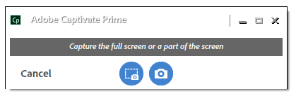

# Adobe Captivate Prime desktop application

Learn how to use Adobe Captivate Prime's desktop application to create and enrich content that can be shared on Social Learning.

The Adobe Captivate Prime desktop application is primarily meant for learners who use Captivate Prime Social Learning. Once installed on a desktop, the application enables learners to create content and post them to boards in Captivate Prime to facilitate informal, collaborative, and social learnings among peers. In addition, the desktop application also ensures that learners get Social Learning notifications on their desktop, even if they are not necessarily logged into Captivate Prime's web application. 

Learners can create rich content including video, audio, and screenshots and share them with other learners. The content could literally be anything – a software demo or walkthrough, a presentation, a podcast, or an annotated screenshot of something that can be shared.

On Captivate Prime Social Learning web page, click new Post and select record video, or record audio, or take a screenshot, or Captivate Prime gallery to launch the desktop application. For more information on Social Learning, [click here](feature-summary/social-learning-web-user.md).

If users do not have the desktop application, you can download it from the Adobe Captivate Prime desktop page. If you are unable to download, [click here](../kb/troubleshooting-issues-with-adobe-captivate-prime-desktop-app.md).

Once the user has finished installing the application, he/she must sign into it using their Captivate Prime learner credentials. The home page appears like the below screenshot. 

Learners will not be able to use the desktop application if Social Learning is disabled for their account.

## Creating a video {#creatingavideo}

The desktop application allows a user to record web, screen and both.

Do the following to make a video recording and post it onto the social learning web platform:

1. Ensure that hardware and software requirements are met. See [System Requirements](../system-requirements.md) for information.
1. To start a recording from Social Learning, select the video recording record (web, screen, both) icon, which opens the Captivate Prime desktop application. In the desktop application with user logged in, the content can be created, and then posted.
1. To start recording from the desktop application, login to the application using your Captivate Prime credentials as a learner.
1. The home page appears.
1. To create a post, you can choose one of the three options provided in the home page. To launch the recording window, click the Record video icon.
1. As per the requirement, you can choose webcam, Screen or both. 

   **Webcam **The webcam captures the narrator who is demonstrating or presenting a project or application including audio. Select the webcam icon  from the above options for the Live window to appear.

   **Screen **Record actions performed on the monitor screen. By selecting the screen icon, the screen gets highlighted with a record dialog at the center of your screen.

   **Both **Records both the narrator and screen actions. By selecting the last icon, the screen gets highlighted and the user gets a Live window along with it. 

1. Set recording preferences.

   **Select Camera** Click the video camera icon at the bottom of the record video window. Select a camera that the user would like to use from the given options.

   **Select Microphone **Click the microphone icon at the bottom of the video or audio window and select a microphone that the user would like to use from the given options. 

   If the user does not want to record audio with screen or video, select the **None** option from the drop-down list that is displayed on the clicking the audio icon.

   When users start recording their screen or themselves, a pop-up dialog box appears asking them to confirm if they want to continue to record without an audio support. Click yes to continue.

1. Use the record button to start recording. The recording begins after the countdown(3 seconds). 
1. Click the pause or resume button to pause while recording and then resume if wanted. To edit the recording, see [Editing a recording](adobe-captivate-prime-app-for-desktop.md#Editing) and to publish see [Publishing a recording](adobe-captivate-prime-app-for-desktop.md#Publishing).

## Creating an audio {#creatinganaudio}

To record an audio, do the following:

1. Click the record audio icon from Captivate Prime desktop application launch window.
1. Ensure that the microphone volume is turned up by clicking the microphone volume icon  and adjusting the volume.
1. Click the record button to start recording.
1. Once users are done recording the audio, click the pause button to stop recording.
1. To preview the recording, click the play button.
1. If users want to record an additional audio to the same file, click **Resume**. Once the desired recording is met, click **Next **to save the file to a desired location. The recording is saved in the Adobe Captivate Prime app for desktop gallery where users can view their recordings and screenshots.
1. To edit the recording, see [Editing a recording](adobe-captivate-prime-app-for-desktop.md#Editing) and to publish see [Publishing a recording](adobe-captivate-prime-app-for-desktop.md#Publishing).

## Creating a screenshot {#creatingascreenshot}

To take a screenshot, do the following:

1. Click the screenshot icon from Captivate Prime desktop application home page.
1. To capture only part of the screen, click the snip partial screen icon. To capture the entire screen, click the capture full screen icon.

   

1. To help other learners comprehend and retain the presentation or static  content better, add annotations to the content.  
1. To edit  the screenshot, [click here](adobe-captivate-prime-app-for-desktop.md#Editing), and to publish a screenshot [click here](adobe-captivate-prime-app-for-desktop.md#Publishing).

## Editing a video, an audio, and screenshot {#editing}

Once a file is saved, the edit window instantly appears on system where recordings can be made to look perfect and professional by using below options:

## Annotations (video recordings and screenshots) {#annotationsvideorecordingsandscreenshots}

Annotations can be used on video recordings and screenshots to highlight specific details or write some text for the other users to read. 

For video, users can only annotate on top of the screen.

* The different annotations that can be selected are **ellipse**, **line**, **arrow**, **highlight**, and **text**.

* Choose a color for each annotation from the colors panel in the annotation’s properties panel.
* For **Text**, choose the following properties: Font, bold, italic, heading, alignment, color, and background color.

To view the background color for text, enable background color to yes.

## Trim (all types of video and audio recordings) {#trimalltypesofvideoandaudiorecordings}

To trim or remove parts of a video or audio that is not required use the trim tool.

To trim, click **Start Trim **button or click the plus icon on the timeline to start trimming. Then click the pause button on the player to stop the trim. Click the **Confirm** button to complete the trim.

Recordings can be trimmed by entering the time in the **Start time** and **End time** input fields after enabling **Change Timing.    **

 

## Pan & Zoom (any video recording) {#panampzoomanyvideorecording}

Pan & Zoom action can only be done on **Both **(webcam and screen) video recordings. By default, the entire webcam or screen is selected. Select the corner handle and drag to select the part of screen that is to be displayed or focused. Double click the window for full screen. 

## Branding (all types of video recordings) {#brandingalltypesofvideorecordings}

To create a unique name for a video along with a consistent theme, select the branding tool. Branding aims to establish a significant and differentiated presence in the learning management system that attracts and retains learners to watch the complete video.

To add a brand or theme to a video, do the following:

1. Click the branding icon from the left navigation panel in the editing window.
1. Select a **Theme **from the given options or users can customize their own theme by adding a **start**, **background,** and **end** video from their system.

   To download more themes, click the **Get more assets** button.

1. Add a video title text and select a location on the **Display at** grid for it to be displayed.

   Title text can only be added as part of a branding video. A theme is required before giving a title to the branding video.

1. Add a presenter name and presenter title to the video if necessary. Type a number within the video time range in the Display at playhead field for the presenter name and title to be displayed while playing the video.
1. Add a branding icon on the left or right side of the video screen if necessary. To select a branding icon, click **select **> **browse from system**.
1. To preview the video, click the play button in the preview screen. 

   

## Recording additional clips (all types of video and audio recordings) {#recordingadditionalclipsalltypesofvideoandaudiorecordings}

Additional audio and video clips can be recorded to an existing video or audio file.

To start a new recording, click the record additional clip icon. The new recording gets inserted at the playhead position in the recording that’s being edited.

## Publishing a video recording, an audio recording and screenshot {#publishing}

Once all changes and edits are made, click **Share** > type or search for a **skill or board **that best relates to the post > **Post.**

## Browsing Captivate Prime desktop gallery {#browsingcaptivateprimedesktopgallery}

All recordings and screenshots are saved in Adobe Captivate Prime desktop application. To browse these files, click **Gallery** from the left navigation panel in the home page. 

The gallery can also be launched from Social Learning by clicking the **Captivate Prime Gallery **icon while creating a post.

From the gallery window, type the name of the file you are looking for in the search field.

To create a new recording from the gallery window, click the **Record New** button.

To edit or delete a file from the gallery, click the three dots from bottom of the file and select your option from the pop-up list.

## Notifications {#notifications}

Notifications in Captivate Prime appear in the notifications window regardless of whether the learner is logged into Captivate Prime web application. Notifications include posts or boards that users have created, or are following, or have participated in. Clicking the notification will navigate the user to Captivate Prime Social Learning web.

To mute notifications, click **profile menu > Settings > Mute notifications**.

## Settings in Adobe Captivate Prime desktop application {#settingsinadobecaptivateprimedesktopapplication}

In the **Settings** page, change the following settings:

Mute notifications, Auto-launch application, Auto-update application, enable product improvement.

Users can also change the gallery location by clicking the **Change** hyperlink.

