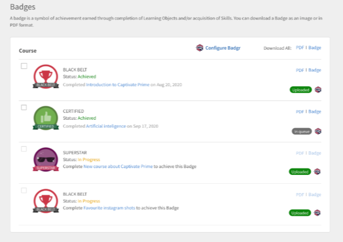

# Badges {#badges}

Learn how to view and download badges using the Captivate Prime Learner app.

## Badges {#Badges-1}

Badges are a measure of achievement that your employee can earn upon completing a course.&nbsp;Adobe Captivate Prime introduces one of the latest e-learning concepts called Badges. Professionals across the globe use these badges as a representation of particular skill or a learning achievement.

Badges help learners to better define themselves and showcase their granular set of skills in addition to bringing credibility and good visibility for learners.

## Viewing and downloading badges {#viewinganddownloadingbadges}

As a learner, you can view badges from the My Achievements widget on the Learners Home page. A list of badges appears at the top of the page adjacent to your profile. At a time, you can view only up to seven&nbsp;Badges&nbsp;on the home page. However, you can view complete list of badges in dialog, when you click&nbsp;any badge.

Recently achieved badges are displayed at the left most part of the list followed by yet-to-achieve badges. You can notice 40% opacity for yet-to-achieve badges as compared to achieved badges, for better identification.

Click any badge to get a list of all the badges acquired by you. You can also view all the available badges aligned to respective courses. In&nbsp;yet-to-achieve badges, click course name to view the course that is aligned to the&nbsp;badge. A sample snapshot is shown below for your reference.

Click&nbsp;**Download All Badges**&nbsp;link to download all of your acquired badges in zip format. You can also download an individual badge by clicking the cube icon adjacent to each badge name.

**Download badge as PDF**

You can also download a set of badges or an individual badge in PDF format.

* Click **Download All Badge Records**&nbsp;to download the badges acquired by you as PDFs.&nbsp;
* To download individual badges, select the badge and click the pdf icon adjacent to the badge name.&nbsp;

**For certificates with expiry i.e., recurring certificates, Prime mentions the validity date for the certificate. The dates will appear in the UI and on the certificate PDF.**

## Open badges {#openbadges}

The Open Badges backpack platform, which Captivate Prime supports, is being **retired**. At present, Captivate Prime does&nbsp;not support Open Badges.

Open badges is a standard to recognize and verify learning for the learners. You can use these badges to showcase your achievements online.

Captivate Prime supports open badges concept for its learners. You can use the downloaded badges as open badges. Each badge that you download has the metadata information that supports the new open badge standard.

## Support for&nbsp;Badgr&nbsp;badges

Learners&nbsp;can&nbsp;integrate their learning platform account with their&nbsp;Badgr&nbsp;account. This&nbsp;enables learners to&nbsp;share badges to social websites via their&nbsp;Badgr&nbsp;account.&nbsp;Badgr&nbsp;also offers authenticable badges based on the&nbsp;backpack standard,&nbsp;which means the badges are verified.

Open badges are badges which have some metadata embedded into the badge image. This metadata gives information about the issuer, the recipient, the task achieved, validity of the badge etc.&nbsp;Badgr&nbsp;backpack will be accessible directly from Prime for providing a central place to store all badges and share them. Learners can login to their&nbsp;Badgr&nbsp;account and establish the integration. From then on, badges achieved in Prime get uploaded to&nbsp;Badgr&nbsp;account automatically.

Once the Administrator enables the option **Badgr Integration**, a learner can then integrate&nbsp;with&nbsp;Badgr&nbsp;and configure his/her badge.&nbsp;To integrate, learner need to login to the&nbsp;Badgr&nbsp;account from Captivate Prime.&nbsp;

**Note:**&nbsp;Captivate Prime does not offer a&nbsp;Badgr&nbsp;account as a part of this integration. Learner should create his/her own account and integrate with Captivate Prime.&nbsp;

A Learner must have a&nbsp;Badgr&nbsp;account created before establishing a connection from Prime.

In the Learner app, in&nbsp;Badges&nbsp;page, there is an option called Configure&nbsp;Badgr. If the option is clicked,&nbsp;a dialog will launch, where the status of the connection should be displayed as Connected/Not Connected.

## Badge update

A Learner can update his/her badge to the latest badge by selecting the badge and clicking **Update **in the top right section of the page. A badge update happens in case of any changes in Badge image or Badge from the Learning Object by an Admin/Author.

This process of updating the page is called Manual rebake. In this case, the badge gets reuploaded to Badgr backpack after baking is completed even if it has the same badge image/name. After updating the badge, the&nbsp; Learner receives a notification that update is completed.

## Frequently Asked Questions {#frequentlyaskedquestions}

**1.&nbsp;How to download Badge as learner?**

On the badges page,&nbsp;You can download a Badge as an image or in PDF format. Choose a skill or a course, and click either **PDF **or **Badge**.
