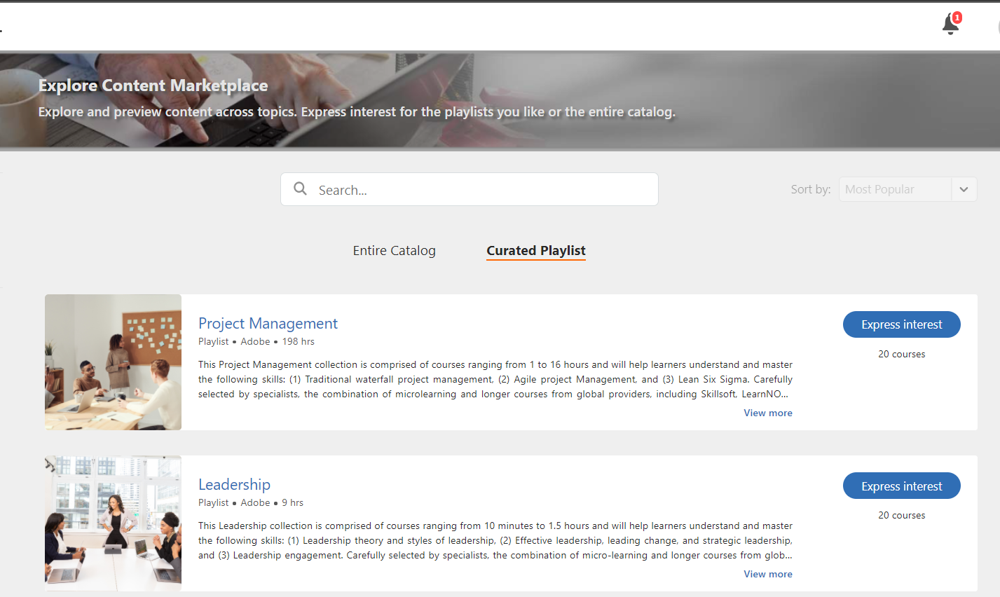

# Courses {#courses}

Learning Manager Learning Programs are renamed to Learning Paths. This change happens immediately after the October 2021 release and the terminology of Learning Path is reflected for all roles.

Read this article to know how to view and consume courses in Learning Manager. Participate in discussions and provide feedback.

Authors create courses. Learners can take up the courses and Administrators can track the performance of learners based on course consumption.

Adobe Learning Manager enables learners to access the courses, learning programs and certifications. Learners can browse through all the available courses by using catalog or enroll themselves to courses of their choice. Learners can view all the enrolled courses and the courses assigned to them in Learning tab.

>[!NOTE]
>
>Learners can also install Learning Manager iPad app from apple store and Learning Manager Android app from Google Play and access courses on mobile devices. All the learners role features are also available in the app. Learners can also take courses offline and get a seamless access after going online. Refer to  [iPad & Android tablet users](ipad-android-tablet-users.md) feature for more information. 

## Viewing courses {#viewingcourses}

You can view a list of all available courses as a learner. Click My Learning from the Home page, or from the left pane to view all the courses that you have enrolled in.

If you are yet to start the course, you can click the Start button next to the course. If you have already started consuming the course, you can click the Continue button.

To view a completed course, click the Revisit button next to the course.

There can be multiple instances to a course. Click the course name to view the details. At the right pane, you can see the deadline date for each instance of the course.

 

## Course effectiveness {#courseeffectiveness}

Course effectiveness score helps the learners to pick up the courses with most effective scores for their learning needs. Course effectiveness is evaluated to understand the usefulness of a course to the learner. It is calculated based on the feedback received by number of users for a particular course. If the percentage of learners giving feedback is more, the course effectiveness rating is high.

It is a combination of results from learner feedback on the course content, the course quiz results for a learner and the manager's feedback evaluating a learner based on learnings from the course.

From the Courses page, a learner can view the course effectiveness rating on the course thumbnails as shown in the below snapshot. You can see the rating for this course as 14.

To view the details of course effectiveness rating, click the course effectiveness value. A pop-up appears as shown below.

Click the down-arrow at the lower-right corner of the pop-up to view how course effectiveness calculations are done.

 

## Searching courses and learning programs {#searchingcoursesandlearningprograms}

Adobe Learning Manager makes it easier for you to find the courses of your choice quickly. You can search for your courses in the following ways:

1. Click search icon displayed at the upper-right corner. A search field appears. Type the course/learning program name or any keywords associated with your courses. You can search for courses by metadata, notes, skills, badges, or tags. Tags are searchable inside search field, which means the tags are displayed in search field as you type.
1. Learner can refine the search results in catalog page using type, skills, tags and status.

 You can sort the courses by relevancy, name or publish date by clicking Sort by and choosing from the drop down menu. 

On the search results page, you can filter the courses according to the **duration** of the courses and the **format** of the courses. This gives you greater flexibility when searching for courses and ensures that you find the courses suitable to you.

## Enrolling for courses {#enrollingforcourses}

Learners are enrolled to courses in the following three possible ways:

1. The Administrator/ Manager enrolls some learners to mandatory courses based on organization needs.
1. The Manager nominates some courses to their team members. You get a notification with an option to accept or reject the course/learning program. When learners accept nomination, they are enrolled to the course/learning program.
1. Learners can directly enroll themselves to a course/learning program:

   * If the course/Learning program is of self-enroll type, then the learner gets enrolled immediately.
   * If the course/Learning program is of manager approved type, then the learner moves into **approval pending** state. After manager's approval, the learner is enrolled for the course.
   * If learners enroll to an already wait listed course (in case of class room), then they have to wait until someone drops out of the course or till admin approves them for the course.

Learners can enroll themselves to a wide list of courses based on their choice. Courses tab displays all your enrolled/assigned courses.

However, you have an option to go through any of the courses listed under catalog by moving mouse over it and by clicking Explore. Enroll page appears. Click Enroll on the upper-right corner of the page, to include the course to Courses list.

There can be multiple instances/sessions to a course/learning program. In catalog, click the course/learning program tile name to view the details. You can see enroll into course/learning program instance based on the deadline date for each instance of the course/learning program.

**Register interest for courses**

You can register to express interest for any classroom courses that do not have any planned sessions. You get notification whenever the course session commences to join the course.

## Workflow as a Learner

As a Learner you will be allowed to rate a course only post enrolment. You can see the average Star Ratings for any course on the **Home** Page, **My Learning** page and **Catalog**.

1. Login as a **Learner**. This loads the **Home Page**.  

1. Search a course by entering the course name in the search bar. Alternately, you can choose from the displayed course list by clicking **My Learning** or **Catalog** from the left pane.  

1. After selecting a course, click **Enroll**.

   

1. Select the number of stars to rate a course accordingly, 1 being the least and 5 being the best. Then click **Submit**.

   

   A Learner can re-submit the feedback by providing Star Rating multiple times, as the most recent rating is considered.

1. A confirmation message is displayed post submission.

   

   If you want to re-submit the feedback, you can do so by clicking the message. Once the rating is submitted, the message is displayed for three seconds and then the rating is shown. If you want to change the rating, you can select a different star and submit.

Courses can be sorted based on the average ratings provided. You can sort the cases from the Sort By drop-down in the top right corner, available in **Catalog**.

## Consuming a course {#consumingnbspacourse}

After enrolling to a course, you can start taking up the course, by clicking Start on the course. Alternatively, click **Courses** in **Learning** tab. Choose a course that you would like to start taking up.

If you are yet to start a course, click the Start button next to the course title.

You can view all the modules for the course in a browser window.

**Player features**

**TOC** - While taking up a course, the player displays a table of contents for that particular course on the left pane of the window. You can click each topic and navigate to it directly.

**Bookmarks** - If any of the course modules has a module TOC, then topics in module TOC can be bookmarked to refer later. When bookmarked, a ribbon icon appears next to the TOC entry. Bookmarks can be deleted by clicking the ribbon again.

**Notes** - A provision is available to record notes while you are taking up the course. After recording the notes, you can save and download it as PDF or e-mail the notes to e-mail ids of any registered learners. When you click Save, you get an option to choose the location for saving it as PDF file.

**Closed captions** - For Adobe Captivate developed courses, if the closed captions is enabled during course development, then the learner can view the captions. Click CC at the bottom of the player. The closed captioning option is available only for Captivate 8.0.2 HTML content. For all other types of modules, the CC option does not appear on play bar.

**Revisit course** - You can revisit a course in two modes under two possible scenarios:

* Click Revisit while the course is in complete state.
* Click Continue while the course is in incomplete state.

**Full screen** Click Full screen icon at the lower-right corner of the player to view the course in full screen window.

**Navigation buttons** You can click up/down arrows to move across slides in pdf, docx and pptx content. Slide arrows can be used to move to next topics for all types of content.

**Close the course** Click close (x) icon at the upper-right corner of the player to exit the course.

*After exiting from the course, you can revisit the course by clicking Revisit button on the course description page.*

## Star rating

Only after enrolling to a course, a Learner can provide a star feedback to the course. In the Course Overview page of a course, the Learner can rate the course as stars (1-lowest, 5-highest). 

A Learner will be able to select a particular star (out of 5) and submit the rating. The learner can also edit the selection by clicking on a different star. Once submitted, a Thank you for your feedback message will be displayed. 

If the Learner wants to re-submit the feedback, he/she can do so by clicking the message. The **Submit **button gets re-enabled. A Learner can provide star rating multiple times after enrollment to a course. The most recent rating will be considered always.

Once the Learner provides a rating, the average star rating and the count of learners who've provided the star ratings feature in the **Course Overview** page.

For all existing accounts, this feature is disabled. Administrators can enable it from Settings. Only then star ratings will appear to the learners. 

## Content marketplace

The Content Marketplace option features on the left pane in the Learner app. When you click the option, you can see all courses/Entire Catalog and Curated playlists.

In the page below, you can see the courses that are present in the entire catalog. Each course displays its duration and the broader topic it belongs to. You can choose the topic from the filter on the left of the page.

You can preview a course for exactly two minutes. 

When the Administrator invites you to explore and preview a wide range of courses, you see a notification.

As a Learner, you can express interest for an entire catalog or any curated playlist in the **Curated Playlist** section.

After you express your interest for a course/training, the interest gets recorded, and the Administrator can then fetch the record.

In the Learner app, all administrators have access to the Content Marketplace. If the access is revoked by the Administrator, learners cannot see the Content Marketplace tab.

Learners who've been invited by the Administrator can explore the Content Marketplace.

**Note:** Content Marketplace is not supported in Internet Explorer 11.

All filters and other options are shown in the video below.

### Preview content

You can explore and preview the course and see if the course suits your learning needs. Click the **Preview** button and see the course preview. The preview is available for two minutes.

 

## Content Hub

Content Hub allows Administrators and Subject Matter Experts (SMEs) to shortlist required playlists from learner app. Once shortlisted, Admins can download the Purchase Request Form and share it with the Adobe Sales agent.

An Admin can invite SMEs to shortlist the playlist which they are interested in.

Content Hub is available in Learner role for all Administrators. Administrators allow SMEs to shortlist the playlist which they are interested in purchasing.

The Content Hub page is visible to Administrators in their learner role all the time as it allows them to shortlist playlists easily. To help you in shortlisting the right playlist, Admins can make this page accessible to limited Subject matter experts in their account. Visit the Enterprise Training page on the Admin side and take steps to provide access.

 

## Choose course instance {#choosecourseinstance}

If you are a Learner enrolled in a course instance of which the session is expired, you can now switch to a different session to make progress. This can be done only if the LP is flexible.

To change course instance, follow these steps:

1. Open Catalogs > Learning Program.

   

1. Use the radio buttons to choose if you want to view all courses or courses with unselected instances. Note that if the learner has completed the instance, he cannot switch to another instance.

   

1. The instance drop-down menu for the course displays the available instances. Choose the instance from the drop-down list.

   

1. To apply the selected instance, click **[!UICONTROL Update Enrollment]**. Update Enrollment option is available on the right-top of the page.

   The newly selected instance is enrolled. If a learner is enrolled to a course instance which is a part of another LO, and he updates the course instance which is a part of the flexible Learning Program, he will automatically be unenrolled from the other Learning Objects after a warning.

## Completing a course {#completingacourse}

As a learner, you can complete the required number of modules in a course for course completion. The course completion criteria depends on how many modules have been set as mandatory by the author. When you enroll into a course with a minimum completion criteria, you can view the completion criteria on the right pane of the Course page.

For example, if a specific course has the completion criteria as one out of two modules, then completing just one module marks your completion of that course. In this case, when you complete the first module the progress bar displays 100% completion state.

If the modules are set as ordered by the author, you must complete the required number of modules in the sequential order starting from first. If the modules are unordered, you can complete the specified number of modules in any order.

After completing a course with the required number of modules, if you want to complete the optional modules, you can revisit the course.

## Viewing and pariticpating in discussions {#viewingandpariticpatingindiscussions}

As a learner, you can interact with other learners and your instructors using the Discussion tab. You can view the posts for any course that you view or enroll in. If an administrator has enabled discussions for a course, you can view the Discussion tab next to the Notes tab for that course.

When you click the Discussions tab, you can see the existing posts and comments for that course. If you have already enrolled into the course, you can also start typing posts or comments for other users to see. After you type the message, click Post. Your post must at least contain 10 characters.

The post is immediately visible in the Discussions tab. You can sort the posts as Newset First or Oldest First, and delete those posts that you wrote. Even after you unenroll from the course, you can still view all the posts and delete the posts that you wrote.

The Discussion tab is not enabled for external users.

 

## Course life cycle {#courselifecycle}

A typical course life cycle looks as follows:

**Draft** -When an author completes creating a course and saving it. At this state, course is not available yet for learners.

**Published** -When an author completes publishing a course. At this state, the course is available for learners to enroll.

**Retired** - After publishing a course, an author can move it to a retired state if he doesn't want the course to appear in course catalog for learners.

**Deleted** - A course under deleted state is when it is removed completely from the Adobe Learning Manager application. Courses can be deleted by authors only when they are in Draft or Retired states.

