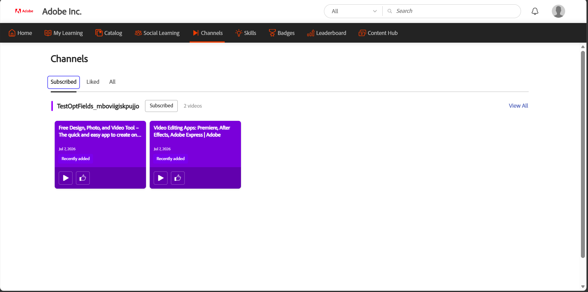

Channels help the learners discover and access video-based informal learning content curated in web and Cloud Confluence pages within the Adobe Learning Manager. Administrators create channels by connecting them to enterprise web pages or Cloud Confluence pages that host recorded knowledge-sharing and knowledge-transfer sessions.

Instead of searching across multiple internal sites, you can browse channel content directly in Learning Manager. Channels provide a
centralized location to discover relevant videos, stay informed about new content, and engage with your organization's self-paced learning
resources.

## Key benefits

- Access video content from enterprise web pages and Cloud Confluence pages in one place.
- Discover learning resources without navigating multiple internal websites.
- Subscribe to channels to stay informed when new content is added.
- Watch and like videos directly within Adobe Learning Manager.
- Participate in discussions and collaborate with other Learners around shared content.
- Explore curated collections of videos relevant to your role and interests.

# Find Channels

Use the **Channels** page to discover new content, access channels you subscribed to, and view videos you have liked.

1. Login to Adobe Learning Manager.

2. Select **Channels** from the top navigation bar.
  The **Channels** page opens with the **All** tab displayed by default.
 The All tab of the Channels page, where you discover and subscribe to available channels.

3. Use the following tabs to browse channel content:

| **Tab** | **Description** |
|----|----|
| **All** | Displays all channels available to you. Use this tab to discover and subscribe to new channels. |
| **Subscribed** | Displays only the channels that you have subscribed to. |
| **Liked** | Displays all videos that you have liked across channels. |

4. Select **View All** for a channel to view all videos available in that channel.

# Subscribe to a Channel

Subscribe to channels to quickly access the content that is most relevant to you and stay updated when new videos are added.

1. In the **All** tab, navigate to the channel that you want to subscribe to.

2. Select the **Subscribe** button.
  The channel is added to the **Subscribed** tab.

3. Select the **Subscribed** tab.
  This displays all channels that you have subscribed to.
 Your subscribed channels collected under the Subscribed
tab for quick access.

### Unsubscribe from a channel

If you no longer want to follow a channel, select the **Subscribed** button again. The channel is removed from your **Subscribed** tab and remains available under the **All** tab, where you can access it at any time.

# Watch a video

Watch videos from your organization's channels to access curated knowledge-sharing and learning content.

To watch a video, navigate to a channel and select the video thumbnail or play icon. On the video details page, select the **Watch Video** button to open and play the video.

# Like a video

Like videos to save them to your **Liked** tab and quickly find them later.

To like a video, select the **Like** button on a video card or on the video details page. The like count is updated, and the video is added to your **Liked** tab for easy access.

 The Liked tab, where videos you like are saved so you can
find them later.

# Join the discussion

Use the discussion on each video to share insights, give feedback, and ask questions. Each video has its own discussion thread.

To post a comment:

1. Open the video that you want to discuss.

2. Navigate to the **Start discussion** section.

3. Enter your comment in the **Add a comment** box.

4. Select **Post**. The comment is added to the discussion thread and is visible to other Learners who view the video.
 Watch a video, view its like and view counts, and join the discussion from the video details page.
