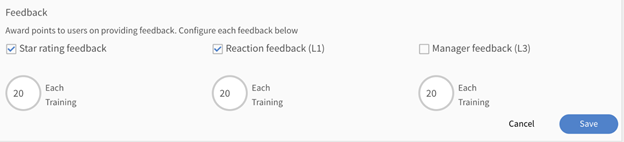

# Gamification

Engage users using gamification techniques in Learning Manager.

Gamification is the use of game thinking and game mechanics in non-game contexts to engage users in earning points while learning.

## Overview {#overview}

To engage learners and motivate them to achieve their goals by using gaming techniques, use the gamification feature in Learning Manager. Learners can compete with their colleagues to score points for various learning activities and achieve bronze, silver, gold, and platinum levels.

Learners can also see the achievement level based on the points that they have earned. The levels include Fast learner, Self driven, and so on. **Both internal learners and external learners can access this feature.**

## Leaderboard {#leaderboard}

Leaderboard is a gamification feature which acts as a scoreboard to showcase the ranking scores of leading competitors. Learners can see their gamification points using Leaderboard.

From the Learner's home page, click **[!UICONTROL Gamification]** from the left pane. To view the leaderboard, click Leaderboard link. This feature enables the learners to understand how they are faring against a particular team member. It also shows their ranking position relative to other members of the team.

Some of the features of Leaderboard for learners:

* Learners enrolled in a Learning Program instance can see each other's' points if gamification is enabled for that instance.
* Click **[!UICONTROL Add colleagues]** to include team member that you want to compare against. Your team member's profile picture is added to the timeline scale at the top of the leaderboard page. This timeline scale shows your points at the beginning and moves your position to the right when you achieve more points than your team members. You can only compare it against other members of the same group.
* **User groups:** At any time you can choose your team members profiles that you want to compare your rank with, using the **[!UICONTROL Rank Me With]** option. From the Select User Groups field, type and choose the group. The list of all the team members along with their latest points are listed below. Both internal and external users can view the list but only internal users are enabled to search other internal learners.

* Also, the People Around Your Rank dialog box displays the names of team members who are above, below or at the same level as you.
* When an external user converts in to an internal user, the timeline is automatically updated.

## Points for consistent learning

Adobe Learning Manager introduces a new gamification task that encourages users to access the learning platform consistently and engage in the learning activities. To support this task, the Administrator can now setup a new rule that awards points if the learner carries out learning activities for 1, 2, 3, or 4 days in a week, month, or quarter.

Note that the gamification points for this rule are awarded once every 24 hours. For example, if a learner performs a learning activity today at 8AM Pacific Standard Time (PST) and has received gamification points for today, then tomorrow he will be considered for gamification points only if he performs a learning activity any time after 8AM PST.

The following activities are considered as learning activities:

* Consuming a course, learning path, or certification in the fluidic player.
* Downloading a job aid.
* Downloading an attachment.
* Adding notes.
* Accessing the social learning dashboard.
* Commenting on the social learning dashboard.
* Posting on social learning dashboard.

**Gamification points for providing L1 and L3 feedback and star rating**

Adobe Learning Manager now enables an Administrator to activate a gamification criterion that awards points to users when they provide an L1 feedback, L3 feedback, and a star rating.

*View feedback rating*

This feature encourages the users to actively provide feedback, which benefits Learners as well as the Administrators, who now better understand the Learner's point of view and can better evaluate the efficiency of a course.

## Tasks {#tasks}

There are five gamification tasks of learners. You can view gamification points inside the circle at the upper-right corner of the window in the Learners home page. To view the allocation for each task, click Gamification.  

The system displays the Gamification page, depicting all the learners tasks and points is shown below:

>[!NOTE]
>
>Gamification points within a particular task are not cumulative. But, the points are added to learners account cumulatively if the learners get across these points across different tasks. 
>
>While assigning courses to points, administrator has to ensure that the learners get the points progressively.

**For Fast learner**

This task is applicable when a learner completes some courses within a month/quarter/year. This task is to encourage fast learners.

You can see the following possible scenarios:

1. When learners complete two courses within a month/quarter/year, they get 20 points.
1. When learners complete four courses within a month/quarter/year, they get 100 points.
1. When learners complete eight courses, they get 300 points.
1. When learners complete ten courses, they get 500 points.

>[!NOTE]
>
>Administrator can modify the time period and the number of courses required to complete to earn corresponding points.  
>
>Within a task, points are not accorded to learners cumulatively. For example, assume that a learner completes single course and gets 20 points. When learners complete two courses, they get 100 points but the existing 20 points are not considered.

**For Self driven learner (a)**

This task is applicable when learners enroll for the prescribed number of courses and complete within a month/quarter/year. In this case, Administrator can enable this task to allocate points and encourage them.

Possible scenarios:    

1. When learners enroll for one course within a month/quarter/year, they get 50 points.
1. When learners enroll for two courses within a month/quarter/year, they get 150 points.

>[!NOTE]
>
>Administrator can modify the time period and the number of courses.

**For Self driven learner(b)**

This task is applicable when learners enroll and complete more number of courses than required to complete in a month/quarter/year. In such cases, Administrator can enable this task to allocate points and encourage them.

Possible scenarios for learners enrollment of courses in addition to their allotted courses:

1. When learners enroll for one course within a month/quarter/year, they get 20 points.
1. When learners enroll for two courses within a month/quarter/year, they get 100 points.
1. When learners enroll for three courses within a month/quarter/year, they get extra 300 points.
1. When learners enroll for four courses within a month/quarter/year, they get extra 500 points.

>[!NOTE]
>
>Administrator can modify the time period and the number of courses. For example, the third scenario can be modified to five courses instead of three to gain 80 points.

**For Upskill (a)**

This task is applicable when learners complete a number of competencies. Administrator can choose this task to encourage learners to gain as many competencies as possible.

Possible scenarios for Upskill in competencies:

1. When learners achieve one competency, they gain 100 points.
1. When learners achieve two competencies, they gain 300 points.
1. When learners achieve three competencies, they gain 600 points.
1. When learners achieve four competencies, they gain 900 points.

>[!NOTE]
>
>Time period is not applicable for this task. Administrator can modify the number of courses for each scenario.

**For Upskill (b)**

This task is applicable whenever learners complete each higher level within a competency.

Possible scenarios for upskill in levels within a particular competency:

1. When learners achieve one level, they get 100 points.
1. When learners achieve two levels, they get 200 points.
1. When learners achieve three levels, they get 500 points.

>[!NOTE]
>
>Time period is not applicable for this task. Administrator can modify the number of levels for each scenario. If learners achieve higher level and then  achieve lower level of a competency, then they gain points only for the higher level.

**Early completion points**

This task is applicable for learners when they become first N learners to complete the course.

Possible scenario:  
When a learner becomes one of the first 10 learners to complete the course he/she gets 100 points.

**Timely completion points**

This task is applicable for learners when they complete a course within a stipulated number of days before the course completion deadline.

Possible scenario:  
When learners complete a course within 10 days of course commencement, they get 100 points.

**Achieve levels**

Learners status of Level is displayed at the upper-right corner of the page in a circle, at the My Courses page. Learners can achieve the following different levels based on the number of points achieved during learning period:

1. Bronze - when learner achieves 1500 points.
1. Silver - when learner achieves 2500 points.
1. Gold - when learner achieves 3000 points.
1. Platinum - when learner achieves 5000 points.

## Frequently Asked Questions {#frequentlyaskedquestions}

**1. How to see the Leaderboard as a learner?**

On the learner app, on the left pane, click **[!UICONTROL Social Learning]**. You can see the social leaderboard on the bottom-right corner of the page.
