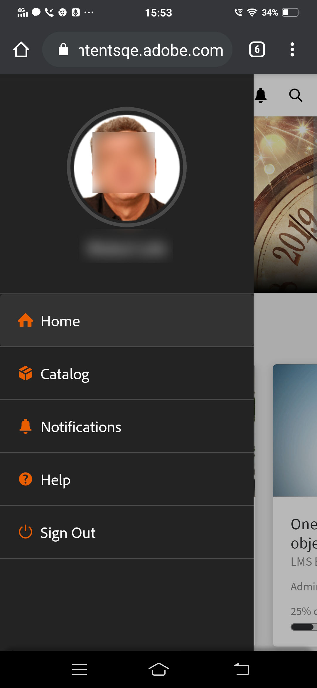
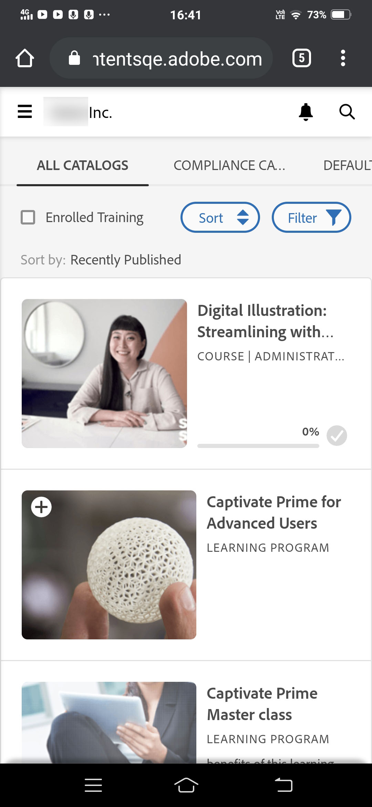
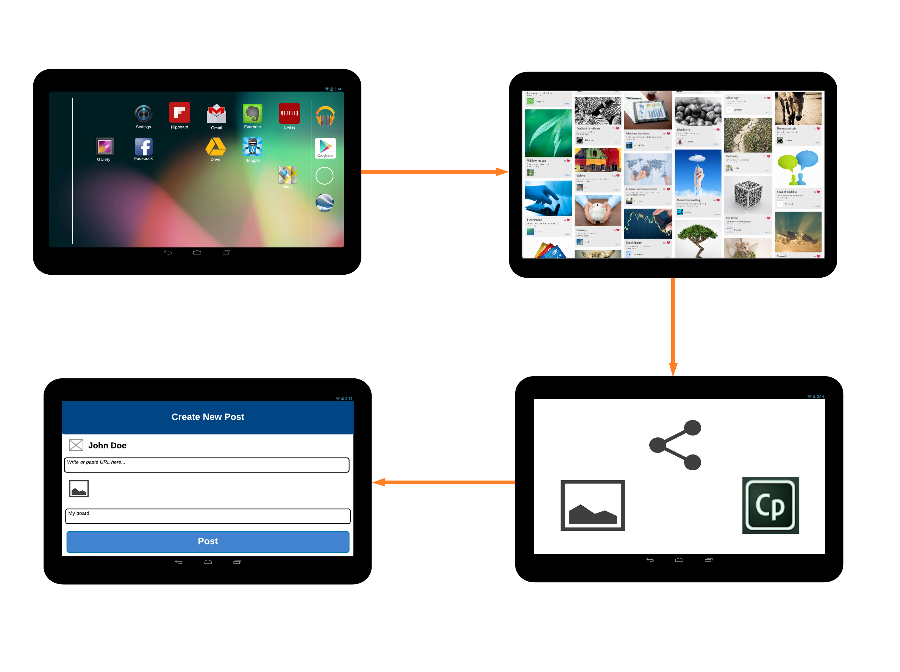
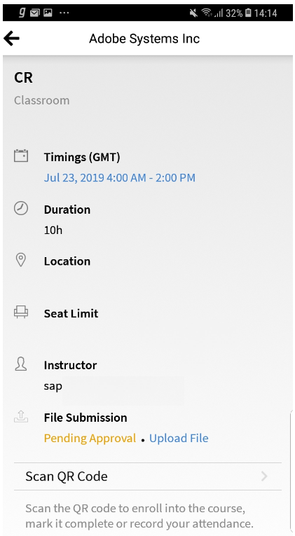
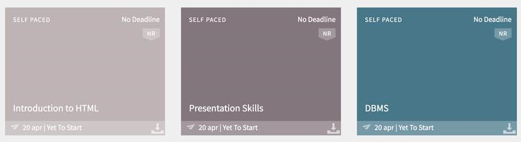

# Learner App for mobiles and tablets

Read this article to know how to download Captivate Prime Learner app for smartphones and tablets. Learn how to consume courses using your mobile or tablet.

## Overview {#overview}

Captivate Prime app for learners is available for both Android phone users and iPhone users. Go to either Google Play Store (Android OS) or iTunes (macOS), and download the Captivate Prime app.

After you download and install this app, log in to the app using your learner credentials. When you open the Captivate Prime mobile app, the following screen is displayed by default.

## Home page {#homepage}

For all accounts that have the option Immersive Layout enabled, there is a brand-new home page to support the Immersive Layout configuration. The home page is organized as a list of cards for the following:

|  | |
|---|---|
|  |  |

## Feedback rating {#feedbackrating}

Captivate Prime prompts the learner to provide feedback about their experience with the Mobile App. This feedback appears once in a month and gives enough time interval for users to experience the app and then provide the feedback.

|  | |
|---|---|

For existing users, they should see the feedback popup once they close the Player for the first time after updating the app to latest version.

Note that the feedback collection is anonymous and appears only for users who've enabled the option **Share Usage Data** via a configuration in App settings.

## Download badge {#downloadbadge}

Learners can download their badges in PDF and Image format. In the User profile section, scroll down, and click any link to download a badge. The downloaded badge is saved in the default device folder. The app allows you to open the folder or the file immediately after the download completes.  

| |
|---|

## Mobile web responsive layout {#responsive}

A completely responsive mobile web experience that ensures that learners use their devices to consume training even if they haven't installed the mobile app.

When you first sign into the learner app via the browser on your device, the learner app shows up in the form of a mobile-friendly, responsive layout.

The mobile web responsive UI support is only available when an account **is configured for immersive layout only**. The responsive UI is **not available for classic layout**.

<table>
 <tbody>
  <tr>
   <td>
    
<strong>Home page</strong>

    
<strong>View options</strong>

    
<strong>Start course</strong>
</td>
   <td>
    
<strong>My Learning List</strong>

    
<strong>View catalog</strong>

    
<strong>Apply filters</strong>
</td>
   <td>
    
<strong>Recommendations based on interest</strong>

    
<strong>View notifications</strong>

    
<strong>Share url</strong>
</td>
  </tr>
 </tbody>
</table>

## Unsupported features in mobile immersive experience {#unsupportedfeaturesinmobileimmersiveexperience}

The following workflows appear in the classic experience for a learner:

* Multi-Attempt
* Flexi LP
* File Upload scenarios
* Providing L1 Feedback

Other app features that are not supported are:

* Social App: A learner is redirected to Classic experience if he/she clicks on Social widget on Home page
* Profile Settings/Edit Profile
* View Badge/Skills
* Leaderboard: A learner is redirected to Classic experience if he clicks on Leaderboard widget on Home page
* Downloading Job Aids.
* Filter options in Search.

Social Learning now supports the mobile immersive web experiences.

There are some features, which are not supported Mobile Immersive App. These are:

| **Area** |**Not supported** |
|---|---|
| Board  |Board Creation, Board Editing, Copy URL , Delete , Report, Sort , Filter  |
| Post  |Poll Type Post Creation, Edit , Multiple attachment to the post, Copy URL, Pin to Top  |
| Comment/ Reply  |Edit, Mark as Right Answer, Uploading image/video/audio in comment or reply  |
| Media |Capture Audio; only uploading of audio file |
| Others |Notifications, Post View, Social Leaderboard, People I follow, User Profile |

## Enable learners to download Job Aid {#download-job-aid}

In the mobile immersive mode, a learner can download a Job Aid. Tap **Settings** and then tap **Catalogs**. Download a Job Aid from the list that appears.

| |
|---|

## Enable learners to download Learner Transcript {#download-learner-transcript}

In the mobile immersive mode, a learner can download the Learner Transcripts.

|  | |
|---|---|

## View badges and skills {#viewbadgesandskills}

**Viewing badges, skills, and gamification points**

The default screen displays your recently achieved badges, skills, and gamification points just below your profile info. If you are using a phone, the recently achieved badges are displayed. Swipe right to see more information.

**My Pending Learnings**

By default, the screen displays the courses that you are enrolled in. The donut chart displays the learning overdue, learnings nearing deadline, and learnings on track.

Tap a course to view the details of the course, your completion date (if applicable). You can either Continue or Revisit the course from this screen, depending on your completion status.

**Viewing catalogs**

Tap the icon next to the book icon at the bottom of the screen. You can immediately view the catalog with all the associated learning objects. You can choose to view them in grid layout or choose the detailed view. Select recommendations to see course recommendations based on your learning history.

## Sort and filter learning objects {#sortandfilterlearningobjects}

**Sorting and filtering**

Click the sort icon at the upper right corner of the courses or catalog screen to sort the learning objects alphabetically (ascending or descending), or by published date. You can also filter the learning objects by type, completion status, skills, or by tags. Tap and select the filter and tap Apply to apply the filter.

**Using the Search functionality**

At the top right of your phone screen, you can see a search icon. Tap that icon to search for learning objects by course metadata, unique Id, skills, and so on.

**Managing profile, settings, and notification**

Tap  menu at the top left corner of the screen to view your profile, notifications as well as account settings. 

This menu also allows you to scan the QR code for marking attendance for courses.

All you need to do is, tap the **Scan QR Code** option and scan the code.

**Offline consumption of courses**

When you consume downloaded courses while you are online, Prime will access the downloaded course instead of making server calls.

## Scan QR code to enroll {#qrcode}

You can scan a QR code and enroll for a course. After the learning Administrator generates a QR code, you can scan the QR code from the app and get enrolled in a course.

1. To scan the QR code, tap  on the top-left corner of the screen.
1. Tap **Scan QR Code**.

The scan QR feature allows a learner to perform one of the actions mentioned below depending on the QR code generated by the learning administrator:

* **Enrollment:** This allows the learner to enroll to a course by scanning the QR code.
* **Completion:** This allows the learner to mark the course as completed by scanning the QR code.
* **Enrollment and Completion:** This allows the learner to enroll and mark completion at the same time by scanning the QR code.
* **Mark Attendance:** This allows the learner to mark attendance for a particular session by scanning the QR code.

## Renaming Learning Objects {#renaminglearningobjects}

Administrators can rename Learning Objects terminology. To rename, see [Renaming Learning Objects](../../administrators/feature-summary/settings.md#main-pars_header_1570157145).

## Social learning {#socialmobile}

In this update, the following features are not supported. You cannot:

* Create or follow a board.
* Copy a URL to a post.
* Add post as story or add  as post as favorite or pin to top.
* View a social leaderboard.

Social learning is a platform in the Captivate Prime mobile app, which engages users to share ideas and meaningful insights in an informal environment. It is a methodology that supplements the idea of traditional learning. 

Social learning allows users to use the expertise around them to get correct and concise information. Learners can quickly apply that information to complete a task and achieve a goal.

Using the mobile app, users can interact with one another by sharing content and get validation for the shared content.

On this platform, the different type of content that can be shared are video, audio, screenshot, text, question, and poll. Users can also share their online learnings with their peers.

This feature is only available on the device app once the Admin enables **Social Learning** for the account.

## Launch social learning on the app {#launchsociallearningontheapp}

Upon launching the app, tap the **Social** icon.

## Create a post in a board {#createapostinaboard}

Like any other social platform, in the Captivate Prime mobile app, you can create a post in a board, so that all learners who are part of the same board can view your post, comment, and upload a file along with the comment.

To create a post, tap the () icon on the bottom-right of the screen. 

The following screen appears.

<table>
 <tbody>
  <tr>
   <td>
    

</td>
   <td>
    
Write a post or paste any URL.
</td>
  </tr>
  <tr>
   <td>
    

</td>
   <td>
    
Take a picture with your mobile camera and upload it with your post.
</td>
  </tr>
  <tr>
   <td>
    

</td>
   <td>
    
Record a video with your mobile camera.
</td>
  </tr>
  <tr>
   <td>
    
 
</td>
   <td>
    
Record audio with your mobile.
</td>
  </tr>
  <tr>
   <td>
    

</td>
   <td>
    
Upload any document or file in the board.
</td>
  </tr>
  <tr>
   <td>
    
 
</td>
   <td>
    
Ask a question.
</td>
  </tr>
  <tr>
   <td>
    
 
</td>
   <td>
    
Create a poll with your post.
</td>
  </tr>
 </tbody>
</table>

## Supported content format {#supportedcontentformat}

<table>
 <tbody>
  <tr>
   <td>
    
<strong>Content type</strong>
</td>
   <td>
    
<strong>Extensions</strong>
</td>
  </tr>
  <tr>
   <td>
    
Video
</td>
   <td>
    
wmv, f4v, asf, 3gp, 3g2, avi, mov, h264, m4v, mp4, MPEG, mpg
</td>
  </tr>
  <tr>
   <td>
    
Audio
</td>
   <td>
    
mp3, amr, m4a, wav, wma, aac
</td>
  </tr>
  <tr>
   <td>
    
Static Files
</td>
   <td>
    
PDF, ppt, pptx, doc, docx, xls, xlsx
</td>
  </tr>
  <tr>
   <td>
    
Image
</td>
   <td>
    
jpg, jpeg, png, bmp, gif
</td>
  </tr>
 </tbody>
</table>

After creating a post, choose the board where you want to upload the post. Tap Select Board and search for the required board.

After you've created a post, tap Post and post your comment for other learners to view your post.

In the mobile app, you cannot create a board. To create a board, you must log in to the web app as a learner. For more information on creating a board, see Social learning in [Captivate Prime](https://helpx.adobe.com/captivate-prime/learners/feature-summary/social-learning-web-user.html).

## Actions that can be performed on a post {#actionsthatcanbeperformedonapost}

* Comment on a post and based on the permission, view post in a board.
* Edit or delete comments in a board.
* Edit or delete a post based on permissions.
* Report an abuse of a post if it violates their privacy, or its content is inappropriate. Once a post is reported, a notification is sent to the board administrator and moderators for further actions.
* Like    or dislike     a post.

* Like   or dislike  a comment.

## Create a post in other boards {#createapostinotherboards}

You can create a post in other boards as well.

Tap **All Boards** and you can view the activities in the board performed by other learners.

Navigate to the required board and post your comment.

## Share media in a board {#sharemedia}

Share pictures, documents, or audio or videos files to any board, so that other board members can view your post and start an interaction. To share any media,

1. Open the media that you want to share.
1. Tap the share button and choose Captivate Prime.
1. Choose the board in which you want to share the media.
1. Tap **Post**.

You can also post any content from an external app, for example, you can share a comment from Reddit or Quora.

## Upload assets in external certificate as proof of completion {#externalcert}

Follow the steps below:

1. Log in to the device app using your learner credentials.
1. Search for the certificate that the author had created.
1. From the list of external certificates, choose the required certificate, and enrol for the certificate.      
1. Tap **Proof of Completion** and upload a file, for example, a pdf or an image.

   |  | |
   |---|---|

1. After uploading a file, tab **Submit**. A confirmation message appears.

**Uploading a file**

1. After you upload a file, tap **Submit**.

   You can upload only one file as proof of completion. When you try to upload multiple files, the following message displays:

   **The changes you made will be lost. Do you wish to Continue?**

1. The status changes to **Pending Approval**, displayed in an orange color.

   You cannot view or download the uploaded file on the mobile app.

After the Manager approves the submission, the status changes to **Approved**, colored in green.

If the Manager rejects the submission, the status changes to **Rejected**, colored in red.

|  |  |  |
|---|---|---|

After rejection, you are allowed to upload a file as proof of completion.

* You can only submit a file when the status is **Pending Submission and Rejected**.  
* You cannot submit a file when the status is **Pending Approval and Approved**.

## Take courses from LinkedIn Learning {#linkedin}

Captivate Prime already supports LinkedIn Learning courses within the learning platform. Now learners can take up such LinkedIn Learning courses within the Captivate Prime mobile app. In the device app, search for a course, and then start the course.

If you have the LinkedIn app already installed, the course will open in the app, or else the course will open in the default browser, where you must log in using your LinkedIn credentials. 

If you are taking the course via the LinkedIn app, your progress will not be tracked inside Captivate Prime. Hence, it's recommended that the course is launched in the browser instead of the LinkedIn Learning app. 

>[!NOTE]
>
>You can only take the courses if you have an active internet connection.

|  |  |  |
|---|---|---|

Learning time spent in LinkedIn Learning courses is communicated by the LinkedIn content/LinkedIn platform to Captivate Prime learning platform.

In case LinkedIn learning does not send the learning time, it cannot be recorded by our learning platform. In such case, learning time spent displayed by Captivate Prime is zero.

## Submit file for classroom and activity modules {#submitfile}

As a learner, you can submit files as proof of course completion to your instructor. The instructor can then approve or reject your submission, based on the contents of the file.

An author can create only classroom and activity modules for a learner to consume in the mobile app.

After the learner starts a course, the learner can see the status **File Submission** as pending along with the link to upload file, on the screen, as shown in the screenshot below.

To upload the file, click **Upload File**.

Upload any file and click the **Submit** button.

 

## Supported file types for upload {#supportedfiletypesforupload}

<table>
 <tbody>
  <tr>
   <td>
    
<b>Content type</b>
</td>
   <td>
    
<b>Extensions</b>
</td>
  </tr>
  <tr>
   <td>
    
Video
</td>
   <td>
    
wmv, f4v, asf, 3gp, 3g2, avi, mov, h264, m4v, mp4, MPEG, mpg
</td>
  </tr>
  <tr>
   <td>
    
Audio
</td>
   <td>
    
mp3, amr, m4a, wav, wma, aac
</td>
  </tr>
  <tr>
   <td>
    
Static Files
</td>
   <td>
    
PDF, ppt, pptx, doc, docx, xls, xlsx
</td>
  </tr>
  <tr>
   <td>
    
Image
</td>
   <td>
    
jpg, jpeg, png, bmp, gif
</td>
  </tr>
 </tbody>
</table>

## Approval or rejection of submission {#approvalorrejectionofsubmission}

After you upload the file, the status changes to **Pending Approval. **The instructor then views the list of [pending submissions](https://helpx.adobe.com/captivate-prime/instructors/feature-summary/learners.html#Approveorrejectsubmissions) and approves or rejects the submission via the Instructor web app.

When the instructor approves the submission, the status on the Learner mobile app changes to **Approved**.

When the instructor rejects the submission, the status on the Learner mobile app changes to **Rejected**. 

To submit the file again, click the link **Upload File**.

## Captivate Prime for iPad and tablets {#captivateprimeforipadandtablets}

In Captivate Prime app on iPad or Android tablet, after you log in as a learner, you can see the following **Home** screen:

To navigate to learning and catalog features, tap the **Menu** drop-down and choose appropriate option.

You have an option to view the set of courses in a list view instead of tiled/cards view. 

## Access the app off-line {#accesstheappoffline}

You can access the Captivate Prime app off-line in iPad and Android tablets. You can download courses and learning programs. Take courses, consume the Learning programs in off-line mode and synchronize the content back with online app when you connect to the network.

1. Tap **Menu** drop-down at the top and tap **Learning** option. A list of all the available courses is displayed in tiles.
1. Tap the download icon at the bottom of each learning object tile, to download the learning content.

   

   A prompt appears in a bar at the top of the app denoting the network status of the device. 

   * Red bar indicates that the network is not available for the device. 
   * Green bar indicates network is back online. 

User can switch back to online mode by clicking **view online content** button on the green bar. Content in the device is synchronized when the user switches to online mode. 

## Track device storage {#trackdevicestorage}

You can monitor your device storage periodically.

Tap the profile icon at the upper-right corner of the app and tap **Device Storage** menu option.

An app storage information dialog appears as shown below.

Using the app storage information, you can check the total space of device, app and the downloaded courses. This information enables you to download courses accordingly. To delete the downloaded courses in the device, tap delete icon adjacent to each course name.
