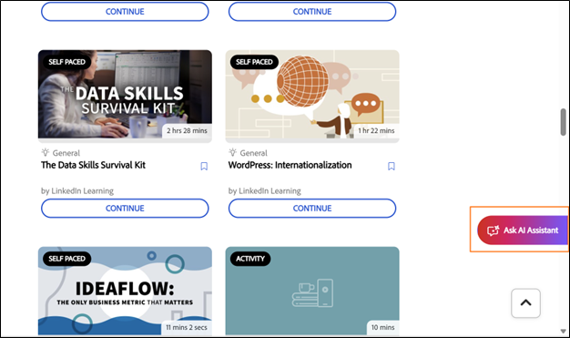

# AI Assistant for learners

The AI Assistant (Beta) for learners helps them quickly find answers from the assigned learning content without browsing through entire courses. You can ask questions in plain language and receive accurate, focused responses with source links to the relevant course content.

>[!IMPORTANT]
>
>The AI Assistant for learners is currently available as a beta feature. Capabilities, supported scenarios, and limitations may change as the feature evolves.

## What is the AI Assistant for learners

The AI Assistant is a generative AI-powered chat companion in Adobe Learning Manager that delivers quick, accurate answers using your trusted learning content. It includes citations so you always know the source of the information.

### Capabilities

- **Intelligent question answering**
  - Single-turn and multi-turn conversations
  - Natural language understanding in English
  - Answers derived from courses, certifications, learning paths, and job aids
  - Smart clarifying questions when queries are ambiguous

- **Content sources and citations**
  - Retrieves answers from available resources in supported catalogs
  - Provides citations with direct links to source materials
  - Supports all Learning Manager content formats (static and interactive): PDF, DOCX, PPTX, XLSX, audio (MP3, WAV, M4A), video (MP4, MOV, WMV), HTML, SCORM 2004, and SCORM 1.2

- **User experience**
  - Side panel interface accessible from all learner pages
  - Responsive design that adapts to the content area
  - Chat history maintained within the browser session
  - Clean slate on new login or page refresh
  - Friendly, clear, and pedagogically sound tone

- **Administrator controls**
  - Enable or disable the feature at the account level
  - Control access by user groups
  - Select which catalogs are included for AI responses
  - Terms of Use acceptance requirement following Adobe AI guidelines

## Supported content types

The AI Assistant retrieves information from learning content assigned to you, including:

* **Documents:** PDF, Word, PowerPoint, Excel, HTML
* **Media:** Audio (MP3, WAV, M4A), Video (MP4, MOV, WMV)
* **Interactive content:** SCORM 1.2, SCORM 2004
* **Learning object types:** Courses, learning paths, certifications, job aids

Adobe securely processes your learning content using trusted services.

### Catalog and content source limitations

The AI Assistant only uses content from **Internal** catalogs that are explicitly configured by administrators.

The following content sources aren't supported in the current release:

* **Shared** catalogs
* **Acquired** catalogs
* **External** catalogs
* **Default** catalogs
* Third-party content libraries (for example, LinkedIn Learning or Go1)

If you don't have access to a course or job aid, the AI Assistant won't surface information from that content, and citation links won't be accessible.

## Use cases

### Technical learner

Sarah is a sales engineer learning about graphics cards. She needs to quickly understand the technical specifications and benefits to answer customer questions confidently.

The AI Assistant helps Sarah with:

* Clear, technical explanation of complex GPU architecture
* Deepen understanding about various graphic cards and their differences
* Explanation of examples so Sarah can relate features to real world use cases

### Customer support

Marcus is a support specialist at a partner company. He needs quick answers about product features to help customers without escalating to engineering teams.

The AI Assistant helps Marcus with:

* Finding relevant support content for freuently asked customer queries
* Asking clarifying questions when the initial answer isn't specific enough
* Finding recommendations for related troubleshooting courses to improve his skills

### New employee onboarding

Jennifer just joined the company and is overwhelmed by the amount of training material. She needs a way to find specific information without reviewing entire courses.

The AI Assistant helps Jennifer with:

* Getting a step-by-step guidance on submitting expense reports
* Discovering courses about company policies without browsing the entire catalog
* Guding her to the appropriate section of a course without making her watch hours of video

## How the AI Assistant uses content

The AI Assistant finds accurate answers from your learning content. Here's how it works.

### What content the AI Assistant uses

The AI Assistant answers questions using only the learning content enabled by the account administrator. Content from the selected catalogs is indexed.

The AI Assistant analyzes your assigned learning content to generate focused, contextual responses:

- Every response includes citations that reference the original source content.
- You can select a citation to navigate directly to the relevant course, module, or document.
- Citations help you verify information and explore additional context when needed.

### Streaming responses

The AI Assistant delivers answers progressively as they're generated, so you can start reading immediately without waiting for the entire response to load.

### Citations and source transparency

Every AI Assistant response includes citations that link directly to the original course, module, or learning object. Citations let you:

- Select an inline citation number to jump to the exact referenced section.
- Open the full source list by selecting **Show Sources** at the bottom of the response.
- Verify information and explore additional context from the authoritative source.

> **IMPORTANT**
> The AI Assistant provides answers based on content enabled by the administrator. If you don't have access to a referenced item, you'll see a "not supported" message when you try to open it.

## Built-in prompts

The AI Assistant includes built-in prompts to help you get started quickly with common questions and scenarios. These prompts guide you on how to interact with the assistant and demonstrate the types of questions you can ask.

Organizations can customize built-in prompts to reflect their learning goals, roles, terminology, or specific use cases. Administrators can work with their Customer Success Manager to configure or update built-in prompts. In the current release, you can't customize prompts directly in the Adobe Learning Manager interface.

## Set up the AI Assistant (administrators)

Administrators select which user groups and **Internal** catalogs can access the AI Assistant feature. Make sure the catalogs you assign include only the learning content appropriate for AI responses and citations, and that those catalogs are **Internal** (not **Shared**, **Acquired**, or **External**).

Before configuring the AI Assistant, confirm that you have administrator credentials and have identified which user groups and catalogs should have access.

### Configure AI Assistant access

To enable Learner AI Assistant:

1. Log in to Adobe Learning Manager as an administrator.

2. Select **Settings** from the home page.

3. Select **Learner AI Assistant (Beta)** from the **Settings** menu.

4. Select the toggle switch to enable the **Learner AI Assistant (Beta)**.

5. Select one or more user groups from the **Eligible user groups** option.

6. Select **Save** to apply the user group settings.

7. Select one or more catalogs from the **Eligible Catalogs** option.

8. Select **Save** to apply the catalog settings.

>[!IMPORTANT]
>
>Only **Internal** catalogs are supported. If a **Shared**, **Acquired**, **External**, or other non-Internal catalog is selected, its content won't be surfaced by the AI Assistant, even if it appears in the **Eligible Catalogs** list.

## Launch the AI Assistant (learners)

To launch the AI Assistant:

1. Log in to Adobe Learning Manager as a learner.

2. Select **Ask AI Assistant** on the home page.

3. When the **Learner AI Assistant** screen appears, select **Get Started**.

>[!NOTE]
>
>When launching the AI Assistant for the first time, you must provide your consent before using it. The consent dialog will only appear during this initial launch. For all subsequent launches, you will be taken directly to the AI Assistant to enter your prompts.

4.Type your prompt in the text field.
<!--  -->

5.Press **Enter** to receive a response. Review your answer, sources, and recommendations.

You can:

* Select the citation number inline to jump to the exact referenced section
* Open the full list of sources by selecting **Show Sources** at the bottom of the response

The AI Assistant includes citations with every response to show where the information comes from. Each citation links directly to the original course, module, or learning object used to generate the answer.

You can select any citation to open the course page in Adobe Learning Manager and review the full content in context. Citations help you verify information, explore additional details, and continue learning from the authoritative source.

## Access the AI Assistant via search

You can also launch the AI Assistant directly from the search bar. Type your question in the search field, then select **Ask AI Assistant** from the options that appear.

## Provide feedback on AI Assistant responses

Your feedback on the responses generated by the AI Assistant (Beta) helps improve its accuracy, relevance, and overall performance.

### Like or dislike a response

- Select **Thumbs Up**, choose what you found helpful in the response, optionally add comments, and then select **Submit**.
- Select **Thumbs Down**, choose the reason the response wasn't helpful, add any comments, and then select **Submit**.

## Start a new chat

Starting a new chat lets you begin a fresh conversation, clearing prior context so the assistant can focus on the new topic without referencing previous interactions.

To clear the current conversation and start fresh, select **New chat** in the AI Assistant screen and then select **Yes**.

The AI Assistant provides learners with fast, contextual answers, supports multiple content types, and offers inline citations for transparency. Administrators can control access, ensuring the AI Assistant is tailored to organizational needs and enhances the learning experience.

## Troubleshoot AI Assistant issues

> **NOTE**
> After configuring a new catalog, allow 4–5 hours for the content to be indexed and available for AI Assistant responses.

### No access to content

**Problem:** A learner has access to the AI Assistant but receives "I don't have an answer to this question" responses.

**Possible causes:**

- The learner's catalogs aren't included in the AI Assistant configuration.
- Content related to the question isn't in the selected catalogs or the catalogs are empty.
- The learner doesn't have visibility to the relevant content.

**Solution:**

- Verify the learner's catalog access.
- Check which catalogs are enabled in AI Assistant settings.
- Ensure relevant content exists in those catalogs.
- Wait a few hours after adding new content for it to be indexed.

### Irrelevant or poor-quality answers

**Problem:** The AI Assistant provides answers that don't match the question or are low quality.

**Possible causes:**

- The question is too broad or ambiguous.
- Relevant content has poor metadata (descriptions, tags).
- Content structure makes it difficult to extract information.

**Solution:**

- Encourage learners to ask more specific questions.
- Review and improve course descriptions and metadata.
- Ensure content has clear headings and structure.
- Review the detailed usage report to identify patterns.
- Consider creating job aids for frequently asked questions.

### Out-of-scope questions

**Problem:** A learner asks questions unrelated to training content.

**Examples:**

- General knowledge questions ("Who is the president?")
- Personal opinions ("What do you think about X?")
- Inappropriate content

The AI Assistant is designed to answer questions based only on assigned learning content and won't respond to out-of-scope queries.
