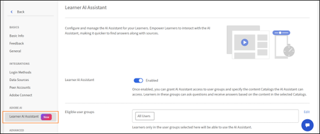
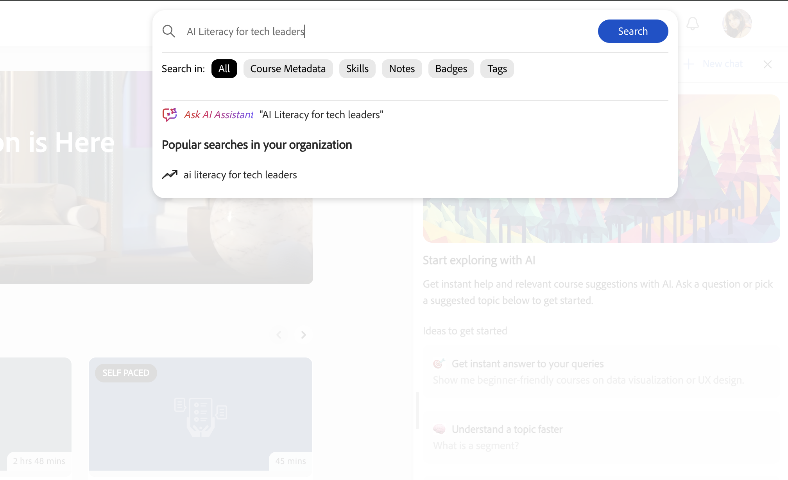

# AI Assistant for learners

## Introduction

Use the AI Assistant to get quick, accurate answers from your assigned learning content, generate course summaries, compare learning objects, find how-to answers, and create personalized learning paths, all without browsing through entire courses.

>[!IMPORTANT]
>
>The AI Assistant for learners is currently available as a beta feature. Capabilities, supported scenarios, and limitations may change as the feature evolves.

>[!NOTE]
>
>This feature is not available in FedRAMP-authorized environments. See [Feature availability in FedRAMP environments](/help/migrated/feature-availability-in-fedramp-authorized-environment.md) for details.

## What is the AI Assistant for learners

The AI Assistant is a generative AI-powered chat companion in Adobe Learning Manager that delivers quick, accurate answers using your trusted learning content. It includes citations so you always know the source of the information.

### Capabilities

- **Intelligent question answering**
  - Single-turn and multi-turn conversations
  - Natural language understanding in English
  - Answers derived from courses, certifications, learning paths, and job aids
  - Smart clarifying questions when queries are ambiguous

- **Content sources and citations**
  - Retrieves answers from available resources in supported catalogs
  - Provides citations with direct links to source materials
  - Supports all Learning Manager content formats (static and interactive): PDF, DOCX, PPTX, XLSX, audio (MP3, WAV, M4A), video (MP4, MOV, WMV), HTML, SCORM 2004, and SCORM 1.2

- **User experience**
  - Side panel interface accessible from all learner pages
  - Responsive design that adapts to the content area
  - Chat history maintained within the browser session
  - Clean slate on new login or page refresh
  - Friendly, clear, and pedagogically sound tone

- **Administrator controls**
  - Enable or disable the feature at the account level
  - Select which catalogs are included for AI responses
  - Terms of Use acceptance requirement following Adobe AI guidelines

## What the AI Assistant can do

The AI Assistant is a generative AI-powered chat companion that answers questions using your assigned learning content. Every response includes citations with direct links to the source material so you can verify information and continue learning in context.

In addition to answering questions, the AI Assistant can:

- **Summarize learning objects** — generate a quick overview of any course, job aid, learning path, or certification in your catalog without opening it
- **Compare learning objects** — identify differences between two courses side by side to decide which one fits your learning goals
- **Answer how-to questions** — source answers from Adobe Experience League, Adobe's official help documentation, for questions about using Adobe Learning Manager as a learner
- **Query third-party content** — ask questions about Go1 or LinkedIn Learning courses if your administrator has added those catalogs
- **Create a personalized learning path** — have a guided conversation with the AI Assistant to build a custom, sequenced learning plan based on your goals, background, and available time.

Your administrator controls which catalogs the AI Assistant uses. If you don't have access to a course, the AI Assistant won't surface information from it.

## Supported content types

The AI Assistant retrieves information from learning content assigned to you, including:

- **Documents:** PDF, Word, PowerPoint, Excel, HTML
- **Media:** Audio (MP3, WAV, M4A), Video (MP4, MOV, WMV)
- **Interactive content:** SCORM 1.2, SCORM 2004
- **Learning object types:** Courses, learning paths, certifications, job aids

Adobe securely processes your learning content using trusted services.

### Catalog and content source limitations

The AI Assistant only uses content from **Internal** catalogs that are explicitly configured by administrators.

The following content sources aren't supported in the current release:

- **Shared** catalogs
- **Acquired** catalogs
- **External** catalogs
- **Default** catalogs
- Third-party content libraries (for example, LinkedIn Learning or Go1)

If you don't have access to a course or job aid, the AI Assistant won't surface information from that content, and citation links won't be accessible.

## Use cases

### Technical learner

Sarah is a sales engineer learning about graphics cards. She needs to quickly understand the technical specifications and benefits to answer customer questions confidently.

The AI Assistant helps Sarah with:

- Clear, technical explanation of complex GPU architecture
- Deepen understanding about various graphic cards and their differences
- Explanation of examples so Sarah can relate features to real world use cases

### Customer support

Marcus is a support specialist at a partner company. He needs quick answers about product features to help customers without escalating to engineering teams.

The AI Assistant helps Marcus with:

- Finding relevant support content for freuently asked customer queries
- Asking clarifying questions when the initial answer isn't specific enough
- Finding recommendations for related troubleshooting courses to improve his skills

### New employee onboarding

Jennifer just joined the company and is overwhelmed by the amount of training material. She needs a way to find specific information without reviewing entire courses.

The AI Assistant helps Jennifer with:

- Getting a step-by-step guidance on submitting expense reports
- Discovering courses about company policies without browsing the entire catalog
- Guding her to the appropriate section of a course without making her watch hours of video

## How the AI Assistant uses content

The AI Assistant finds accurate answers from your learning content. Here's how it works.

### What content the AI Assistant uses

The AI Assistant answers questions using only the learning content enabled by the account administrator. Content from the selected catalogs is indexed.

The AI Assistant analyzes your assigned learning content to generate focused, contextual responses:

- Every response includes citations that reference the original source content.
- You can select a citation to navigate directly to the relevant course, module, or document.
- Citations help you verify information and explore additional context when needed.

### Streaming responses

The AI Assistant delivers answers progressively as they're generated, so you can start reading immediately without waiting for the entire response to load.

### Citations and source transparency

Every AI Assistant response includes citations that link directly to the original course, module, or learning object. Citations let you:

- Select an inline citation number to jump to the exact referenced section.
- Open the full source list by selecting **Show Sources** at the bottom of the response.
- Verify information and explore additional context from the authoritative source.

> **IMPORTANT**
> The AI Assistant provides answers based on content enabled by the administrator. If you don't have access to a referenced item, you'll see a "not supported" message when you try to open it.

## Built-in prompts

The AI Assistant includes built-in prompts to help you get started quickly with common questions and scenarios. These prompts guide you on how to interact with the assistant and demonstrate the types of questions you can ask.

Organizations can customize built-in prompts to reflect their learning goals, roles, terminology, or specific use cases. Administrators can work with their Customer Success Manager to configure or update built-in prompts. In the current release, you can't customize prompts directly in the Adobe Learning Manager interface.

## Set up the AI Assistant (administrators)

Administrators select which **Internal** catalogs can access the AI Assistant feature. Make sure the catalogs you assign include only the learning content appropriate for AI responses and citations, and that those catalogs are **Internal** (not **Shared**, **Acquired**, or **External**).

Before configuring the AI Assistant, confirm that you have administrator credentials and have identified catalogs should have access.

### Configure AI Assistant access

To enable Learner AI Assistant:

1.Log in to Adobe Learning Manager as an administrator.

2.Select **Settings** from the home page.

3.Select **Learner AI Assistant (Beta)** from the **Settings** menu.

4.Select the toggle switch to enable the **Learner AI Assistant (Beta)**.
<!---->
<!--5. Select one or more user groups from the **Eligible user groups** option.-->
<!--5. Select **Save** to apply the user group settings.-->

5.Select one or more catalogs from the **Eligible Catalogs** option.

6.Select **Save** to apply the catalog settings.

>[!IMPORTANT]
>
>Only **Internal** catalogs are supported. If a **Shared**, **Acquired**, **External**, or other non-Internal catalog is selected, its content won't be surfaced by the AI Assistant, even if it appears in the **Eligible Catalogs** list.

## Launch the AI Assistant (learners)

To launch the AI Assistant:

1. Log in to Adobe Learning Manager as a learner.

2. Select **Ask AI Assistant** on the home page.

3. When the **Learner AI Assistant** screen appears, select **Get Started**.

>[!NOTE]
>
>When launching the AI Assistant for the first time, you must provide your consent before using it. The consent dialog will only appear during this initial launch. For all subsequent launches, you will be taken directly to the AI Assistant to enter your prompts.

4.Type your prompt in the text field.
<!--  -->

5.Press **Enter** to receive a response. Review your answer, sources, and recommendations.

You can:

- Select the citation number inline to jump to the exact referenced section
- Open the full list of sources by selecting **Show Sources** at the bottom of the response

The AI Assistant includes citations with every response to show where the information comes from. Each citation links directly to the original course, module, or learning object used to generate the answer.

You can select any citation to open the course page in Adobe Learning Manager and review the full content in context. Citations help you verify information, explore additional details, and continue learning from the authoritative source.

## Access the AI Assistant via search

You can also launch the AI Assistant directly from the search bar. Type your question in the search field, then select **Ask AI Assistant** from the options that appear.

## Provide feedback on AI Assistant responses

Your feedback on the responses generated by the AI Assistant (Beta) helps improve its accuracy, relevance, and overall performance.

### Like or dislike a response

- Select **Thumbs Up**, choose what you found helpful in the response, optionally add comments, and then select **Submit**.
- Select **Thumbs Down**, choose the reason the response wasn't helpful, add any comments, and then select **Submit**.

## Start a new chat

Starting a new chat lets you begin a fresh conversation, clearing prior context so the assistant can focus on the new topic without referencing previous interactions.

To clear the current conversation and start fresh, select **New chat** in the AI Assistant screen and then select **Yes**.

The AI Assistant provides learners with fast, contextual answers, supports multiple content types, and offers inline citations for transparency. Administrators can control access, ensuring the AI Assistant is tailored to organizational needs and enhances the learning experience.

## Get summaries and answers from specific Learning Objects in Learning Assistant

Adobe Learning Manager's Learning Assistant can generate a summary of any course, job aid, learning path, or certification in your catalog\. The summary is drawn from the course content and module transcripts stored in the catalog.

### Search for a course

1. Open _Learning Assistant_ from your learner home page.
2. In the chat panel, type / to initiate a content search.

>[!NOTE]
>
>Learning Objects not added to the catalog are not searchable. You can access any content that you have access to, but the Learner Assistant only fetches the summary from the module content.

1. Type the name of the course, job aid, Learning Path, or certification you want to summarize\. A type\-ahead list of matching catalog items appears.
2. Select the Learning Object from the list.

### Generate a quick overview of a course

Use this feature when you need a fast, reliable snapshot of a course without opening it in full\. Common scenarios include:

- Revisiting or brushing up on learning 
*Scenario:* A sales rep completed a "Negotiation Fundamentals" course six months ago and now has a big client renewal call tomorrow. Instead of re-watching all four modules, they ask Learning Assistant to summarize the course and get a quick refresher on the key negotiation tactics covered\.
- Deciding whether to enroll_
*Scenario:* A new manager sees "Leading Through Change" recommended in their catalog but isn't sure if it's the right fit for their current team situation. They ask for a summary first, see that it focuses heavily on remote-team change management, and decide to enroll because it matches what they need.
- Preparing for or referencing a topic_
*Scenario:* A support engineer is about to join a customer call about a product feature they haven't touched in a while. Rather than digging through a 45-minute training course, they ask Learning Assistant to summarize the relevant course so they can quickly refresh the key steps and terminology before the call.

1. In the chat input, type a query such as summarize this course or give me a summary of this course.
2. Select **Send** to submit your query.
3. Learning Assistant generates and displays a summary based on the course modules and content stored in the catalog.

### Best practices

- Use specific course names when searching to get accurate type-ahead results.
- You can request summaries for courses, job aids, learning programs, and certifications.
- Review the summary to quickly determine whether a course addresses your learning goals before enrolling.

## Compare Learning Objects in Learning Assistant

Adobe Learning Manager's Learning Assistant lets you compare up to two Learning Objects from your catalog side by side. Use this feature to understand the differences in content, scope, or focus between two courses before enrolling.

### Select Learning Objects to compare

1. Open _Learning Assistant_ from your learner home page.
2. In the chat panel, type / to initiate a content search.
3. Type the name of the first Learning Object. A type-ahead list of matching catalog items appears.
4. Select the first Learning Object from the list.
5. Type / again and search for the second Learning Object.
6. Select the second Learning Object from the list.

>[!NOTE]
>
>You can compare a maximum of two Learning Objects in a single query.

### Request the comparison

1. In the chat input, type a query such as what is the difference between these two courses or compare these learning objects.
2. Select _Send_ to submit your query.
3. Learning Assistant generates and displays a comparison that highlights the differences in content between the two learning object.

### Best practices

- Review individual course summaries before comparing to understand each course briefly.
- Use the comparison result to identify which course covers topics most relevant to your role or skill gap.
- If catalog items aren't appearing in the type\-ahead, confirm with your administrator that both Learning Objects are part of your assigned catalog.

## Experience League answers in Learning Assistant

Understand how Adobe Learning Manager's Learning Assistant can answer learner questions using content from Adobe Experience League, including links to relevant help articles.

### How Learning Assistant uses Experience League

Adobe Learning Manager's Learning Assistant can source answers from [Adobe Experience League](/help/migrated/user-guide.md), Adobe's official help and documentation site. When a learner asks a procedural or how-to question, Learning Assistant can retrieve a relevant answer and include a link to the full Experience League article.

### What kinds of questions Learning Assistant can answer

Learning Assistant can answer questions about how to use Adobe Learning Manager as a learner. Examples include:

- How to enroll in a manager-nominated course
- How to access a learning program or certification
- How to find and view your completed courses

When Learning Assistant finds a relevant answer in Experience League, the response includes a link to the source article so you can explore the full documentation.

### How this differs from Admin Assistant

The [Admin Assistant](/help/migrated/administrators/feature-summary/alm-ai-assistant.md) in Adobe Learning Manager has provided Experience League-sourced answers for administrators since earlier releases. The August 2026 enhancement extends this capability to the learner-facing Learning Assistant so that learners can also get help without leaving the platform.

Both the Admin Assistant and the learner\-facing Learning Assistant use the same underlying Experience League content to generate answers.

## Support for third-party content in Learning Assistant

Adobe Learning Manager's Learning Assistant can answer learner questions about Learning Objects from any third\-party content available on the platform, as well as native Adobe Learning Manager content. Before learners can query these courses, an administrator must add the Go1 or LinkedIn Learning catalog to Adobe Learning Manager.

### How third-party catalog support works

>[!IMPORTANT]
>
>As a prerequisite, an administrator must add the required catalogs to the Learner Assistant. See[ Configure AI Assistant access](https://experienceleague.adobe.com/en/docs/learning-manager/using/learner/learner-ai-assistant#configure-ai-assistant-access) for more details.

When an administrator adds a Go1 or LinkedIn Learning catalog to Adobe Learning Manager, the catalog content goes through a scheduled ingestion process. After ingestion completes, the learning objects from that catalog become available for Learning Assistant to query.

Ingestion typically completes within one to two hours of the administrator adding the catalog.

Once ingestion is complete, learners can ask questions about the Go1 or LinkedIn Learning courses in the same way they query native Adobe Learning Manager content\. For example, a learner can request a summary of a Go1 course or compare a LinkedIn Learning course with an Adobe Learning Manager course using the / command.

- Adobe Learning Manager doesn't have content transcripts for third-party content, so transcripts aren't used to retrieve answers. Answers are retrieved only from available metadata, such as title, description, and overview.
- Only _English_ is supported currently.

### Requirements

For Learning Assistant to query Go1 or LinkedIn Learning content:

- An administrator must add the relevant Go1 or LinkedIn Learning catalog to Adobe Learning Manager.
- The scheduled catalog ingestion must complete before the courses are available for querying.
- The Learning Objects must be part of the learner's assigned catalog.

## Troubleshoot AI Assistant issues

> **NOTE**
> After configuring a new catalog, allow 4–5 hours for the content to be indexed and available for AI Assistant responses.

### No access to content

**Problem:** A learner has access to the AI Assistant but receives "I don't have an answer to this question" responses.

**Possible causes:**

- The learner's catalogs aren't included in the AI Assistant configuration.
- Content related to the question isn't in the selected catalogs or the catalogs are empty.
- The learner doesn't have visibility to the relevant content.

**Solution:**

- Verify the learner's catalog access.
- Check which catalogs are enabled in AI Assistant settings.
- Ensure relevant content exists in those catalogs.
- Wait a few hours after adding new content for it to be indexed.

### Irrelevant or poor-quality answers

**Problem:** The AI Assistant provides answers that don't match the question or are low quality.

**Possible causes:**

- The question is too broad or ambiguous.
- Relevant content has poor metadata (descriptions, tags).
- Content structure makes it difficult to extract information.

**Solution:**

- Encourage learners to ask more specific questions.
- Review and improve course descriptions and metadata.
- Ensure content has clear headings and structure.
- Review the detailed usage report to identify patterns.
- Consider creating job aids for frequently asked questions.

### Out-of-scope questions

**Problem:** A learner asks questions unrelated to training content.

**Examples:**

- General knowledge questions ("Who is the president?")
- Personal opinions ("What do you think about X?")
- Inappropriate content

The AI Assistant is designed to answer questions based only on assigned learning content and won't respond to out-of-scope queries.

### Go1 or LinkedIn Learning courses aren't appearing in Learning Assistant search

Confirm with your administrator that the Go1 or LinkedIn Learning catalog has been added to Adobe Learning Manager and that the catalog ingestion has completed. Ingestion may take up to one to two hours after the catalog is added.

### A recently added course isn't available yet

Wait for the scheduled catalog sync to complete. If the course still doesn't appear after two hours, contact your administrator to confirm the catalog connection is active.
