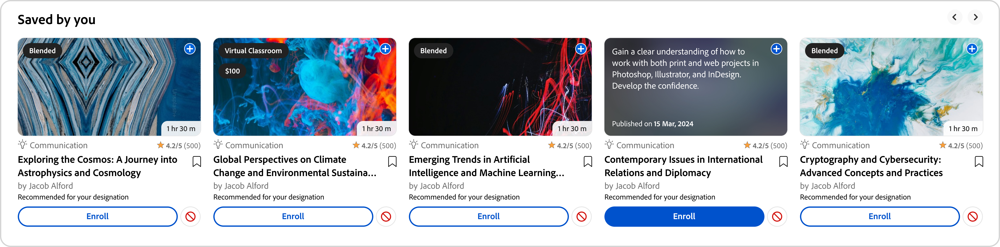

# Learner home page

## Overview {#overview}

After the Administrator enables Immersive layout, the learner, after signing into the app, is greeted with a completely revamped User Interface. 

>[!NOTE]
>
>The Immersive Layout is not supported on the IE11 browser.

## New learner UI for immersive layout

>[!IMPORTANT]
>
>The new learner UI will be released in phases. 

The **Learner UI** has been refreshed with a more elegant and modern design. The new UI aims to provide a consistent user experience. The following pages are getting a new and modern look: **[!UICONTROL Learner Home]**, **[!UICONTROL My Learning]**, **[!UICONTROL Catalog]**, and **[!UICONTROL Course Overview]** landing pages. Course cards also have a new design to display details in a modern way. Hovering over a course card shows the course description and publication date. 
The new refreshed visual elements align with modern design trends, making the product look intuitive and appealing. This includes a new masthead, side panel, and modern-looking widgets.

>[!NOTE]
>
>The revamped **User Interface** applies only to the **Immersive layout**. These changes are not supported on the mobile web/app yet and will be updated in a future release.

_Old user interface_
 
 
_New user interface_

### Homepage

The homepage has a new design with an improved side panel, top header, enhanced course cards, and modern-looking widgets.

 
_New homepage_

### Catalog page

Catalog pages have a new look with organized filters and enhanced course cards to provide a better user experience. 

_Catalog page_

### Course overview page

The course overview page has a new look with more details about the course. This helps learners get all the information they need.

 
_Course overview page_

### Course cards

Consistent player launch from all pages to give learners a unified experience and easy access to course/learning paths
Revamped course cards now highlight relevant metadata required for enrollment. This metadata includes correct published or due dates, ratings, and a description along with their authors/providers. 

_Old course card_

 
_New course card_

For **LinkedIn** and **Go1** courses, the course cards will show the real publish dates from **LinkedIn** and **Go1**. You can also see these actual publish dates on the **User Interface**.

### Sidebar and search bar

The sidebar is updated with new UI elements for a cleaner look. The new search bar has no search icon, giving it a more modern look. Learners can type a keyword and press enter to start the search or select results that appear below the search bar.

_Sidebar and search bar_

### Masthead {#masthead}

Features a video or image carousel with an embedded URL. The [Administrator can upload any image or video](../../administrators/feature-summary/announcements.md#masthead) asset as a masthead and set its visibility for a group of learners.

*View masthead*

### My Learning List {#mylearninglist}

Displays the training that the learner had taken. These trainings are displayed as cards lined up horizontally. You can click the right or left button to browse the courses. 

*View My Learning list*

You can also can also swipe left and right to navigate through the list.

To resume a course, click **[!UICONTROL Continue]** on a card, and the player will launch. 

The appearance of icons on each training card is enabled/disabled by the Admin via the Admin app (**Settings** > **General** > **Enable Training Card Icons**).

**Add to My learning List**

If you hover on any course card in the **Recommended based on your areas of interest** and **Recommended based on peer activity lists**, you can see an option to add the course to the **My Learning List**. Click **[!UICONTROL +]** on the course card and the course will get added to the **My Learning List**.

*Add to My learning List*

## Choose skill levels {#chooseskilllevels}

As a learner, you can filter the course catalog according to these levels:

* Beginner
* Intermediate
* Advanced

Choose an option and you can then see the course catalog according to the selection.

*Select skill levels*

## Compliance dashboard widget

The Compliance dashboard widget allows learners to filter courses/learning paths/certifications that have upcoming deadlines using the Compliance label. This feature is available on all learner apps, including ALM Teams app, AEM, Mobile app, Immersive, and SF app.

_Compliance dashboard widget_

## Calendar {#calendar}

Shows your scheduled sessions and training. Browse the calendar to see training for subsequent months. 

*View calendar for scheduled sessions*

The Calendar widget has the following features. You can view:

* Training by month. Scroll left or right.
* Upcoming classroom or VC training that are available to you for enrollment.
* Upcoming classroom or VC training you have enrolled in.
* Manager-approved classroom or VC training.

## Social feed {#socialfeed}

*View social feed*

See what other users are talking about.

The widget summarizes activity for a period. It:

* Displays active users and their activities of the users who are in your scope or group.
* Displays posts made in the last two weeks.

## Profile Skills {#profileskills}

Profile skills are used for course recommendations. If the Administrator assigns a skill to a user or group of users, the skill gets added to the profile skills of the learner. If the learner adds a skill to his/her profile, all levels of the skill get added to the learner's profile skills. When a learner hovers on a skill, he/can see the name of the skill, method of addition of the skill, level, percent of completion of the skill, and credits.

 
*View profile skills*

If a learner enrolls in a course, only the external skills that are based on a score get added to the profile skills. In addition, a learner can search, select, and add external skills to his/her profile.If a learner has logged in to the learner app for the first time, and if the learner's skills are already present, the skills appear on My Profile. 

## Recommendation based on your area of interest {#recommendationbasedonyourareaofinterest}

Displays training based on your chosen area of interest. The recommendation is driven by a Machine Learning algorithm. 

*View recommended courses*

For more targeted recommendations, you can update your skills by clicking on **View/Update**. 

After you add a skill, future recommendations will become more targeted and focused according to your preferences.

If the Admin disabled the option **Explore Skills**, you would be able to add interest to your skills.

The recommended courses are displayed as cards. When you mouse hover a card, you can see more details of the course.

Product terminology is also supported.

**Industry Aligned Skills**

You will be able to see the network graph of skills if the Admin has enabled the option **Industry Aligned** in the Admin app.

These skill can only be viewed when the Admin sets the training type to Industry Aligned.

In the Skill Map visualization, you can search for a skill or skills and add those.

*Skill map visualization*

Enable the option **Show Skills for which trainings are present in my account**, if you want to display all the skills that are in your account.

After you add a skill, you can see the force directed graph with the selected skill as the primary vertex and the associated skills as smaller vertices.

The skills that you chose also displays in the **Selected Skills** section.

*Selected skills*

To add the skills, click **[!UICONTROL Add]**.

## Recommendation based on peer activity {#recommendationbasedonpeeractivity}

Displays training based on what your peers are taking. This is again driven by a Machine Learning algorithm. The recommendations are based on training for both Custom and Industry Aligned learners.
