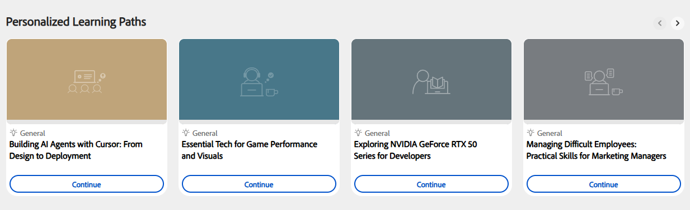

# What is Learning Path Agent

A Learning Path Agent creates a structured Learning Path using the AI assistant. Unlike standard learning paths assigned by your administrator, such Learning Paths are generated through a guided conversation. You describe your goal, and the agent builds a path matched to your learning needs.

The agent draws content from your organization's internal course catalog first, prioritizing courses that are approved and relevant to your team. If your administrator has enabled third-party content, the agent may also include courses from connected external providers to fill any gaps in coverage. You are always automatically enrolled in the courses within your saved path, so you can start learning immediately.

Personalized Learning Paths are designed for two main use cases:

- **Targeted skill development**: When you need to achieve a specific business outcome or reach a performance goal quickly, such as preparing for a new responsibility or closing a skill gap identified in a review.
- **Building deep expertise**: When you want to advance from beginner to expert in a chosen domain, technology, or discipline over a longer timeframe.

## How the conversation-based approach works

The agent meets you where you are. You start by describing what you want to learn in plain language, in as much or as little detail as you have. The agent then asks follow-up questions to understand your role, your specific challenges, and how much time you can dedicate to learning each week.

From your answers, the agent identifies 3–5 learning topics with suggested proficiency levels. You can review these topics, request changes, or confirm them before the agent searches for matching courses. The agent then generates a named learning path showing each course, its description, duration, and module count. You can adjust the path further before saving it.

When you save the path, you are automatically enrolled in all courses. The path appears on your home page in the _Personalized Learning Paths_ section, ready to start.

### Content sources and course selection

The agent selects courses based on relevance to your stated goal, your current proficiency level, the total time you have available, and how recently the content was updated. When the agent cannot find matching courses for a specific topic in the available catalog, it tells you and suggests reaching out to your administrator to request additional content for that area.

### Personalized Learning Paths on the home page

All saved personalized learning paths appear in the _Personalized Learning Paths_ strip on your home page. Each card shows the path name, number of courses, and a _Continue_ button to resume where you left off.

