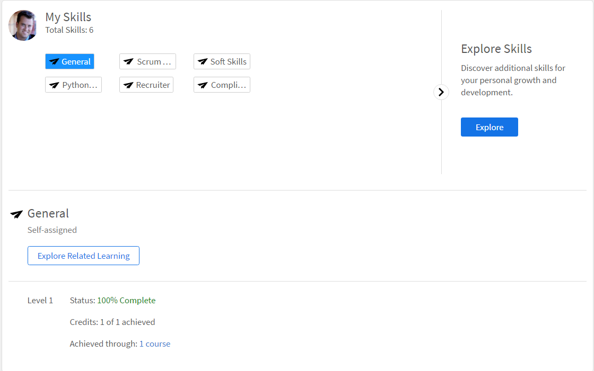

Read this article to know how to achieve skills in Learning Manager, as a learner.

Skills map is a grouping of skill sets, knowledge, and traits of an employee in an organization. These skills help companies/organizations to set or raise the performance expectations for its employees. Skills enable employees to align their behaviors to organizational expectations.

Adobe Learning Manager enables you to map the performance of learners based on their skill sets using the Skills widget. When learners complete taking up some courses, learners can know their standing against each skill&nbsp;by clicking on Skills from the Learners Home page.

# View skills {#viewskills}

To view the skills, click any one of the skill names in the Skills widget on the Learner page. Skills are displayed along with their levels adjacent to them.

The percentage of completion for each skill is available next to the skill on the widget. When you click on each skill, the app takes you to the Skills page, where you can view the details of the skill that you clicked.

The Skills page displays the Status of the skill that you clicked. For example, Java. The Skill page displays the Status - for example "In Progress", and the credits - for example "2 out of 10 achieved".

From this page, you can click each of your skills to view the corresponding data.

Only administrators can create and assign skill to learners. Learners are automatically assigned to skill corresponding to the enrolled courses/learning programs.

# Achieve skill  {#achieveskill}

A learner can achieve skill as and when they complete the assigned courses/learning programs with skill credits assigned to it. Learners can also achieve skill by self-enrolling to the courses that belong to a particular skill and completing it.
