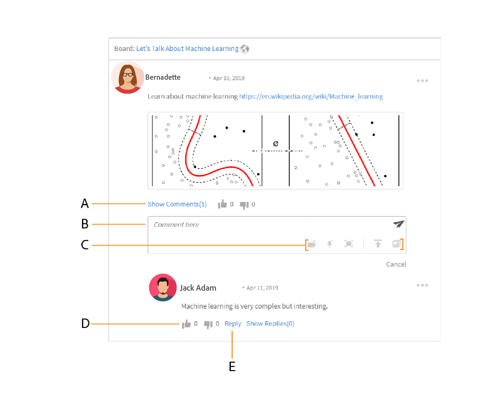
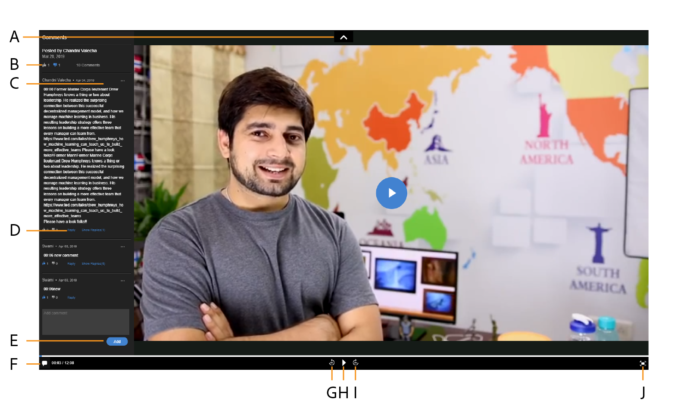
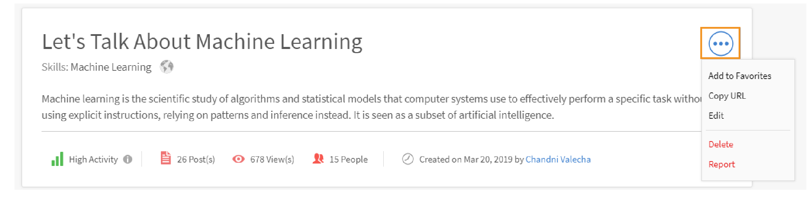
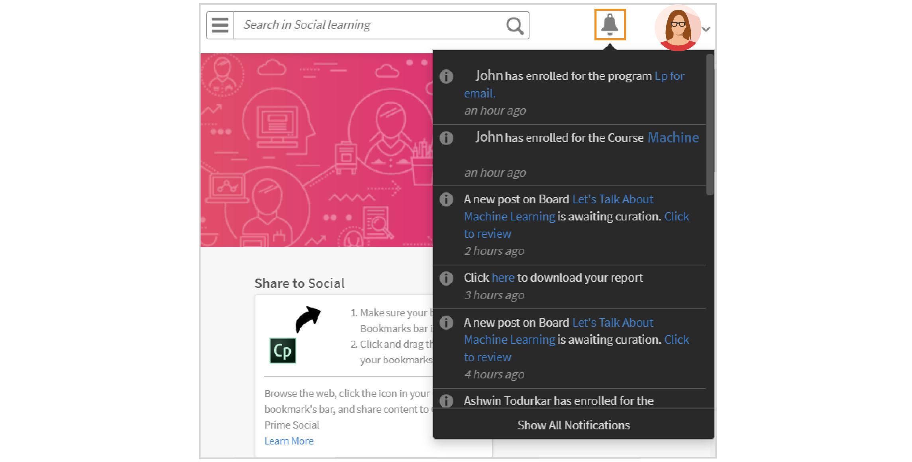

# Social Learning in Captivate Prime

Learn how to use Social Learning web as a learner

Social learning is a platform in Captivate Prime which engages users to share ideas and meaningful insights in an informal environment. It is a methodology which supplements the idea of traditional learning. Completing an online course does not give an advantage to users to interact with their peers at a social level.

By simply attending a training, does not guarantee that users retain everything that is taught. On the other hand, social learning allows users to use the expertise around them to get exactly the information they need. In turn users can quickly apply that information to complete a task, and achieve a goal.

Similarly, Captivate Prime Social Learning feature allows users to be able to interact with one another by being able to share and learn from content.  

On this platform, the different type of content that can be shared are video, audio, screenshot, text, question, and poll. Users can also share their online learnings with their peers by using the **Share to Social bookmarklet**. For more information, see  [Share to Social Learning](share-to-social.md).

Content can also be posted inside a board with the help of the **Adobe Captivate Prime desktop application**. For more information, see  [Adobe Captivate Prime app for desktop](../adobe-captivate-prime-app-for-desktop.md).

Only if the administrator enables Social Learning, the feature is visible to a learner .

 

<table width="100%" cellspacing="0" cellpadding="1" border="1">
 <tbody>
  <tr>
   <td width="48">
    
<b>Sl. No.</b>
</td>
   <td width="174">
    
<b>Terminology or Concept</b>
</td>
   <td width="402">
    
<b>Brief Explanation</b>
</td>
  </tr>
  <tr>
   <td width="48">
    
1
</td>
   <td width="174">
    
My Boards
</td>
   <td width="402">
    
A board is <g class="gr_ gr_58 gr-alert gr_gramm gr_inline_cards gr_run_anim Grammar only-ins replaceWithoutSep" id="58" data-gr-id="58">
      collection
     </g> of posts created by a user. My boards display all the posts that the user has participated, created, and followed.
</td>
  </tr>
  <tr>
   <td width="48">
    
2
</td>
   <td width="174">
    
All Boards
</td>
   <td width="402">
    
In the All boards page, users can view the boards created by all learners that share activity scope.
</td>
  </tr>
  <tr>
   <td width="48">
    
3
</td>
   <td width="174">
    
Comment
</td>
   <td width="402">
    
Users can comment and view posts that are created in boards. 
</td>
  </tr>
  <tr>
   <td width="48">
    
4
</td>
   <td width="174">
    
Reply
</td>
   <td width="402">
    
Users can reply to comments that are made on posts inside a board.
</td>
  </tr>
  <tr>
   <td width="48">
    
5
</td>
   <td width="174">
    
Upvote/Downvote
</td>
   <td width="402">
    
Click the upvote and downvote button to like or dislike a post.
</td>
  </tr>
  <tr>
   <td width="48">
    
6
</td>
   <td width="174">
    
Social Leaderboard
</td>
   <td width="402">
    
In social leaderboard, users can view the names of learners with the number of points they have gained by participating in Social Learning.
</td>
  </tr>
  <tr>
   <td width="48">
    
7
</td>
   <td width="174">
    
People I follow
</td>
   <td width="402">
    
Here users can view the names of other learners they follow and the number of posts they have created.
</td>
  </tr>
  <tr>
   <td width="48">
    
8
</td>
   <td width="174">
    
Popular Skills
</td>
   <td width="402">
    
In the All boards sections, the skills that have been frequently used by learners can be viewed along with the number of posts they have created using that skill.
</td>
  </tr>
  <tr>
   <td width="48">
    
9
</td>
   <td width="174">
    
Share to social
</td>
   <td width="402">
    
Share to Social is a bookmarklet that allows users to share their online learnings like web pages and blogs directly to Captivate Prime Social Learning.
</td>
  </tr>
  <tr>
   <td width="48">
    
10
</td>
   <td width="174">
    
New Post
</td>
   <td width="402">
    
New post button allows users to create and post content inside boards.
</td>
  </tr>
 </tbody>
</table>

## Creating content as a post {#creatingcontentasapost}

Content is created as a post inside a board. To create a post, follow the below steps:

1. Click **New Post.**

   

1. Select any of the following types of contents to be posted: Text, question, video, audio, poll, and screenshot. Existing content can be uploaded from users system or from the Adobe Captivate Prime desktop application's gallery.

   Use Adobe Captivate Prime desktop app to record a video or screen, audio, and take a screenshot. For more information, see [Adobe Captivate Prime desktop application](../adobe-captivate-prime-app-for-desktop.md). 

   

1. Search for a board or skill that relates to the post. If the board does not exist, click **Create a New Board**. 

   

   If you are an external or internal user, and if the Administrator has granted you access to create a board, you can ceate a board. If you do not have the permissions to create a board, the link **Create a New Board **does not appear. 

1. From the pop-up dialog box, fill in the details, select the following type of board:

   * **Public** – Participation and visibility of posts is available to all users.
   * **Private**- Post is only visible to the creator of the board, moderators, and user(s) added to the board.
   * **Restricted**- Only board owner, administrator, and board moderators can create post. Other users can participate by commenting/replying, upvoting/downvoting and so forth. 

   

1. **Note:**

   *In Social Learner app, only an **Admin **has the capability to create private board with user groups (internal/external).*

   *Any other user except Admin, Author, Learner, manager, instructor, etc. **cannot **create private boards with user groups. They cannot see the section of **user groups** in while creation of private board.*

   Admin only- When you choose **Private**, you see two options- **Users** and **User Groups**. Choose the option **User Groups**, and then add the user groups with who you want to share the private board.

   In the User Groups field, you can choose internal, external, or custom groups. Your private board will then be visible to all the specified user groups, irrespective of scope settings.

1. To share content, click **Post**. On clicking Post the user gets a notification.

   The content is posted based on the curation setting set by the administrator for Social Learning content which can be curated by  [Board Moderators/Subject Matter Experts](social-learning-web-user.md#HowtobecomeaSubjectMatterExpertSME).

   

1. Users receive notifications when their post is approved or rejected, if the administrator has set the curation setting to Manual-Only curation. If the post is rejected, click the **Click to Review** hyperlink to review comments given by the board moderators or Subject Matter Experts (SMEs).

   Content created by users are curated by Board moderators or Subject Matter Experts.

   

When creating or replying to a post in Social Learning, you can compose a post using the Rich Text Editor and apply different types of formatting. 

In addition, when creating a board, you have access to the same set of options in the Rich Text Editor. 

## Viewing approved content {#viewingapprovedcontent}

Once a post is approved, it is displayed in a Social Learning board. Users can now, comment, reply, upvote/downvote on the post.

Users can use the following type of content to make a comment: Record Screen, webcam, or both, Record Audio, Take Screenshot, Upload File, Captivate Prime Gallery. 

## Content in Social player {#contentinsocialplayer}

In Captivate Prime, videos, static content like presentations and images are posted inside Social player in a board. You can uploading a file from your system, recording a video/screen, and capture a screenshot with the assistance of Adobe Captivate Prime desktop application.

Once the user has finished posting some content, it can be viewed by other learners in their activity scope. On Social player learners can view, comment/reply, upvote/downvote, and report abuse. 

**To comment/reply, upvote/downvote on social player, follow the below steps:**

1. Click the full screen button from the lower-right corner of the social player.
1. To view the player controls on the screen, click the downward facing arrow.
1. To view the comment section, click the comments icon from the lower-left corner of the screen.
1. Users can comment/reply, upvote/downvote, and report abuse.
1. Click the Esc key to exit full screen mode.

## Board view in social {#board-view-social}

A Learner can see all boards in a list view. Sign in to your learner app and in your Social Learning page, click the button, as shown below: 

When you view the posts in a board format, you can then sort the posts according to **Post **and **Contributor**. 

* If you choose **Posts**, the boards will be sorted according to the number of posts made in the board.
* If you choose **Contributors**, the boards will be sorted according to the number of users who've commented or replied in the threads.

### Skill filter {#skillfilter}

Using the Skill filter, you can select multiple skills to filter the boards. You can also clear the filters once you've selected the skills.

### Activity Level filter {#activitylevelfilter}

Using the Activity filter, you can sort the boards according to the magnitude of interactions in a board. You can sort these according to:

* High activity
* Normal activity
* Low activity

In the board view, you can perform the usual board-level actions.

## Download posts {#downloadposts}

Learners can download the content, with attachments, from Social Learning Platform, so that they can use this content offline.

You can download the content from the Posts or Comments or the Replies sections. You can download only one file at a time.

Both types of users (Internal or External) must be able to download the content. 

The Download button can also be seen in search results for posts or comments or replies.

You cannot, yet, download a post in the device app. This feature will be available soon.

## Supported content formats {#supportedcontentformats}

<table>
 <tbody>
  <tr>
   <td>
    
<b>Content type</b>
</td>
   <td>
    
<b>Extensions</b>
</td>
  </tr>
  <tr>
   <td>
    
Video
</td>
   <td>
    
wmv, f4v, asf, 3gp, 3g2, avi, mov, h264, m4v, mp4, MPEG, mpg
</td>
  </tr>
  <tr>
   <td>
    
Audio
</td>
   <td>
    
mp3, amr, m4a, wav, wma, aac
</td>
  </tr>
  <tr>
   <td>
    
Static Files
</td>
   <td>
    
PDF, ppt, pptx, doc, docx, xls, xlsx
</td>
  </tr>
  <tr>
   <td>
    
Image
</td>
   <td>
    
jpg, jpeg, png, bmp, gif
</td>
  </tr>
 </tbody>
</table>

## Board visible only to selected users {#selected-users}

A learner who also has an **admin** role can add a user group to a private board. Any user group can be added to the private board and the users belonging to the user group only has access to the board.

If a new user are added to the user group, both users can see the private board.

If any user is removed from the private board, the user can no longer see the private board.

If multiple user groups are added to the private board, all the users of both the groups get access to the private boards.

## Actions that can be done on a post {#actionsthatcanbedoneonapost}

Click the collapsed menu icon from the upper right corner of a post to view its options. The following menu list is displayed: Edit, add to my story, copy URL, delete and report.

Only some users have permissions to perform particular tasks. The following types of users are content owners, board moderators, and the administrator of the organization. 

<table>
 <tbody>
  <tr>
   <td>
    
<b>Sl. No.</b>
</td>
   <td>
    
<b>Action</b>
</td>
   <td>
    
<b>Explanation</b>
</td>
  </tr>
  <tr>
   <td>
    
1
</td>
   <td>
    
Edit
</td>
   <td>
    
Edit allows the creator of content to correct or modify their post.
</td>
  </tr>
  <tr>
   <td>
    
2
</td>
   <td>
    
Add to my story
</td>
   <td>
    
A story is a collection of content curated by a user. Users can set the visibility of the content to Private or Public.
</td>
  </tr>
  <tr>
   <td>
    
3
</td>
   <td>
    
Copy URL
</td>
   <td>
    
This option allows all users to copy the URL of a board or post and share it.
</td>
  </tr>
  <tr>
   <td>
    
4
</td>
   <td>
    
Delete
</td>
   <td>
    
Delete option removes  the post after user’s confirmation.
</td>
  </tr>
  <tr>
   <td>
    
5
</td>
   <td>
    
Report
</td>
   <td>
    
Every user has permissions to report an abuse of a post if it violates their privacy, or its content is inappropriate.

    
Once a post is reported, a notification is sent to the board administrator and moderators for further actions.
</td>
  </tr>
 </tbody>
</table>

**Add to my story**

Social story allows users to add or create stories with posts created by them or other users.

To add a post to a story, follow the below steps:

1. Click the collapsed menu icon from the upper right corner of a post and click **Add to my Story**.

   

1. From the **Select story** dialog, select a relevant story to add the post. If there are no relevant existing stories, create a story by clicking **New Story**.

   

1. From the New Story dialog, fill in the Story Name and description fields. You can also set the visibility of the story to Public or Private.

   

   To view stories created by users, click user's name from the profile menu options.****

## User privileges for performing the actions on a post {#userprivilegesforperformingtheactionsonapost}

<table>
 <tbody>
  <tr>
   <td>
    
 
</td>
   <td>
    
<b>Content owner</b>
</td>
   <td>
    
<b>Any user</b>
</td>
   <td>
    
<b>Board moderators</b>
</td>
   <td>
    
<b>Administrator</b>
</td>
  </tr>
  <tr>
   <td>
    
<b>Edit</b>
</td>
   <td>
    
Yes
</td>
   <td>
    
No
</td>
   <td>
    
No
</td>
   <td>
    
No
</td>
  </tr>
  <tr>
   <td>
    
<b>Add to my Story</b>
</td>
   <td>
    
Yes
</td>
   <td>
    
Yes
</td>
   <td>
    
Yes
</td>
   <td>
    
Yes
</td>
  </tr>
  <tr>
   <td>
    
<b>Copy URL</b>
</td>
   <td>
    
Yes
</td>
   <td>
    
Yes
</td>
   <td>
    
Yes
</td>
   <td>
    
Yes
</td>
  </tr>
  <tr>
   <td>
    
<b>Delete</b>
</td>
   <td>
    
Yes
</td>
   <td>
    
No
</td>
   <td>
    
Yes
</td>
   <td>
    
Yes
</td>
  </tr>
  <tr>
   <td>
    
<b>Report</b>
</td>
   <td>
    
Yes
</td>
   <td>
    
Yes
</td>
   <td>
    
Yes
</td>
   <td>
    
Yes
</td>
  </tr>
 </tbody>
</table>

## Viewing Content in boards {#viewingcontentinboards}

Boards are a collection of posts. Every board in Social Learning is created based on a skill. In Social Learning, users can view the **All Boards** page and **My Boards** page.

In the All Boards page, posts or boards created by all users in a activity scope are visible. But in the My boards page, only boards created, followed and participated by a user is visible.

In the My Boards Page, the boards visible can be filtered according to the following:** All**, **Created by me**,** Commented by me**, **Followed by me**. 

In both, My Boards and All boards, users can sort the boards by **Relevance** or **Date**.

While creating a post, if there are no relevant boards to the post, click [Create a new board](social-learning-web-user.md#Creatingcontentasapost).  To view, edit, delete, report, copy URL and add a board to your favorite board list, follow the below steps:

1. Click the board name or click **Go to board**.
1. From the boards page, click the collapsed menu icon and select an option from the drop-down list.

   

**Users can view the following options on a boards page:**

* The number of posts, views, and people following the board is visible on this page. The name of the board creator and date that the board was created is also displayed along with the top SMEs for the board.

* The names of boards added to a user's favorite board list is also displayed.

## Share to Social {#sharetosocial}

Share to Social is a bookmarklet that allows users to share their online learnings like web pages and blogs directly onto the social page as a post. For more information, see [Share to Social Learning](share-to-social.md).

## My Skills {#myskills}

Users can view the skills and number of posts or boards created using a skill in the My Boards page. To view all skills used by the user while creating a board, click **See all Skills**.

## People I Follow {#peopleifollow}

In the My Boards page, users can view the names of people they follow and the number of posts they have created.

To follow other users, follow the below steps:

1. To view another user's profile page, click their name.
1. Click follow/ unfollow button to perform the desired action.

   

## Social Leader board {#socialleaderboard}

Social leaderboard enhances gamification. Activity points are awarded to users on creation of a new post/board, on getting an upvote for his/her post, on providing the right answer to a question and other participations in Social Learning.

The total number of points and new posts for all users in the same scope is visible in the social leaderboard list. The learner with the maximum number of points appears on top of the social leaderboard list followed by the other learners accordingly.

Click **Go to Leaderboard** in the **My Boards** page to view all learners and the number of points they have been awarded.

## Activity points {#activitypoints}

The number of activity points given to users are based on Social activities performed.

**Activity points are awarded to users for the following:**

* 5 points for creating a board.
* 5 points for adding a post as text, or question type.
* 2 points for commenting on any post.
* 1 point is awarded to the user who is the first to start using a board. Users gain a total of 20 points for the first 20 new posts posted in that board.

## How to become a Subject Matter Expert (SME) {#howtobecomeasubjectmatterexpertsme}

A subject matter expert (SME) is a person with the expertise in a particular skill. In Captivate Prime Social Learning, users are designated as SME’s based on the maximum number of activity points awarded to them for a skill.

Top SMEs have the privilege to curate learner’s content before it gets posted in a board in Social Learning.

The administrator of the organization also has the privilege to add more points to a learner to make them a SME for a skill.

## How to curate content as a SME? {#howtocuratecontentasasme}

1. On creation of a new post or board by a user, the SME gets a notification displaying that a post on a board is awaiting curation. 

   

1. To moderate the post, click the **Click to review **link. This action navigates the SME to the content moderation page which looks like the below screenshot.

   

1. To rate content based on percentage of relevancy it has to a board's skill, select the color in the relevancy scale. The first color is rated as irrelevant (10% relevancy) and the last color represents very relevant(100% relevancy). 
1. It is recommended that the SME types a comment based on a particular relevancy score given. Users get a better understanding of why their post is rejected on reading the comment.

## AI-enabled auto curation {#autocuration}

## Search in formal and informal learning {#searchinformalandinformallearning}

Every page in Social Learning has the search field which allows users to look for any board, skill, or content. Search by typing in the search field and click the search icon or press the Enter key on the keyboard.

The following pages in informal learning have a search field:** My boards**, **All boards**, **Boards page**, user's** Profile page**, and **other learner’s profile page**.

When a user search's for content in the Informal Learning , the total number of search results for the content in the informal and formal learning of Captivate Prime is displayed.

Similarly, the number of search results found in informal learning is displayed while searching content in a Formal Learning page.

In informal learning board's page, only board-related searches can be made. Any search not related to a board is not displayed.

## View user profile {#viewuserprofile}

If Social Learning is enabled for a learner, then the user can view their profile on clicking their profile image in the upper-right corner of Social Learning and clicking their name from the drop-down list.

In the profile page, learners can view the total number of points gained, number of posts created, and the number of followers they have.

Learners can also view the skills for which they are designated as a Subject Matter Expert.

The learner’s page  also displays the learner’s **curated stories**, **recent activities** performed, and the **people followed **by them.

## Notifications {#notifications}

On approval or rejection of a post by SME, users receive a notification which can be viewed on clicking the notifications icon at the upper right corner of the window. Users are able to view notifications Social Learning and Formal Learning activities. 

