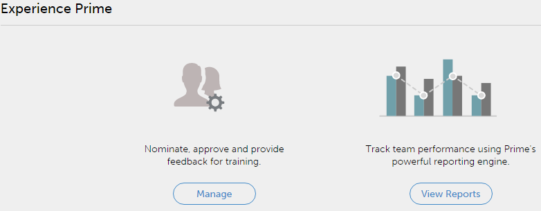

# Getting started for Managers

Getting started as a Manager in Learning Manager.

The getting started page aids you to traverse through the key features of the application.

As soon as you log in as a Manager, you can view the pop-up window with a list of videos.

## View sample videos {#viewsamplevideos}

Browse through the sample video tutorials to understand the key features of your role as manager. If you do not want to make this pop-up window appear during login, you can disable it by clicking Do not show at login option at the bottom-right corner of the pop-up.

Click **Close Window** to close the pop-up.

 

## Getting started page {#gettingstartedpage}

From the getting started page, you can perform the following activities:

* View reports - track team performance using reports.
* Manage team - nominate, approve and provide feedback for courses.

You can also learn more about the Learning Manager application by choosing to view tutorial videos, help content and learn about different roles.

