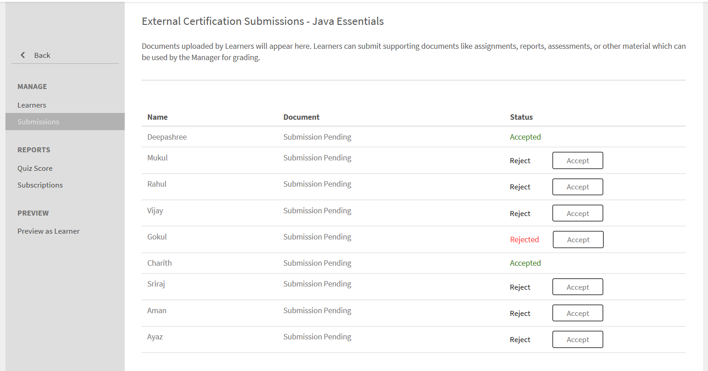

# Learning Objects

This document consists of information about learning objects for managers.

A Manager can enroll the learners under him in courses, learning programs and certifications. For more information and steps to follow to enroll, see [Enroll Learners.](../../administrators/feature-summary/courses.md#main-pars_header_1058138132)

## Courses {#courses}

## Viewing courses {#viewingcourses}

As a manager, you can view a list of all available courses. Click **Courses** on the left pane to view the list of courses with search and filter options. You can also view the course effectiveness percentage for each course on the course thumbnails. Note that you can only enroll team members to courses which are visible to you under the learner application.

>[!NOTE]
>
>List of all the retired courses can be viewed by clicking the **Retired** tab.

## View quiz scores {#viewquizscores}

1. Click course name on the course thumbnail.
1. Click Quiz Score on the left pane.

You can view the quiz scores of any particular course based on user name or based on each question. Choose By User or By Question tabs accordingly. You can only see the quiz score of your team members.

Choose the instance type from the drop-down list to view the scores based on each instance of the course.

## Manage learners list for a course {#managelearnerslistforacourse}

As a manager you can manage learners list for your team members.

1. Click course name on the course thumbnail.
1. From the left pane, click Learners.

You can perform the following actions from the Learners page:

* Select the Learner you want to remove, and click Actions > Remove.
* Select the Learner whose attendance you want to mark, and click Actions > Mark Complete.

To allow learners to reset a module and consume the module again, click Reset. From the pop-up dialog box, click Yes to confirm the Reset. Modules that have been completed cannot be reset. Only failed or incomplete modules can be reset.

You can also export the learners list in an excel sheet. To export the learners list, click Actions > Export.

>[!NOTE]
>
>If there are multiple instances for a course, the learners list in excel is provided in each tab separately. The learners list consists of learner name, status and selection criteria. Learners status can be **Not started**, or **In progress**, or **Completed**. 

## View L1 and L3 feedback {#viewl1andl3feedback}

You can view the L1 feedback provided by learners for a course and the L3 feedback provided for members of your team.

1. Click any course tile in the Courses list.
1. Click L1 Feedback or L3 Feedback on the left pane to view the feedback received.
1. Select the instance from the drop-down list to view the feedback for that particular instance.

## Preview courses {#previewcourses}

Manager can preview courses by clicking the **Preview as learner** option while viewing the course modules.

1. Click **Courses** on the left pane after you log in.
1. Click any course tile from the list of courses on the page.
1. Click Preview as learner from the left pane and click the module name on the page to preview the course module in the player.

## Course effectiveness {#courseeffectiveness}

Course effectiveness is evaluated to understand the usefulness of a course to the learner. It is a combination of results from learner feedback on the course content, the course quiz results for a learner and the manager's feedback evaluating a learner based on learnings from the course.

You can view the course effectiveness rating on the course thumbnails as shown in the below snapshot. You can see the rating for this course as 100.

The course effectiveness rating value is arrived considering L1, L2 & L3 feedback values. To view the breakup of each feedback, click the course effectiveness value. A pop-up appears as shown below.

In this sample snapshot, 1 out 1 users received all the three feedbacks, hence the score is 100/100. From this table, you can understand that if any of the three feedbacks (L1, L2 and L3 ) are not provided for a course, there is a negative impact on the overall effectiveness. Click the down-arrow at the lower-right corner of the pop-up to view how course effectiveness calculations are done.

As per the pie-chart shown above, more weightage is given to L3 feedback from manager.

## Searching courses, learning Programs and Certifications {#searchingcourseslearningprogramsandcertifications}

Adobe Learning Manager makes it easier for you to find the courses/learning programs of your choice quickly. You can search for your courses in two ways:

1. Using Search field. Click search icon displayed at the upper-right corner. A search field appears. Type the course name or any keywords associated with your courses to locate your courses/learning programs. You can also search using predefined tags like Captivate, C, Java, and HTML. Tags are searchable inside Search field, which means the tags are displayed in search field as you type. Search can be executed by using unique id as well.
1. By filtering list of courses/learning programs/Certifications using the filters. You can filter the courses by the state such as All, published and Retired.

You can search based on competencies by clicking Competencies and choosing them. As a manager you can sort the courses in four ways, to better locate your required course. Click Sort By and choose alphabetical ascending order, alphabetical descending order, course updated date, or effectiveness of courses:

You can sort learning programs in three ways: alphabetical ascending order, alphabetical descending order and based on updated date.

## Enrolling learners into courses {#enrollinglearnersintocourses}

Managers enrolls some learners to mandatory courses as per organization requirements:

1. Hover your mouse on any published course tiles and click Enroll learners.  

   Alternatively, click any published course tile and click learners on the left pane. A page appears with a list of learners. Click Enroll.  
   Enroll learners dialog appears.

1. Enter learners name or profile to choose the learners and click Save.

>[!NOTE]
>
>You can only enroll learners who belong to your team.

## Learning Programs {#learningprograms}

Manager can enroll, view quiz scores, L1 & L3 feedback and unenroll only his reporters.

## Add learners to a learning program {#addlearnerstoalearningprogram}

1. In Manager mode, click Learning Programs on the left pane.
1. Select the published learning program from the list of tiles, to which you want to add learners.
1. Click Learners on the left pane under Program reports category. Note: Learning Program must be published before adding learners.
1. Click Enroll link in the page.  
1. Start typing the learners name or profile and choose the learners from the drop-down list of learners. Click Save.

## View quiz scores {#Viewquizscores-1}

1. Click any learning program tile.
1. Click Quiz Score on the left pane.

You can view the quiz scores of any particular learning program based on user name or based on each question. Choose By User or By Question tabs accordingly. Quiz scores appear for one course at a time. Change the course name from the drop-down to view the quiz scores for other courses. You can also export quiz scores of each course. Choose the instance type from the drop-down list to view the scores based on each instance of the learning program.

## Unenrollment for learners {#unenrollmentforlearners}

Manager can unenroll a learner if the learner has not yet started the learning program.

## Mark completion {#markcompletion}

A manager can mark a LP complete for learners. For more information, see [Mark completion](../../administrators/feature-summary/learning-paths.md).

## Certifications {#certifications}

## Enroll learners to the certification {#enrolllearnerstothecertification}

You can enroll learners to the certification in two ways. Follow the steps below to enroll learners.

1. Click Certifications on the left pane after you log in as a Manager. From the Published tab list, hover the mouse on each certification and click Enroll learners. Alternatively, click any published certification tile and click Learners from the left pane. Click + Enroll on the right side of learners page to start adding the learners.
1. You can view Enroll Learners pop-up dialog after clicking enroll learners option from each of the above two steps. Start typing the learner name, profile and choose the name of the learner from the drop-down list, and click Save.

## Unenrollment for learners {#Unenrollmentforlearners-1}

Manager can unenroll a learner if the learner has not yet started the Certification. 

## Mark completion {#Markcompletion-1}

A Manager can mark the completion of Certification. For more information, see [Mark completion](../../administrators/feature-summary/certifications.md#main-pars_header_303097138).

## Manager Notifications for Learner course Approval {#manager-notifications-course-approval}

When attempting to accept or reject a learner for enrollment, a manager can now view the details of the session (**Video Conferencing** or **Classroom**) on the pop window. 

The following session details are displayed:

* Session name
* Instructor name
* Location
* Date and time

Here's the workflow:

1. The manager sees a notification after a learner requests for approval of a course.  

1. The manager clicks **Session Details**.

   

1. The manager then approves or rejects the request.  
1. The manager gets a confirmation or error message if approval or rejection didn't happen as expected.  
1. The learner gets a notification or approval or rejection to the course enrollment.

## Optional submission for external certifications {#optional}

In earlier releases of Learning Manager, for an external certification to be completed, a Manager accepted the file that a learner had submitted. The Manager gets a notifications only after the learner submits the file.

A Manager can now see a list of learners who have enrolled into the External certification on a Submission page present inside the External Certification and can Accept or Reject from the page itself without waiting for a notification.

When the Manager accepts without waiting for the file submission, the learner is shown a new message that the Manager has accepted, and the learner need not submit the file. In case Manager rejects without the file submission, the Manager has the option to again accept without waiting for the file.

If learner submits the file, Manager can view the file from the submission page and can Accept or Reject based on the submitted file.

When courses are set as mandatory:

* The submission page ists the learners only after the learners complete the courses.
* The learner can only upload a file after completing the course.

## Job Aids {#jobaids}

The manager can manage the assignment of Job Aids for his reporters. But, as a Manager, you can only see the published job aids while an administrator can also see withdrawn job aids.
