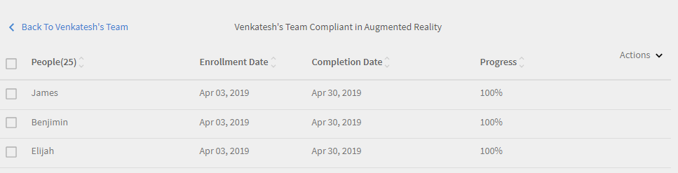

# Manager dashboard

Learn how to view and track learnings from the manager dashboard.

Managers play an important role in a team's learning initiatives. To guide them better, the learning platform provides the manager with a dashboard view to track the learnings in his team.

*Dashboard report for a Manager*

To view the details of a graph, click the graph or click **[!UICONTROL Details]** hyper link.

## Learning Summary {#learningsummary}

A manager can view the summary of learning activities for his team over a selected time period. Select month, quarter, or year from the drop-down menu.

'Month' and 'Year' are based on the calendar year while 'Quarter' is based on the financial year as configured by the Admin in account settings.

*View learning activities over a time perios*

## Team view {#teamview}

The Team View displays the teams, their members, and their respective enrollments, progressions, and completions for learning objects.

*The Team View displays the teams, their members, and their respective enrollments*

On clicking the team names, for example, Venkatesh's Team, you can view the members in Venkatesh's team along with the total number of enrollments, progressions, and completions for a learning object.

*Select a team member*

To view the Learning Summary for each team member, click the number in the respective column that corresponds to the team manager. A table opens that displays the list of learning objects with Enrollment Date, Due Date, and Progress information.

*Select a team manager*

Similarly, you can view the learning objects along with the number of enrollments, progressions, or completions by clicking the values under the corresponding columns.  

*View courses and learning summary*

On further clicking  the number of enrollments, progressions, or completions for each learning, you can view the following details: People, enrollment/completion date, due date, and progress made.

*View enrollment/completion date, due date, and progress made*

## Learnings View {#learningsview}

Learnings View displays the number of Enrollments, Progressions, and Completions for a Learning Object.

To view details including people, enrollment dates, due dates, and progress for respective Learning Objects, click the corresponding values in the enrollments, progressions, and completions columns.

*Learnings view*

## Export report {#exportreport}

To generate an excel report, click **[!UICONTROL Actions] > [!UICONTROL Report]** 

## Compliance Status {#compliancestatus}

Managers can view the team's overall compliance status for configured learnings in compliance dashboard. The learnings list is configurable, and the manager can select the learnings to track the compliance status.

On this dashboard, managers can also view the learners who are compliant, in a safe deadline, approaching deadline, and non-compliant for a selected learning object. 

Learning Objects with completion deadlines can be configured in compliance dashboard for tracking. 

**Compliant**: Displays the number of learners who have completed the learning object within completion deadline.

**Safe deadline**: Displays the number of learners who have less than 30 days available to complete a learning object.

**Upcoming Deadline**: Displays the number of learners with more than 30 days available to complete a learning object.

**Non-compliant**: Displays the number of learners who did not complete the learning object within the completion deadline.

*View compliance dashboard*

## Team View {#TeamView-1}

Displays the compliance status of a course for respective teams. Compliant, Safe Deadline, Upcoming Deadline, and Non-Compliant are columns in the Team View table.

*compliance status of a course for respective teams*

To display names of the members in a team and the individual number of courses for which their status is Compliant, in Safe Deadline, reaching Upcoming Deadline, and Non Compliant, click the corresponding values in the table.

*Select individual teams*

On further clicking the values in the compliant, safe deadline, upcoming deadline, and non-compliant column, the corresponding course details are displayed: Learning object name, enrollment/ completion date, due date, and progress in percentage.

 

*View progress of courses*

## Learnings View {#LearningsView-1}

In the Compliance Status Learnings View, the list of Learning Objects and the corresponding number of team members that are Compliant, within a Safe Deadline, have an Upcoming Deadline, or are Non Compliant is displayed.

*View deadline and compliance status*

On further clicking the values in the compliant, safe deadline, upcoming deadline, and non compliant columns, the following data is displayed: People, Enrollment Date, Completion date, and Progress.

*View details of compliance*

## Export data & send emails {#exportdataampsendemails}

* To export the compliance status for team and learnings view, click **[!UICONTROL Actions]** > **[!UICONTROL Export]**.

* To send an email to team members, click **[!UICONTROL Actions]** > **[!UICONTROL Send Email]**.

*Export and email data*

## Team Skills {#teamskills}

Managers can view the skill completion graph and configure a skill completion forecast at different levels. Five skills are listed in the skill drop-down list. The manager gets to know the expertise gained by the team members and identify strong talent in certain skills.

Managers can also drive certain skills in a team by setting a goal and forecasting on how long it would take to achieve a skill for specific percent of a team within a timeline.

This forecasting is based on system calculations which gives a view in the future for a progress of that specific skill.

*View skill forecast*

To view a team's skill status, follow the below steps:

1. Click **[!UICONTROL Team Skills]** from the left pane under My Team View section. 
1. To view the skills displayed, click the skill filter and select one from the drop-down list. 
1. To select a level(Level 1, Level 2, or Level 3), click the level drop-down menu.
1. Based on the skill and level selected, a graph with its skill status is displayed. On hovering the graph, you can view the following percentages of the skill status: **In progress** and **Achieved**.

   

   *View percentage of skill status*

## How to forecast the team completion % for a skill {#howtoforecasttheteamcompletionforaskill}

To forecast the team completion % for a skill, follow the below steps:

1. To display the configure tracker, click the configure hyperlink. 

   

   *Select the Configure hyperlink*

1. From the configure pop up dialog, for the skill you want to configure, enter a percentage value in the **Target completion %** field, and the date by when you want to achieve the target completion % in the **Target date** field.****

   

   *Enter target completion percentage*

1. To view the output for your forecast, click the **Estimate** button. The output looks like the below screenshot.

   

   *View skill tracxker output*

## Skill level completion forecast {#skilllevelcompletionforecast}

The manager of a team can view and configure the team completion percentage of a skill for a particular time period based on the target completion % and date time provided in the skill tracker.

In the forecast graph, there are two types of lines (solid and dotted line) with three vertices each. 

On the solid line, the first point displays the date for the first enrollment for a skill level.

*View first enrollment for a skill level*

The second point shows the current date and team completion % level of the skill.

*View current date and team completion % level of the skill*

The third point on the line shows the expected target completion % and target completion date.

*View the expected target completion % and target completion date*

## Forecast line {#forecastline}

The dotted line is the forecast line that displays the forecast depending on the current team completion % for a skill in a given time period.

The first point on the dotted line represents the team completion % and projected team completion % for a skill on that date.

*View he team completion % and projected team completion % for a skill*

The second point displays the date on which the projected team completion % was achieved for a skill.

*View the date on which the projected team completion % was achieved for a skill*

The third point in the forecast line displays the team completion % that is achieved on the target date provided in the skill tracker.

*View the team completion % that is achieved on the target date provided in the skill tracker*

Under the graph, a table is displayed with the team's view and the number of skills that have been enrolled, achieved, and in progress. If a learning has a completion date, then the expected completion date is also displayed.

*Table with  team's view and the number of skills that have been enrolled, achieved, and in progress*

On clicking the team name, the list of members who enrolled into the skill, the skill status, and completion date is displayed.

*View list of members*

On clicking the team, you can view the members in it and the corresponding details for the selected skill like if  enrolled, the status (whether in progress or achieved), and the completion date if set.

*View skills of members*

On selecting the values for a team under the enrollment, achieved, and in progress column, you can view the number of users who have enrolled to the skill. You can also view the date on which the user had enrolled to the skill, the status, and completion date if the skill was completed by the user. 

<!-- -->

## Export report {#Exportreport-1}

* Click **[!UICONTROL Actions]** > **[!UICONTROL Export]** to export the data as an excel file. 

*Export the data*
