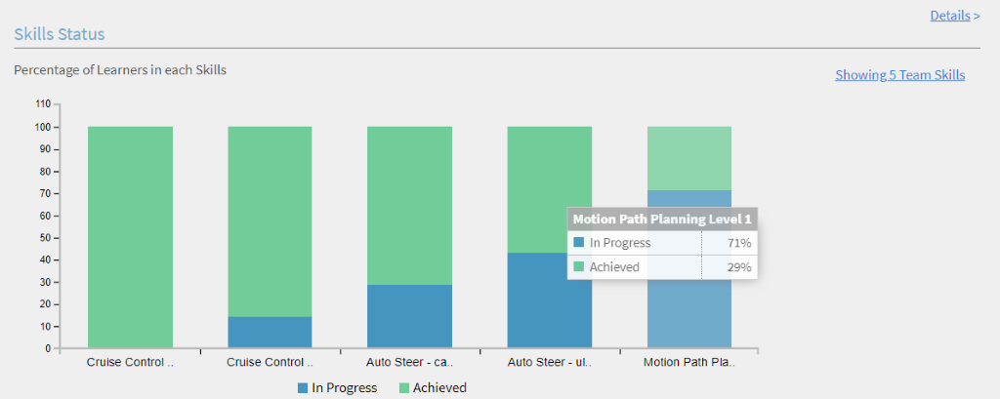

# Reports {#reports}

Learning Manager&nbsp;Learning Programs&nbsp;are renamed to&nbsp;Learning Paths.&nbsp;This change happens immediately&nbsp;after the October 2021 release and&nbsp;the terminology of&nbsp;Learning Path&nbsp;is&nbsp;reflected for all roles.

Creating and managing reports for Managers.

Adobe Learning Manager enables you to create varied reports to track, monitor, and control learner activities. Learners activities are tracked and captured automatically into the database. Manager and Administrator reports are generated from the database.

# Overview {#overview}

Reports generation process is same for both Administrator and Manager. Managers can view reports corresponding to their subordinates whereas Administrator can view all organization-wide reports.

Reports are aggregated in a dashboard. A report has to exist inside a dashboard. A&nbsp;**Default Dashboard**&nbsp;exists by default in the reports page. Any report added by you moves into this default dashboard. To add reports to individual dashboards, use the drop-down arrow and choose&nbsp;Add Report. For more information on creating dashboards, refer to Dashboards section on this page.

# Manager dashboards {#manager-dashboards}

A manager&nbsp;can view information about his/her direct or indirect team,&nbsp;as a summary.

The&nbsp;manager&nbsp;can then filter the report according to ranges like, quarter,&nbsp;this month,&nbsp;last&nbsp;three&nbsp;full months, and&nbsp;last 12 full months.

## Learning Summary {#learningsummary}

  

## Compliance Dashboard {#compliancedashboard}

See your team’s compliance and which team member is bordering on non-compliance.&nbsp;Choose the Learning Objects and see the status of each.&nbsp;

 

## Skills Status {#skillsstatus}

See the percentage of learners for each skill. Choose at most five skills for which you want to see the skills for learners. The visualization is in the form of a stacked bar chart. When you mouse over each bar, you can see the break-up of the status for that skill.&nbsp;

 

## Skils Tracker {#skilstracker}

See a projection of skill completion across a team. Choose&nbsp;the target completion percentage and date of a skill.&nbsp;

Based on historical data, you can see a graphical representation of the skill completion projection on the selected date.&nbsp;

 

# Creating reports {#creatingreports}

1. Click Reports on the left pane. Report summary page appears.  
   **Note** 
   By default, at least three sample reports appear in the report summary page. You can only view these sample reports to get an idea as to how you could create and customize them.

1. On the Report summary page, click Add. Report creation dialog appears.
1. Click&nbsp;Save&nbsp;to complete creating a report. A sample report is shown below for reference.

In Report Type, you can choose a pre-defined set of reports or choose custom. You can view the following reports as part of pre-defined set of reports:

* Skills assigned and achieved
* Course enrolled and completed
* Effectiveness for courses
* Learning programs enrolled and completed
* Learning time spent per course
* Learning time spent per quarter

You can use the above mentioned report types to generate reports of 300+ variations.

Report Name&nbsp;Type a title for your report.

**Primary Y-axis**&nbsp;Choose the&nbsp;first/primary criteria for your report from the drop-down options. For some of the selected criteria, you have an option to choose one or multiple states from the adjacent&nbsp;States&nbsp;drop-down box.&nbsp;For example, for a course enrollment statistics primary criterion, the states can be completed, incomplete, enrolled, and so on. Primary range data is represented in the form of bar graphs in the report.

**Secondary Y-axis**&nbsp;Choose the secondary Y-axis criteria/range for your report from the drop-down options. For example, in learning program enrollment option, choose one or multiple states from the adjacent&nbsp;States&nbsp;drop-down. Secondary range data is represented in the form of line graphs.

**X-axis**&nbsp;Choose the appropriate x-axis criteria for your report from the drop-down options. If x-axis is chosen as date, then an option to group your x-axis criterion by day, month, quarter, and year is available.

**Date**&nbsp;Choose the appropriate option from the drop-down. Options: last one month, quarter, year, QTD (last 90 days), YTD (last 365 days), and the date range. If you choose date range, provide From and To date as follows:

**From**&nbsp;Choose the starting date from which you would like to see the report.

**To**&nbsp;Choose the end date for your report.

# Filters {#filters}

Filters appear in Add report dialog at the bottom based on types of reports you have chosen. Some of the prominent filters are mentioned below.&nbsp;

**Manager** You can choose any one of the managers based on hierarchy. For some managers, there can be subordinate managers and multiple employees reporting to each subordinate manager.

**Profile** Choose the designation of your employee. It would help in viewing reports of employees based on their profile/designation. For example, computer scientist, engineer, and so on.

**User Group** Choose the user group based on which you want to filter the reports. Learning Manager fetches the user groups defined for your account from Users feature.&nbsp;

**Course **You can filter your report based on any course by choosing them from the drop-down.

**Note** 
Above the legend for the graph, you can view a zoom box. You can move cursor over it, click, and drag the crossbar over any part of the zoom box area you want to zoom in.

You can view the secondary y-axis values in the form of a line across the graph bars. For example, in the above sample, you can see the values for Effectiveness in gray line across the graph.

# User group reports {#user-group-reporting}

Track how user groups such as departments, external partners, and roles are performing in comparison with other user groups or against other learning objectives.

### User groups {#usergroups}

To generate reports based on user groups, choose **User Group **in the X-axis from the list of drop-down options as shown in the screenshot below.&nbsp;

Another **Select** drop-down appears adjacent to X-axis with a list of user groups available for your account. In this drop-down you can select one or multiple user groups.&nbsp;

Once you save and generate this report, if you selected multiple user groups, the report is generated with all the user groups represented in bar graph adjacent to each other in x-axis.&nbsp;

This user group report enables you to compare the performance of one department/division/role against the other to evaluate their learning achievements.&nbsp;

### Custom user groups/user attributes {#customusergroupsuserattributes}

You can also create customized user groups using Add users/user groups feature in Learning Manager. After creating the user groups you can generate reports for those customized userg groups with the help of a list of attributes such as location, branch, and so on.&nbsp;

In X-axis, choose the user attribute option and select the attribute the from **select **drop-down next to it. To create a customized user group report based on these attributes, you also need to choose the appropriate user group in the filter.&nbsp;

Managers can create user group reports only for their own team members as learners.&nbsp;

# Types of reports {#typesofreports}

* Course delivery statistics for learners
* Effectiveness of courses report
* Learner skill based report
* Learning program enrollment statistics for learners
* Learning time spent by learners
* Certification completion

# My reports {#myreports}

A dashboard is a collection of reports. Reports can be grouped into a dashboard&nbsp;as per your choice.

**Sample reports**

Click this tab to view&nbsp;some indicative reports which are based on sample data points. Explore these reports to get an idea of different types of feature rich reports that you can generate using your account data.

**My reports**

Click this board tab to view all the boards that you&nbsp;created. From the view board drop-down list you can&nbsp;select the default board or any of your created dashboards.

**Add dashboard**

1. Click Add dashboard on the right side of the page, to start creating your own boards.

1. Provide the name and description of the dashboard and click **Save**.

You can view the recently created board in the My dashboards list.

To add reports to your board, click the drop-down at the upper right corner of your board window and click&nbsp;Add Report. The report you create in this way is associated to your dashboard.

**Note** 
The reports you create by clicking Add on the upper right corner of Reports page, are added to your default dashboard.

**Shared reports**

Shared reports are a collection of reports that have been shared with you by other users within your organization. If you have the permissions, you can download or duplicate the shared reports. Contact the administrator of your organization to get download/duplicate access rights to the shared reports.&nbsp;

**Subscribed reports**

You can subsribe to your favorite reports by providing your email id here. Your subscribed reports are sent to you by email.&nbsp;

Click the **Edit** icon at the right corner of your report name from the reports list to modify your subscription any time.&nbsp;

# Viewing reports {#viewingreports}

On the Report summary page, you can view all the reports. You can minimize each report by clicking minus (-) icon at the upper right corner of each report. Click + icon to view your report again.

**Quick view with different dates**

The date values that you use to view the report are temporary. This view of report is not downloaded when you choose the download option. This is only temporary view.

You can change the date range/value for any report and view quickly for different date without modifying and saving the report. Click the edit icon (as shown with an arrow in the snapshot below) adjacent to the date range, such as QTD, last one year and so on. Choose the new value from the drop-down menu and click tick mark to confirm the change. You can cancel the change by clicking X mark.

**Quick view with different managers**

If there are multiple managers reporting to you, you can view the reports quickly for each manager. Choose the manager name from the drop-down list to display unique report for each manager.
**Edit/Move to board/Create a Copy/Delete/Re-size reports** Click the drop-down arrow at the upper-right corner of each report to view drop-down options as Edit/Move to Dashboard/Create a copy/Delete/Resize.

**Edit**&nbsp;While modifying data, to go back to initial values, click Reset. Click Save after modifying the values.

**Move to Dashboard**&nbsp;You can move the current report to another dashboard, which is chosen from the list of dashboards.

**Create a Copy**&nbsp;You can&nbsp;copy the report to same or another dashboard, which is chosen from the list of dashboards.

**Delete**&nbsp;Click Delete to remove the report. A warning/confirmation message appears before you can delete the report.

**Resize**&nbsp;You can re-size your reports in 1×1(medium) and 2×2(large) sizes.

# E-mail subscriptions {#emailsubscriptions}

You can get your favorite reports in e-mail by subscribing to them.

In Reports page, click Email subscription adjacent to Add button at the upper-right corner of the page. Reports subscription page appears.

Start typing the report name in the&nbsp;Reports&nbsp;field to select the report name from the drop-down list. Choose the frequency of e-mail as daily, weekly, monthly as per your choice, add the subject of the email and click&nbsp;Add&nbsp;to subscribe.

Click&nbsp;Edit&nbsp;to modify the subscription. Click Remove to delete the subscription.
