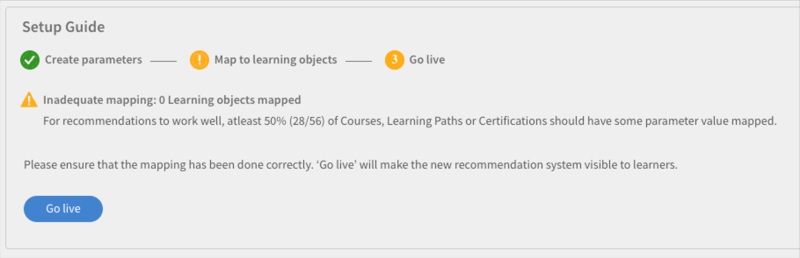
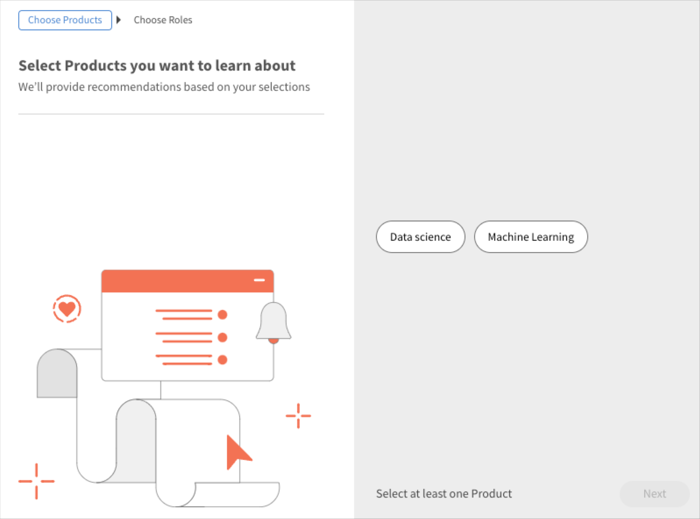

# Recommendations in Adobe Learning Manager

Adobe Learning Manager has introduced a new and revamped recommendation system for courses. This recommendations feature uses AI algorithms and users' interests like Products, Roles, and Levels to provide personalized content recommendations.

The new recommendations system allows you to create custom parameters that learners can select to receive personalized recommendations. These recommendations will be displayed as Courses, Learning Paths, and Certifications to learners on their homepage feed. 

To get started with this feature, you must enable the feature in the Admin app.  

## Enable and configure the recommendations

1. Upload the course and user data (optional). 
1. Make the changes live. 
1. After enabling and configuring the recommendations, upload the data into Adobe Learning Manager for recommendations to start working. This data consists of:

   * Course data
   * User data (optional)

## Course ranking algorithm

The core of the recommendation engine is driven by Learning Manager's new **[!UICONTROL Course Ranking Algorithm]**. The algorithm uses 50 million data points and five years of aggregated learning data across millions of users to rank courses based on their likelihood of enrolment. This ranking ensures that most enrollable courses are displayed upfront to the learners.

## Key terms

Learning Manager's new AI-based recommendation engine provides learning leaders with a configurable parameter-based recommendation system for crafting a personalized experience for learners.

The parameters are - **Products/topics**, **Roles**, and **Levels**. Additionally, these parameters can be renamed to suit your needs. So, 'products' can become 'topics' or 'roles' can become 'region'.

## Set up the recommendation system

Adobe Learning Manager's new recommendation engine simplifies the Admin workflow involved in setting up personalized recommendations because data about Products and Roles associated with a customer/partner is typically available to Admins (for example, from purchase records).

There are primarily three workflows involved in setting up the new recommendation engine:

* Admin
* Author
* Learner

Admins configure the account's Products, Roles, and Levels parameter values. For example, an IT solutions provider with banks as their primary customer base may configure the "Product" parameter to have values such as Payment Gateway, Secure Cloud Storage, Fraud Detection System, Trading Platform etc., and the "Role" Parameter to have values such as Integration Specialist, Network Administrator, Risk Analyst, Compliance Officer, etc.

Admins are provided a guided workflow in Learning Manager to optimally set up the recommendation engine and customize the engine based on the account's use case. Additionally, Admins also get the option of setting up PRL recommendations via a one-time CSV upload.

1. Select **[!UICONTROL Recommendations]** on the Admin app.

   
   
   *Select the Recommendations option*

1. Click **[!UICONTROL Upgrade]**.

   

   *Select the Upgrade option*

1. Click **[!UICONTROL Proceed]** to upgrade to the new recommendation system.

   
   *Select the Proceed button*

1. Create the recommendation parameters for Products and Roles.

   
   *Create parameters for recommendation*

1. Click **[!UICONTROL Add more values]**.
1. Add the products. Type the name of a product and hit Enter.

   You must add at least two products to get started with.

   
   *Add products*

1. Add the roles. Type the names of the roles and hit Enter.

   
   *Add the roles*

1. Click **[!UICONTROL Continue]**.

   The Products and the Roles now feature in the list of Parameters.

   
   *List of products and roles*

## Data preparation

The user interest data, Product, Roles, and Levels must be uploaded for the recommendations to work properly.  

**Upload data options**

The recommendations feature is configurable. So instead of products/roles/levels, you can use topics/roles/level or choose any of these options,: product/topics only, roles only, product/topics and roles only, roles-levels only or products-levels only.  

Based on the recommendation configuration you choose, modify your data sheets accordingly.  

The following section explains the most expansive option of using product, roles & levels.  

The Administrator must upload user data in a pre-determined format. The uploaded data will then be fed into the Recommendation algorithm, so that a learner receives recommendations for the right courses based on their roles and levels. 

**Prerequisites** 

To upload the data for the recommendations to work, populate the Products, Roles, and Levels in the User and RecommendationLO CSVs. 

As part of the data preparation exercise, we are providing two CSV templates: 

**RecUser.csv** 

* User ID 
* Products 
* Roles 
* Levels (Beginner, Intermediate, or Advanced)

The following is an example of records in the csv:

| User ID | Products  | Roles   | Levels      |
|--- |--- |--- |--- |
| 123     | Data Science  | Analyst   | Analyst: Intermediate |
| 456     | Aerospace Engg | Technician | Technician: Advanced  |

**RecLO.csv**

* Training 
* Training Type 
* Training Name 
* Products 
* Roles 
* Levels 
* Tags 
* Skills

The following is an example of records in the csv:

| Training ID | Training Type | Training Name | Products | Roles | Levels | Tags | Skills |
|---|---|---|---|---|---|---|---|
| 111 | COURSE | Python 101 | Data Science | Analyst | Analyst: Intermediate | data | General |
| 222 | COURSE | Julia 101 | Data Science | Analyst | Analyst: Advanced | data | General |

Populate these CSVs and get in touch with your Customer Success team to download the formats & upload these CSVs.

## Make the recommendations live

After both the CSVs have been uploaded, click Go live. This will make the new recommendation system visible to learners.

*Make the recommendations live*

The recommendation system is now available to your learners.

## Edit a parameter

1. In the list of parameters, select the three dots icon, and select **[!UICONTROL Edit parameter name]**.

   

1. Change the name of the parameter and click **[!UICONTROL Save]**.

   
   *Edit the parameter*

## Delete a parameter

1. In the list of parameters, select the three dots icon, and select **[!UICONTROL Delete parameter]**.

*Delete the parameter*

## Course settings page

In the settings page of a course, the recommendation for Products and Roles are listed. Learners will be recommended this Course if they have expressed interest in these Products and Roles.

*Course settings page*

## Learner view

For an account with PRL-based recommendations set up, when a learner logs into the learning platform, a guided workflow helps the learner set up recommendations based on his/her product, role, and level preferences. This creates the learner profile for the recommendation engine to analyze.

Learners on accounts that have switched to the new recommendation system can view the recommended courses and training.

The learners can see the following:

* Products, Roles - Levels: Learners are prompted to select Products first, Roles, and then Levels for each of the roles selected
* Product - Levels: Learners are prompted to select Products first and then Levels for each of the products selected
* Roles - Levels: Learners are prompted to choose Roles first and then Levels for each selected role.
* Products and Roles: Learners are prompted to choose Products first and then Roles.
* Products: Learners are prompted to select only products.
* Roles: Learners are prompted to choose only Roles.

After selecting Recommendations on the left panel, the learner sees a popup to set up the recommendations.

*Learner sets up the recommendation*

Clicking Setup Recommendations takes the learner to the product selection popup.

*Select products*

Then in the next popup, the learner can select the role.

*Select roles*

The learner can then add the levels.

*Select levels*

## Learning strips on the learner app

A learner can see the following strips on the app:

* My Learning strip
* Strip with calendar, social and gamification widget
* Saved by me strip
* Super relevant strip
* Product strip - 1
* Product strip - 2
* Discovery strip
* Admin recommended strip
* Browse by Catalog strip

### Cards on my learning strip

*Cards on learning strip*

Each card has Rating, Card image, Title, Skill, published date, Author, Duration, progress bar , and Continue or Explore button.

### Cards on saved by me strip

*Saved cards*

Each card has Rating, Card image, Title, Skill, published date, Author, Duration, progress bar , and Start or Explore or Continue or Revisit button.

There is no progress bar on the card after a learner starts the course. A learner can also Unsave the course.

### Cards on super relevant strip

*Relevant cards*

Each card has Rating, Card image, Title, Skill, published date, Author, Duration, progress bar , and Start or Explore or Continue or Revisit button.

There is no progress bar on the card after a learner starts the course.

On the menu, there are two options, **[!UICONTROL Save]** and **[!UICONTROL Don't recommend this]**. If the learner clicks **[!UICONTROL Save]**, the course is saved to the 'Saved by me' strip. If the learner clicks **[!UICONTROL Don't recommend this]**, the recommended training is removed from the list.
