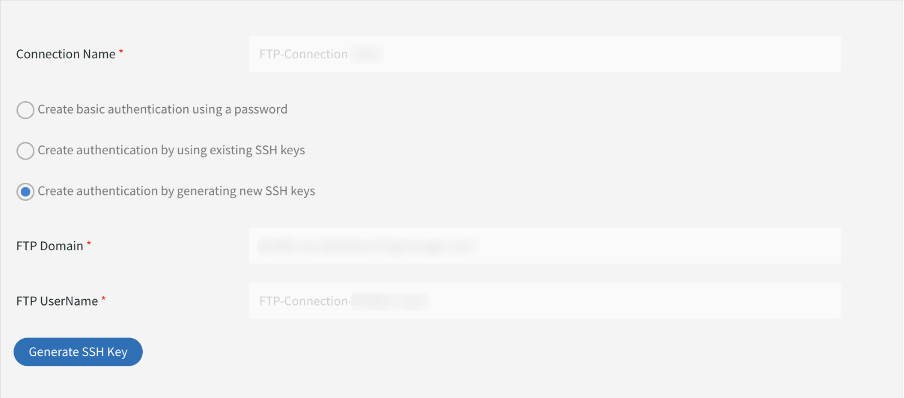

# Transition from Adobe FTP Manager

Adobe Learning Manager supports a new connector using AWS Transfer family's SFTP protocol.

You may replace any open-source FTP client with Adobe FTP Manager.

Some AWS-recommended FTP clients are listed [here](https://docs.aws.amazon.com/transfer/latest/userguide/transfer-file.html):

* FileZilla (Windows, macOS, and Linux)
* OpenSSH (macOS and Linux) - Note: This client works only with servers that are enabled for Secure Shell (SSH) File Transfer Protocol (SFTP).
* WinSCP (Microsoft Windows only)
* Cyberduck (Windows, macOS, and Linux)

## Configure AWS Based FTP connector

You must configure the new AWS-based FTP connector on the Integration Admin.

*Select the FTP option*

Once you connect, you can see the Connection Details page.

*View the Connection details page*

There are three authentication options: 

### Create authentication by generating new SSH keys

If you want to generate the SSH key in your system itself, you can do so. Click Generate SSH Key.

The private key gets downloaded to your computer, and the public key is saved in our services. After you click Connect, the FTP user gets created with the public and private keys as authentication.

You've created an FTP connection.

### Create authentication by using existing SSH keys

If you already have an SSH key, paste the public key in the **[!UICONTROL FTP Public Key]** field, and then click Connect. 

*Paste the keys*

### Create basic authentication using a password

This is the basic authentication mechanism. Select the first option, **[!UICONTROL Create basic authentication using a password]**. Enter the password and then click **[!UICONTROL Connect]**.

This creates a connection.

## What's next

### Setting up the FTP client

Set up the connection on an FTP client (recommended in the section earlier) with the keys downloaded or existing keys or password.

### Sample test export

* In your FTP client, change the location of the ExaVault FTP to the new FTP location. The new domain is `http://almftp.adobelearningmanager.com/`.
* You must also whitelist the IP, `18.195.107.67`.
* After authentication, you must upload and download a few sample files to and from the new FTP location using external FTP clients or automation scripts.
* You must transfer data from the old location to the new one.
* The data retention policy for the connector remains the same. ExaVault also supported some data retention policies in addition to the official policy. Such data retention policies will not be available for the new connector. Check if your connector uses any data retention beyond the officially supported policies.

### What happens to the migration projects

| Status | Recommendation |
|---|---|
| New migration | You cannot start new migrations from the old FTP. You must use the new FTP for the new migrations. For more support on this, contact the Customer Success team. |
| Migration in progress | Creating a sprint: You can continue using the old FTP, but we recommend using the new FTP. Contact the Customer Success team for any existing sprint that cannot be shifted. |
| Closed migration | No action. | 

## Connect to Adobe Learning Manager using Filezilla FTP client

1. Connect to new ALM FTP Connector. Click Connect.

   
   *Connect to new ALM FTP Connector*

1. To connect via basic authentication via password, enter the domain name, FTP user name, and set up password that matches the password validation criteria. Click Connect. The new FTP Connection will be created and can be accessed via any SFTP client.

   
   *via basic authentication via password*

1. Install any SFTP client, for example, File Zilla. Launch File Zilla and click Open Site Manager at the upper-left corner.

   
   *Connect via SFTP c lient*

1. Click **[!UICONTROL New site]** to create a new site. Rename the site as required.

   
   *Create a site*

1. Map the details from the Connector credentials page.

   * Select protocol as 'SFTP - SSH File Transfer Protocol'
   * Host as FTP domain
   * Logon type as 'Ask for password'
   * User as FTP Username

1. Click Connect.

   
   *Enter credentials*

   >[!NOTE]
   >
   >Perform this step in the File Zilla client.

1. Enter the password.

   (Optional) Select the Remember password checkbox to remember the password.

   
   *Enter password*

   (Optional) Select the **[!UICONTROL Always trust this host]** checkbox to trust the host.

1. Click OK.

   
   *Host key*

1. Check the status and progress of the connection on top.

   The left half is the local site, and the right half is the remote site.

   To move files from local to remote and vice versa:

   * You may drag and drop files.
   * Double click on the file.

   
   *Check the connection status*

At any point, you may change and update the authentication type.

Other ways of authentication are via SSH keys:

Paste your public key in the text box to use existing SSH keys. Click Connect/Save.

To generate new SSH keys, click the '**[!UICONTROL Generate SSH Key]**' button. The private key will be downloaded. Click **[!UICONTROL Connect/Save]**.

*Generate SSH Key*

Map the details. Select logon type as Key file. Select the private key file.

Click **[!UICONTROL Connect]**.

## What happens after ExaVault is deprecated

After ExaVault is deprecated, all existing migration projects, which are in progress, will be transitioned to the new FTP as the source location. You must then configure the new FTP connector and continue the migration process.

## Recommendations to migrate sprints

When creating a migration project, Adobe recommends that you create the project using the new AWS SFTP connector to avoid the sprint migration from Exavault to AWS at a later stage.

If a migration is in progress, close the current sprint that uses Exavault as a data source. Create the AWS SFTP connection, test the setup, and contact the Customer Success team to switch to the new AWS SFTP data source. After switching, create a new sprint in the same migration project. The sprint folders are created in the new location, and you can upload the migration CSVs to continue the activity. 

**Cases where a migration project cannot be closed**

* The course id mapping is done in the current project for courses that are migrated from external legacy systems to Adobe Learning Manager. You can only do so if you want to update the same courses in the same project. Once you close the project, you cannot modify its details.
* For API-based migration projects, where you must not close a project.