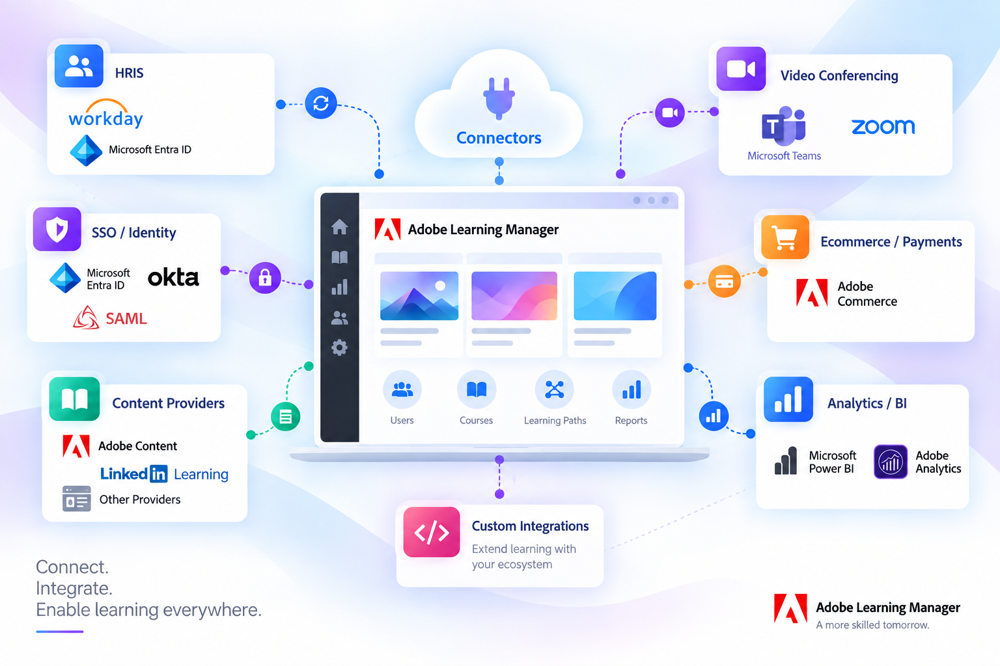
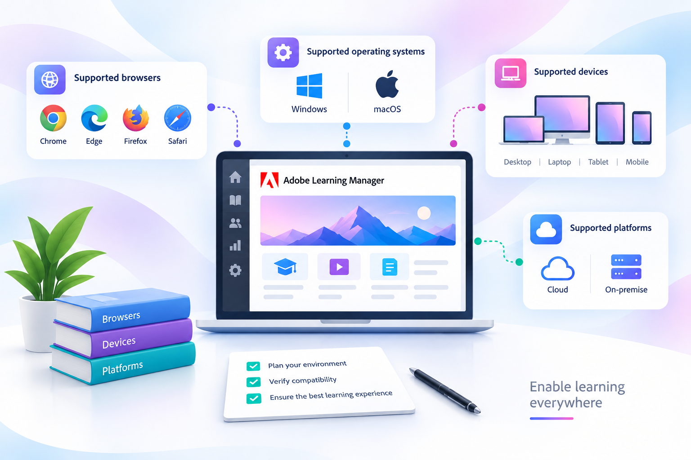

# Adobe Learning Manager user guide

Enterprise LMS for scalable learner experiences, compliance training, and skill-based development. Select your role to go directly to your documentation. Build practical product skills with curated Adobe Learning Manager Academy courses and guided learning paths.

[Browse the user guide](#){class="button primary"}

[Explore Academy learning](https://cdn.content.adobelearningmanageracademy.com/){class="button secondary"}

## Start with your role {#roles}

Go directly to the workflows and concepts that match what you need to accomplish.

::::landing-cards-container

:::card

Administrator

Configure accounts, users, access, and learning paths.

[Learn more](/help/migrated/administrators/feature-summary/getting-started-admin.md)
:::

:::card

Author

Create courses, certifications, content, and learning paths.

[Learn more](/help/migrated/authors/feature-summary/getting-started-author.md)
:::

:::card

Learner

Discover, take, and track assigned learning.

[Learn more](/help/migrated/learners/feature-summary/getting-started-learner.md)
:::

:::card

Manager

Assign learning and monitor team progress.

[Learn more](/help/migrated/managers/feature-summary/getting-started-manager.md)
:::

:::card

Integration administrator

Connect systems, APIs, data, and workflows.

[Learn more](/help/migrated/integration-admin/feature-summary/connectors.md)
:::

::::

## Quick access {#quick-access}

Find frequently used product guidance and information about newer Adobe Learning Manager capabilities.

::::landing-cards-container

:::card

What's new

Explore the latest features and release updates.

[Learn more](/help/migrated/whats-new.md)
:::

:::card

Content Composer (Beta)

Create and refine learning content with AI-assisted authoring.

[Learn more](/help/migrated/authors/feature-summary/content-composer/content-composer-help.md)
:::

:::card

Live Hub (Beta)

Set up and manage live learning.

[Learn more](/help/migrated/getting-started-with-live-hub/getting-started-live-hub.md)
:::

:::card

Connectors

Configure integrations and data connections.

[Learn more](/help/migrated/integration-admin/feature-summary/connectors.md)
:::

:::card

System requirements

Review supported browsers, devices, and platforms.

[Learn more](/help/migrated/system-requirements.md)
:::

::::

## Adobe Learning Manager Academy {#academy}

Choose focused courses for key capabilities or follow guided learning paths. Academy links open in a new tab and may require sign-in.

### Featured Academy courses {#featured-academy-courses}

Explore focused training for key Adobe Learning Manager capabilities.

::::landing-cards-container

:::card

Learning Path Agent

Build practical skills with focused training for this Adobe Learning Manager capability.

[Open course](https://content.adobelearningmanageracademy.com/app/learner?accountId=98632#/course/17286956)
:::

:::card

Insights Agent

Build practical skills with focused training for this Adobe Learning Manager capability.

[Open course](https://content.adobelearningmanageracademy.com/app/learner?accountId=98632#/course/17286964)
:::

:::card

Live Hub (Beta)

Build practical skills with focused training for this Adobe Learning Manager capability.

[Open course](https://content.adobelearningmanageracademy.com/app/learner?accountId=98632#/course/17286962)
:::

:::card

Report Builder

Build practical skills with focused training for this Adobe Learning Manager capability.

[Open course](https://content.adobelearningmanageracademy.com/app/learner?accountId=98632#/course/17286960)
:::

:::card

Email Builder

Build practical skills with focused training for this Adobe Learning Manager capability.

[Open course](https://content.adobelearningmanageracademy.com/app/learner?accountId=98632#/course/17286967)
:::

::::

### Academy learning paths {#academy-learning-paths}

Follow a guided curriculum across broader product and administration workflows.

::::landing-cards-container

:::card

Course & Content Management

Follow a guided Academy curriculum for this Adobe Learning Manager capability area.

[Open learning path](https://content.adobelearningmanageracademy.com/app/learner?accountId=98632#/learningProgram/168917)
:::

:::card

Portal & Experience

Follow a guided Academy curriculum for this Adobe Learning Manager capability area.

[Open learning path](https://content.adobelearningmanageracademy.com/app/learner?accountId=98632#/learningProgram/168919)
:::

:::card

Administration & Access

Follow a guided Academy curriculum for this Adobe Learning Manager capability area.

[Open learning path](https://content.adobelearningmanageracademy.com/app/learner?accountId=98632#/learningProgram/168920)
:::

:::card

Recognition & Compliance

Follow a guided Academy curriculum for this Adobe Learning Manager capability area.

[Open learning path](https://content.adobelearningmanageracademy.com/app/learner?accountId=98632#/learningProgram/168921)
:::

:::card

Learning Journeys

Follow a guided Academy curriculum for this Adobe Learning Manager capability area.

[Open learning path](https://content.adobelearningmanageracademy.com/app/learner?accountId=98632#/learningProgram/168918)
:::

:::card

Reporting & Analytics

Follow a guided Academy curriculum for this Adobe Learning Manager capability area.

[Open learning path](https://content.adobelearningmanageracademy.com/app/learner?accountId=98632#/learningProgram/168922)
:::

::::

## Additional resources {#additional-resources}

- [Release notes](/help/migrated/release-note/release-notes.md)
- [Community](https://community.adobe.com/t5/adobe-learning-manager/ct-p/ct-captivate-prime)
- [Support](https://helpx.adobe.com/support/learning-manager.html)
