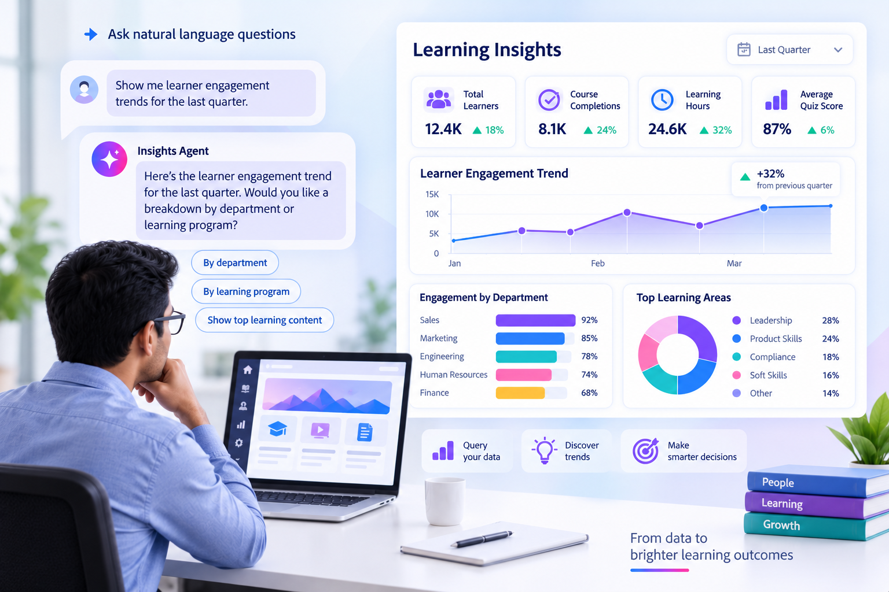
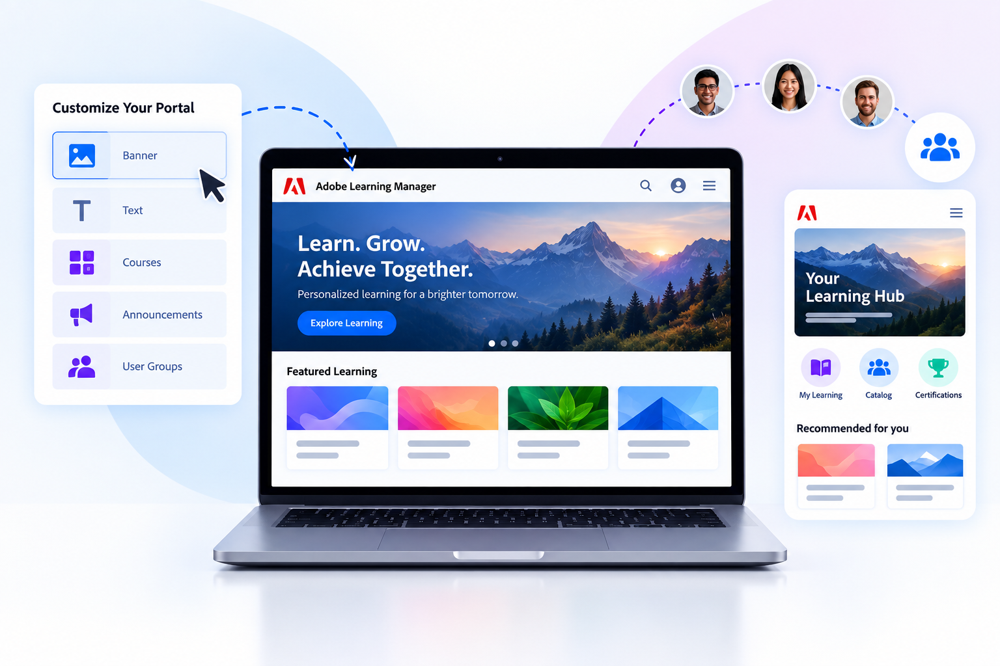
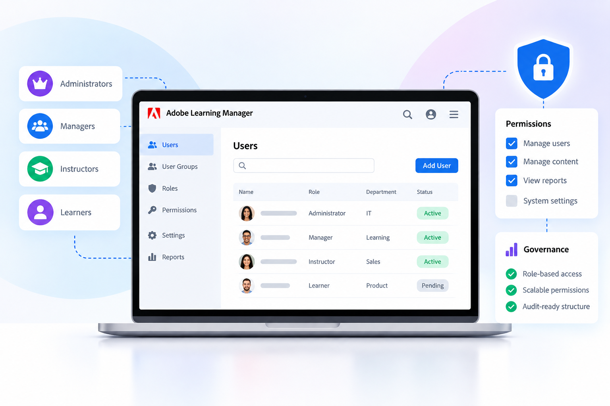
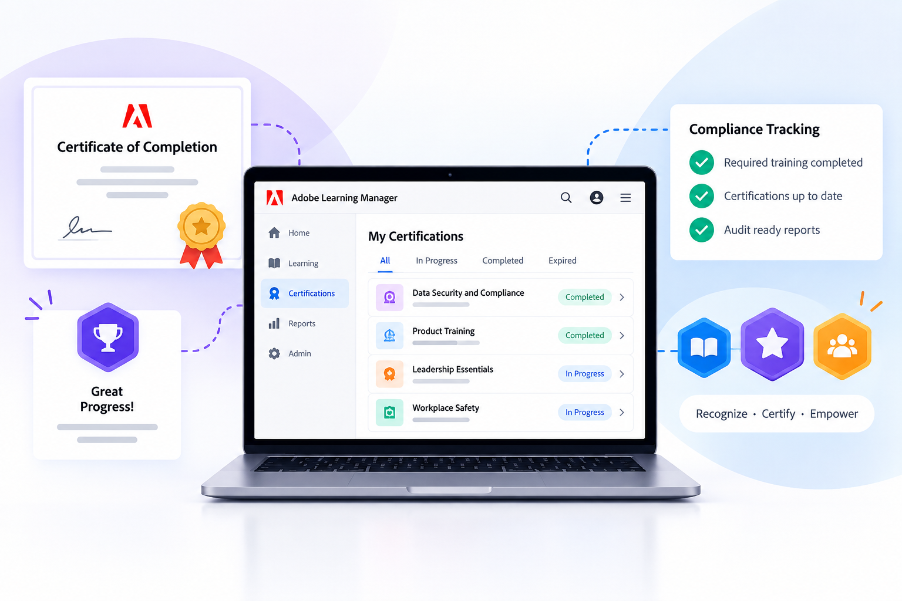
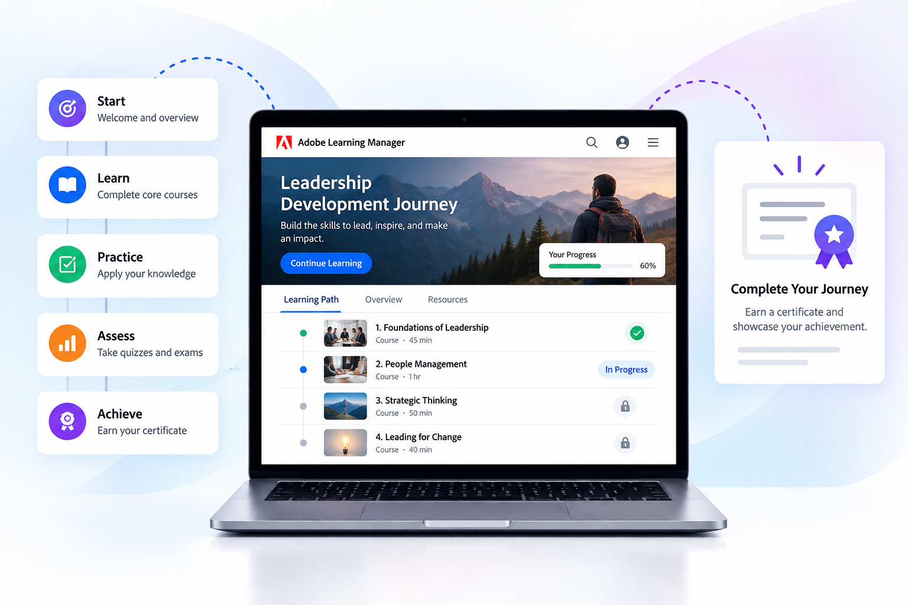
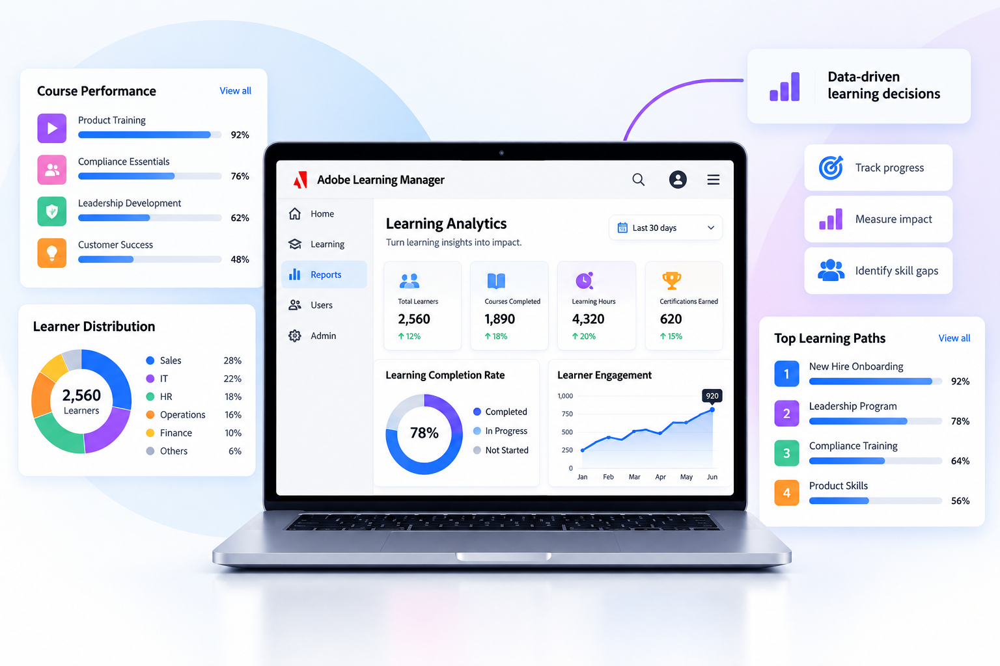

# Adobe Learning Manager documentation

Enterprise LMS for scalable learner experiences, compliance training, and skill-based development. Select your role to go directly to your documentation. Build practical product skills with curated Adobe Learning Manager Academy courses and guided learning paths.

<!--
<table style="table-layout: fixed;">
    <tr style="border: 0;">
        <td>
            
        </td>
        <td>
            
        </td>
    </tr>
</table>
-->

## Start with your role {#roles}

Go directly to the workflows and concepts that match what you need to accomplish.

::::landing-cards-container

:::card

**Administrator**

Configure accounts, users, access, and learning paths.

[Learn more](/help/migrated/administrators/feature-summary/getting-started-admin.md)
:::

:::card

**Author**

Create courses, certifications, content, and learning paths.

[Learn more](/help/migrated/authors/feature-summary/getting-started-author.md)
:::

:::card

**Learner**

Discover, take, and track assigned learning.

[Learn more](/help/migrated/learners/feature-summary/getting-started-learner.md)
:::

:::card

**Manager**

Assign learning and monitor team progress.

[Learn more](/help/migrated/managers/feature-summary/getting-started-manager.md)
:::

:::card

**Integration administrator**

Connect systems, APIs, data, and workflows.

[Learn more](/help/migrated/integration-admin/feature-summary/connectors.md)
:::

::::

## Quick access {#quick-access}

Find frequently used product guidance and information about newer Adobe Learning Manager capabilities.

::::landing-cards-container

:::card

**What's new**

Explore the latest features and release updates.

[Learn more](/help/migrated/whats-new.md)
:::

:::card

**Content Composer (Beta)**

Create and refine learning content with AI-assisted authoring.

[Learn more](/help/migrated/authors/feature-summary/content-composer/content-composer-help.md)
:::

:::card

**Live Hub (Beta)**

Set up and manage live learning.

[Learn more](/help/migrated/getting-started-with-live-hub/getting-started-live-hub.md)
:::

:::card

**Connectors**

Configure integrations and data connections.

[Learn more](/help/migrated/integration-admin/feature-summary/connectors.md)
:::

:::card

**System requirements**

Review supported browsers, devices, and platforms.

[Learn more](/help/migrated/system-requirements.md)
:::

::::

## Adobe Learning Manager Academy {#academy}

Choose focused courses for key capabilities or follow guided learning paths. Academy links open in a new tab and may require sign-in.

<!--

-->

### Featured Academy courses {#featured-academy-courses}

Explore focused training for key Adobe Learning Manager capabilities.

::::landing-cards-container

:::card

**Learning Path Agent**

Learn how to generate personalized, sequenced learning paths through a guided AI conversation.

[Open course](https://content.adobelearningmanageracademy.com/app/learner?accountId=98632&sdid=MLR7RYC9&mv=partner#/course/17286956)
:::

:::card

**Insights Agent**

Learn how to ask natural-language questions to generate learning data insights instantly.

[Open course](https://content.adobelearningmanageracademy.com/app/learner?accountId=98632&sdid=MQH8RTM8&mv=partner#/course/17286964)
:::

:::card

**Live Hub (Beta)**

Learn how to run AI-powered live training sessions with smarter polls, analytics and breakout tools.

[Open course](https://content.adobelearningmanageracademy.com/app/learner?accountId=98632&sdid=MV79RPW7&mv=partner#/course/17286962)
:::

:::card

**Report Builder**

Learn how to build custom, saved reports by joining data across multiple ALM datasets.

[Open course](https://content.adobelearningmanageracademy.com/app/learner?accountId=98632&sdid=MYYBRL56&mv=partner#/course/17286960)
:::

:::card

**Email Builder**

Learn how to design branded, reusable email templates using the component-based editor.

[Open course](https://content.adobelearningmanageracademy.com/app/learner?accountId=98632&sdid=N3PCRGF5&mv=partner#/course/17286967)
:::

::::

### ALM Academy learning paths {#academy-learning-paths}

Follow a guided curriculum across broader product and administration workflows.

::::landing-cards-container

:::card

**Course and content management**

Learn how to create, organize, and manage learning content effectively through this structured learning journey.

[Open learning path](https://content.adobelearningmanageracademy.com/app/learner?accountId=98632&sdid=N7FDRBP4&mv=partner#/learningProgram/168917)
:::

:::card

**Portal and experience**

Learn how to build custom branded portals and engaging public-facing homepages with Experience Builder. 

[Open learning path](https://content.adobelearningmanageracademy.com/app/learner?accountId=98632&sdid=NC5FR6Y3&mv=partner#/learningProgram/168919)
:::

:::card

**Administration and access**

Learn how to structure roles, manage permissions, and establish governance frameworks that scale with your organization.

[Open learning path](https://content.adobelearningmanageracademy.com/app/learner?accountId=98632&sdid=NGWGR372&mv=partner#/learningProgram/168920)
:::

:::card

**Recognition and compliance**

Learn how to set up compliance certifications, design custom certificates, and badges that celebrate learner achievements.

[Open learning path](https://content.adobelearningmanageracademy.com/app/learner?accountId=98632&sdid=NLMHQYH1&mv=partner#/learningProgram/168921)
:::

:::card

**Learning journeys**

Learn how to arrange courses into structured paths and automate enrollment through learning plans.

[Open learning path](https://content.adobelearningmanageracademy.com/app/learner?accountId=98632&sdid=NQCJQTQZ&mv=partner#/learningProgram/168918)
:::

:::card

**Reporting and analytics**

Learn how to transform dashboards and reports into meaningful decisions for leadership.

[Open learning path](https://content.adobelearningmanageracademy.com/app/learner?accountId=98632&sdid=NV3KQPZY&mv=partner#/learningProgram/168922)
:::

::::

## Additional resources {#additional-resources}

- [Release notes](/help/migrated/release-note/release-notes.md)
- [Ask community](https://community.adobe.com/adobe-learning-manager-466)
- [Send feedback](https://github.com/AdobeDocs/learning-manager.en/issues)
