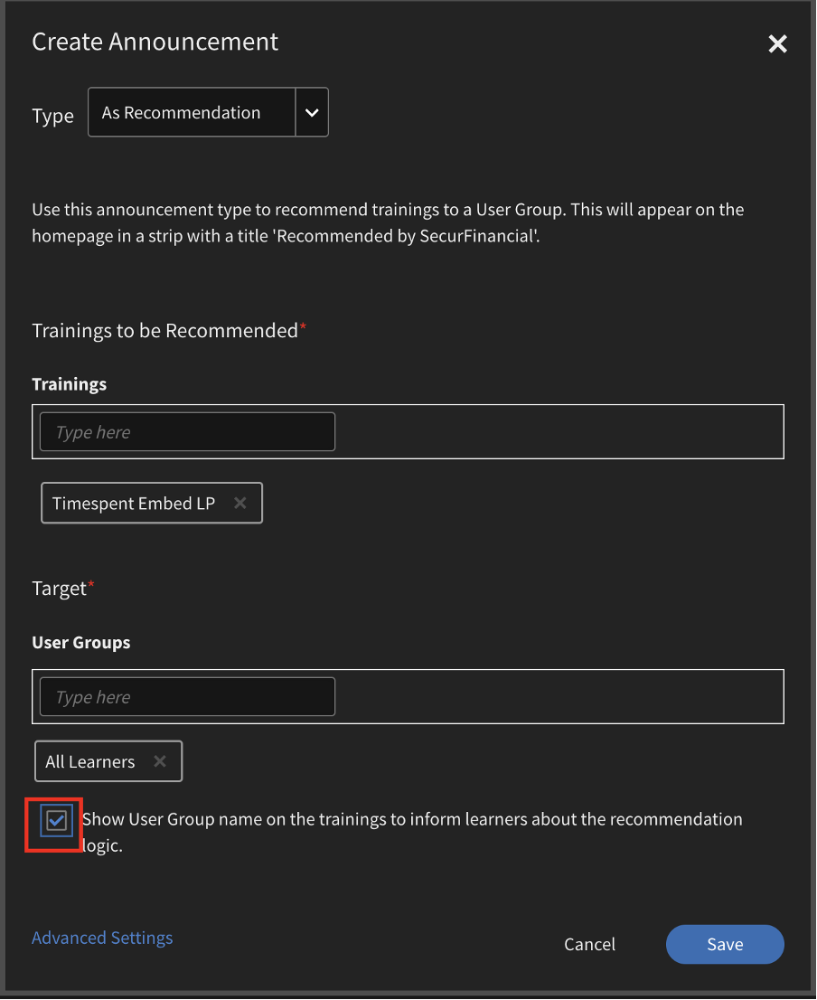

# What's new in this release (April 2023)

## Adobe Learning Manager App for Microsoft Teams

The new Adobe Learning Manager app on Microsoft Teams is designed to foster learning in the flow of work and boost social learning. Learners will be able to access learning content within the Microsoft Teams platform without the need to switch over to a browser. Please contact your CSAM for the beta release of Adobe Learning Manager app on MS Teams. 

For more information, see [Adobe Learning Manager App for Microsoft Teams](/help/migrated/adobe-learning-manager-app-microsoft-teams.md).

## Enhancements to the Instructor-Led Training (ILT) Experience

Several enhancements have been made to the Instructor Led Training (ILT) experience. Key enhancements include - the ability to filter sessions based on location, the ability to switch instances (VILT) without losing progress, a new "Scheduling Assistant" for managing conflicts in booking sessions, the ability to attach "Skills" to Instructors, and choose Instructors based on skills.

### What has changed

* The Skills page of the Admin app has the option to upload Skill-Instructor mapping.
* On the Skills page, there is a new column, Instructors. The column shows the number of instructors against the skill. If you click the number in the Instructors column, you'll be redirected to a pop-up, which shows the number of instructors assigned to a skill.

For more information, see [Assign skills to instructors](/help/migrated/administrators/feature-summary/skills-levels.md).

### Scheduling assistant

Manage conflicts in booking instructors and classrooms or Virtual Classrooms. If you want to know at what time and date any instructor is available before assigning him to the course, use the Scheduling Assistant.

Authors, Administrators, and Custom Admins/Authors can use the Scheduling Assistant.

For more information, see [Scheduling Assistant](/help/migrated/authors/feature-summary/courses.md).

## New Adobe Learning Manager Mobile App

A brand-new Adobe Learning Manager mobile app for Android and iOS that provides learners smooth access to learning on the go. The app enables learners to consume training on their mobile devices and resume it later on their desktops. With support for notifications, file uploads, ease of bookmarking and sharing learning content, social learning, and more, the mobile app provides added flexibility to learners and supports just-in-time learning.

Download the mobile from the Google Play Store and the Apple App Store. Users of the older version of the app will be prompted to download and install the new app.

In this release, the app supports these features:

The new mobile app supports the following key features in this release:

* Enhanced search, including displaying recent searches by the learner and popular searches in the organization in the search input box.
* Ability to download Learner Transcripts.
* Improvised notification center - provides important updates to learners as notifications within the app
* Ability to sort and filter learning objects in the Catalog/My Learning pages
* Ability to bookmark learning objects (LOs) - bookmarked LOs will be available in the "Saved by Me" section on the learner homepage.
* Support for enhanced LPs
* Ability to change the mobile interface language to any Adobe Learning Manager-supported language.
* Support for file uploads in external certifications, CR/VC sessions, and activity modules.
* Ability to submit L1 course feedback within the app.
* Support for deep links.
* Support for Social Learning.
* Support for Badges.
* Support for external user login.

**What's not supported in this release**

* Support for multi attempts to a quiz module in a course when the course is taken from within the mobile app.
* Search options that allow you to specify search parameters, such as course metadata, tags, and skills for specifying the search scope.
* Admin-enabled custom announcements that are shown as a popup to the user in the mobile app.
* You cannot add skills on the skills page in the app. 
* Taking courses while offline.

For more information, see [Adobe Learning Manager mobile app](/help/migrated/learners/feature-summary/ipad-android-tablet-users.md).

## Use any QR code scanning app to scan Learning Manager QR codes

Adobe Learning Manager now supports a more user-intuitive way of scanning QR codes with the help of the native camera app without having to download an app that scans a QR code. 

To support the previous workflow, where you could scan a QR code using the menu of the ALM app, in this release, we have provided information on how to switch to the new workflow.

>[!NOTE]
>
>With enhancements to QR code-based workflows, old QR codes generated before this release will no longer be supported. Therefore, if you've generated a QR code with an older version of Learning Manager for a classroom or VC session that will be conducted after this release, then you must generate a new QR code.

### Recommendation announcement enhancements

In this release, we've updated the recommendation strip from an organization to a recommendation based on the user group, which the learner is part of, to show the relevant courses for the learner.  

Administrators can target certain courses or training to learners based on the learners' profiles. Learners then can search for courses based on the profile they're a part of.

**What has changed**

There is an option on the Announcement page that shows a learner why this course or training was recommended to them.

