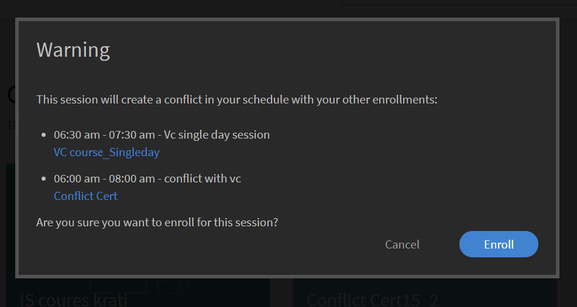

# What's new in this release (April 2023)

## Adobe Learning Manager App for Microsoft Teams

The new Adobe Learning Manager app on Microsoft Teams is designed to foster learning in the flow of work and boost social learning. Learners will be able to access learning content within the Microsoft Teams platform without the need to switch over to a browser. Please contact your CSAM for the beta release of Adobe Learning Manager app on MS Teams. 

For more information, see [Adobe Learning Manager App for Microsoft Teams](/help/migrated/adobe-learning-manager-app-microsoft-teams.md).

## Enhancements to the Instructor-Led Training (ILT) Experience

Several enhancements have been made to the Instructor Led Training (ILT) experience. Key enhancements include - the ability to filter sessions based on location, the ability to switch instances (VILT) without losing progress, a new "Scheduling Assistant" for managing conflicts in booking sessions, the ability to attach "Skills" to Instructors, and choose Instructors based on skills.

### What has changed

* The Skills page of the Admin app has the option to upload Skill-Instructor mapping.
* On the Skills page, there is a new column, Instructors. The column shows the number of instructors against the skill. If you click the number in the Instructors column, you'll be redirected to a pop-up, which shows the number of instructors assigned to a skill.

For more information, see [Assign skills to instructors](/help/migrated/administrators/feature-summary/skills-levels.md#assign-skills-to-instructors).


### Scheduling assistant

Manage conflicts in booking instructors and classrooms or Virtual Classrooms. If you want to know at what time and date any instructor is available before assigning him to the course, use the Scheduling Assistant.

Authors, Administrators, and Custom Admins/Authors can use the Scheduling Assistant.

For more information, see [Scheduling Assistant](/help/migrated/authors/feature-summary/courses.md#scheduling-assistant).

## New Adobe Learning Manager Mobile App

A brand-new Adobe Learning Manager mobile app for Android and iOS that provides learners smooth access to learning on the go. The app enables learners to consume training on their mobile devices and resume it later on their desktops. With support for notifications, file uploads, ease of bookmarking and sharing learning content, social learning, and more, the mobile app provides added flexibility to learners and supports just-in-time learning.


Download the mobile from the Google Play Store and the Apple App Store. Users of the older version of the app will be prompted to download and install the new app.

In this release, the app supports these features:

The new mobile app supports the following key features in this release:

* Enhanced search, including displaying recent searches by the learner and popular searches in the organization in the search input box.
* Ability to download Learner Transcripts.
* Improvised notification center - provides important updates to learners as notifications within the app
* Ability to sort and filter learning objects in the Catalog/My Learning pages
* Ability to bookmark learning objects (LOs) - bookmarked LOs will be available in the "Saved by Me" section on the learner homepage.
* Support for enhanced LPs
* Ability to change the mobile interface language to any Adobe Learning Manager-supported language.
* Support for file uploads in external certifications, CR/VC sessions, and activity modules.
* Ability to submit L1 course feedback within the app.
* Support for deep links.
* Support for Social Learning.
* Support for Badges.
* Support for external user login.

**What's not supported in this release**

* Support for multi attempts to a quiz module in a course when the course is taken from within the mobile app.
* Search options that allow you to specify search parameters, such as course metadata, tags, and skills for specifying the search scope.
* Admin-enabled custom announcements that are shown as a popup to the user in the mobile app.
* You cannot add skills on the skills page in the app. 
* Taking courses while offline.

For more information, see [Adobe Learning Manager mobile app](/help/migrated/learners/feature-summary/ipad-android-tablet-users.md).

## Use any QR code scanning app to scan Learning Manager QR codes

Adobe Learning Manager now supports a more user-intuitive way of scanning QR codes with the help of the native camera app without having to download an app that scans a QR code. 

To support the previous workflow, where you could scan a QR code using the menu of the ALM app, in this release, we have provided information on how to switch to the new workflow.

With enhancements to QR code-based workflows, old QR codes generated before this release will no longer be supported. Therefore, if you've generated a QR code with an older version of Learning Manager for a classroom or VC session that will be conducted after this release, then you must generate a new QR code.

### Recommendation announcement enhancements

In this release, we've updated the recommendation strip from an organization to a recommendation based on the user group, which the learner is part of, to show the relevant courses for the learner.  

Administrators can target certain courses or training to learners based on the learners' profiles. Learners then can search for courses based on the profile they're a part of.

**What has changed**

There is an option on the Announcement page that shows a learner why this course or training was recommended to them.


### NEw administrator setting

The Administrator has a new option called Groups in Settings > Show Filter Panels. When Groups is enabled, the Groups filter on the Learner homepage displays. The Learner can then choose to display the courses based on the user groups.

|   |  When the option is enabled  |  When the option is disabled |
|--- |--- |--- |
|Groups option is enabled | <ul><li> Displays the User Group on the tile along with the link to the catalog page.</li><li> The User Group displays on the catalog filter.</li></ul> | <ul><li>The name of the User Group does not display on the tile.</li><li>The User Group does not get listed in the catalog filter.</li></ul> |
|Groups option is disabled | <ul><li>Displays the name of the User Group on the course tile as plain text.</li><li>The User Group does not get listed in the catalog filter.</li></ul> | <ul><li>The course tile does not display the text or the name of the User Group.</li><li>The User Group does not get listed in the catalog filter.</li></ul>|

**How it works**

The Admin creates an announcement by adding the course for any user group and publishes it.  

What a learner sees is a strip with recommended courses on the homepage, and a link to the course on the tile. 


When the learner clicks the link or the Go to Catalog button, the learner is redirected to the course catalog page. The learner then views the list of user groups to filter based on the user groups in the catalog and My Learning page. 


## Search sessions using locations

### Manage classroom locations

Sometimes, you want a learner to filter a session on the calendar based on location. After adding a location using the Classroom Locations dialog or the CSV file, the learner can then filter.


For more information, see [Add classroom locations](/help/migrated/administrators/feature-summary/settings.md#classroom-locations).

### Calendar widget

As a learner, you can filter sessions that are assigned to you by location. Go to the calendar widget, select Filter Sessions, and select the location.


Also, the training location now displays on the course overview page if the location is added by the author while creating the course. 

### Administrator

As an Administrator, you can control whether a learner can filter courses according to locations. In Settings > General, enable or disable Training Locations.

For more information, see [Administrator settings](/help/migrated/administrators/feature-summary/settings.md).

## Trial experience changes

After the trial account is created, the courses in the Content Marketplace become available without any delay. 

## Chatbot

Chat with an agent or multiple agents using a chatbot. Only administrators and custom administrators of trial accounts can use this feature.

The chatbot will:

* Welcome you with a message.
* Provide option for product information or a product demo.
* Transfer the chat to a live agent.
* Preserve your chat history.


## Improvements to the Observation Checklist

Authors can now select Managers and Store/Location Managers as the Reviewers for checklists. Managers and Store/Location Managers, if selected as a Reviewer, can also view and complete the checklists of their teams without having to switch to Instructor roles. Instructors continue to review checklists. A new "Review Checklist" notification is sent to the Reviewers (Instructors/Managers) of an instance for the checklist on enrollments.

If a manager is added as a reviewer in the checklist module, they will be able to review the checklist in the Manager app. Instructors shall continue to review the checklist as expected.

For more information, see [Observation checklist](/help/migrated/authors/feature-summary/courses.md#observation-checklist).

## Other enhancements

### Learner search

The search results are also categorized as:

* Recent searches by you
* Popular searches in your organization

The search functionality has also been improved for learners. Learners can now use double quotes "…", plus "+" and minus "-" operators to find relevant results faster and have a google search-like experience.

* Use double quotes ("…") to search for courses that contain the exact phrase or word. For example, entering "data science" will return courses that start with the phrase data science.
* Use the + operator to ensure only those results are displayed which contain the specific phrase or word. For example, Computer Programming +python will show only those computer programming courses that contain the word "python".
* Use the - operator to ensure only those results are displayed which don't contain the specific phrase or word. For example, Computer Programming -python will show all computer programming courses except those that contain the word "python".

### Conflicting popup for learning objects

The Overview page displays a pop-up on enrollment when a learner has conflicting sessions. If enrolling from the catalog page or overview page and a learner already has conflicting sessions, then it will trigger a conflicting popup with conflicting session details. Even if a learner has a conflicting session, they can enroll in the new session.



Note that this message is just a warning. You can still enroll for a course.

### New template

We've added a new email template called Session canceled due to unenrolment. When a user is unenrolled from a training, they receive the cancellation email.

### New pricing feature for courses

Admins can now set the currency for the account in the Administrator Settings>Basic Info section. Admins can specify both the symbol as well as the ISO currency code, for example, USD, GBP, and so on. The default for all new accounts will be $. This change is only applicable to non-learner apps. Admins can see the change when they preview the course as learners. The currency symbol also appears in Learner Transcripts and Training reports.

For more information, see [Administrator settings](/help/migrated/administrators/feature-summary/settings.md).

### Switch instances

A learner enrolled in a particular instance of a course can view a list of all available instances of the course and switch to another instance that works better for them. The reason for switching could be that the learner missed attending the previous instance, or the session timing for the new instance is more suitable or it can be something else.

Any progress made by the learner as part of the course, learner quiz scores etc., are carried over to the new instance. This feature is primarily meant for classroom and blended courses, but we shall support all types of courses, including self-paced ones.

The option, View all instances appears irrespective of Instance Switch settings. Learners will now view an option to view all instances if there is more than one instance of a course.

If the option Instance Switch is enabled, learners can switch to various instances until they complete the course. If the option is disabled, learners can view the instances but will be unable to enroll in the course.

When the learner selects **View all instances**, the learner can see all the course instances.


An Admin can switch the instances for Learners.


You cannot switch instances until any instance of the course is completed from Learner or Admin app.

Authors, while creating a course can toggle between enabling or disabling "Instance Switch." Instance switch is available only for free courses.

For more information, see [Instance configuration](/help/migrated/authors/feature-summary/courses.md).

**Learners**

Learners can switch from a waitlisted course instance to another instance. They can also switch a course instance in a Learning Path or certification. 

After enrolling to the Learning Path or certification, on the course page, they can click View Instances, and then switch an instance.

>[!NOTE]
>
>The Instance Switch configuration isn't supported for the Manager Nominated Enrollment types.
>
>If you're switching instances from a Flex LP, the progress will be carried to the other instance.

### User audit trail

The User Audit Trail report will capture information about the learners that switched instances, "from instance" to "to instance", switched by time, date etc. 


For more information, see [User Audit Trail Report](/help/migrated/administrators/feature-summary/reports.md#useraudittrailreports).

### Instructor utilization report

This report captures the time (in minutes) spent daily by an instructor teaching assigned sessions. The report can be downloaded for a period of three months from the selected start date.

For more information, see [Instructor Utilization Report](/help/migrated/administrators/feature-summary/reports.md#instructor-utilization-report).


### Job aids report

A new report to keep track of the job aids present in the account and various information about the job aids, such as language, type, duration, author, tags, and so on. 

For more information, see [Job Aids enrollment report](/help/migrated/administrators/feature-summary/reports.md).

### Targeted ad-hoc emails to learners enrolled in a specific course instance

Administrators and Authors will be able to send targeted ad-hoc email communication to learners enrolled in a specific instance of a course. The option to send instance-level emails has been added for Courses and Learning Programs.


*Send instance-level emails*

On the Create Announcement dialog, the option Type as Email and Training, along with instance, are selected by default. Specify the subject, type the message, and click Save.

For more information, see [Instance level emails](/help/migrated/administrators/feature-summary/courses.md#send-instance-level-emails).

### Targeted ad-hoc emails to learners via announcements by admin

For Administrators, a new type of Announcement -"As Email" has been added. This can be used to send targeted ad-hoc emails to learners of a selected user group or to learners enrolled in specific training.

Custom Admin and Authors can also view this option at the instance level if they have the necessary access.

For more information, see [Announcements](/help/migrated/administrators/feature-summary/announcements.md#as-email).

### New email templates

In this release, we have added email templates for skip-level managers. These templates are intended for when the managers receive emails regarding their second-level reports missing any course, learning path, or certification deadlines. Additionally, they will receive emails when their second-level reports approach any completion deadlines for these courses, learning paths, or certifications.

* Skip level escalation for course completion - Before deadline
* Skip level escalation for missed course deadline
* Skip level escalation for Learning Path completion - Before deadline
* Skip level escalation for missed Learning Path deadline
* Skip level escalation for Certification completion - Before deadline
* Skip level escalation for missed Certification deadline

The options are enabled by default.

## API changes in this release

### New reports

We've added a new attribute, jobType to the jobs API. The attribute accepts the following values:

* **generateInstructorUtilisationReport**: Returns the utilization report of an instructor.
* **generateJobAidMetadataReport**: Returns the metadata of a Job Aid report.

**Endpoint**: POST /primeapi/v2/jobs

generateJobAidMetadataReport request:

```javascript {line-numbers="true"}
{ 
    "data": { 
        "type": "job", 
            "attributes": { 
                "description": "description of your choice", 
                "jobType": "generateJobAidMetadataReport" 
            } 
    }
} 
```

generateJobAidMetadataReport response: 

```javascript {line-numbers="true"}
{ 
  "links": { 
    "self": "https://learningmanagerstage1.adobe.com/primeapi/v2/jobs" 
  }, 
  "data": { 
    "id": "31126", 
    "type": "job", 
    "attributes": { 
      "dateCreated": "2023-02-28T18:36:48.000Z", 
      "description": "description of your choice", 
      "jobType": "generateJobAidMetadataReport", 
      "status": { 
        "code": "Submitted" 
      } 
    } 
  } 
} 
```

generateInstructorUtilisationReport request:

```javascript {line-numbers="true"}
{
    "data": { 
        "type": "job", 
            "attributes": { 
                "description": "description of your choice", 
                "jobType": "generateInstructorUtilisationReport", 
                "payload": { 
                    "year": "2023", 
                    "month": "2" 
                } 
            } 
    } 
}
```

generateInstructorUtilisationReport response:

```javascript {line-numbers="true"}
{ 
  "links": { 
    "self": "https://learningmanagerstage1.adobe.com/primeapi/v2/jobs" 
  }, 
  "data": { 
    "id": "31130", 
    "type": "job", 
    "attributes": { 
      "dateCreated": "2023-02-28T18:43:43.000Z", 
      "description": "description of your choice", 
      "jobType": "generateInstructorUtilisationReport", 
      "payload": { 
        "month": "2", 
        "year": "2023" 
      }, 
      "status": { 
        "code": "Submitted" 
      } 
    } 
} 
} 
```

For more information, see the [API Reference doc](https://captivateprime.adobe.com/docs/primeapi/v2/).

### Learner instance switch

The Enrollment Learner API lets you access all available instances and switch to a different instance of a course. The new instance inherits all the properties of the previous course.

We've added a new query parameter, enrollmentID, for which the information is being requested.

>[!NOTE]
>
>The body is required only for the following scenarios:
>
>1. Flexible Learning Plan
>1. Course instance switch

### Accounts

The response contains a new attribute, currencyCode.

**Endpoint**: GET /primeapi/v2/account

### Skill and skilllevel association for instructors

We've introduced a new feature, which captures the instructors' skill expertise, i.e., for each instructor, their expertise is maintained, and this can be made available for downstream operations like search and filtering.

The following attributes are added:

* instructorSkills
* instructorSkillLevel

**Endpoint**: GET /primeapi/v2/account /<account_id>/instructorskill/search

### ILT changes

| Description  |  New parameter/response | Endpoint |
|--- |--- |--- |
|List all cities | filter.cityName=true/false | GET /primeapi/v2/data |
|Search and filter cities | filter.cityName=city_name<br>Also supports a comma-separated list of cities |
GET /primeapi/v2/search |
| Return room details | include=room | GET /primeapi/v2/users/`<id>`/calendar |
| Learning Object to filter cities | filter.cityName=city_name <br> Also supports a comma-separated list of cities.|GET /primeapi/v2/learningObjects |
| Add city panel | The response contains a new attribute, filterPanelSetting=true/false. | GET /primeapi/v2/account |

### Learner sessions that have a conflict

Retrieve a list of all conflicting sessions for an instance.

We've added these fields:

* loID 
* loInstanceID

**Endpoint**: `GET /primeapi/v2/learningObjects/{loId}/instances/loInstanceId/conflictingSessions?page[offset]=0&page[limit]=10`

### Classroom in VC

Execute location-based search for VC courses. A new attribute roomLocation is present in the resource model to indicate the freeform location provided while creating a VC course.

We've made the following changes: 

**LO**

A new query parameter, filter.loFormat=Virtual Classroom for the learningObjects API.

**Endpoint**: GET /primeapi/v2/learningObjects

**Calendar**

A new query parameter, filter.allSessions=false for the calendar API. The default value of the parameter is false. If true, then the API returns all the calendar sessions of a learner.

**Endpoint**: `GET /primeapi/v2/users/<id>/calendar?filter.allSessions=false`

### Learner search history

**Search**

A new query parameter, persistSearchHistory. The default value is true, that persists the query for the search suggestions.

**Endpoint**: GET /primeapi/v2/search?persistSearchHistory=true

**Suggestions**

A new query parameter, suggestionType. The values accepted are: 

* learnerHistory (default)
* accountHistory

**Endpoint**: GET /primeapi/v2/search/suggestions/?suggestionType=learnerHistory

### User group filtering

Learning Object and Search APIs will provide filters to fetch all Learning Objects that belong to the user group via specified filters. The APIs support filters as a comma-separated list.

We've provided a new filter, filter.lo.announcementGroups to fetch all LOs that belong to the usergroup filters provided. 

This can be a multivalued comma-separated list for flexibility, and the processing would be based on the "OR" operation between the multiple groups. i.e., get all the LOs that fall under the given user groups.

### Custom group

You can add and remove external users to and from Custom Groups through API.

**POST**

POST /userGroups/{id}/users 

**Body**

```javascript {line-numbers="true"}
"data": [ 
     { 
           "type": "user",  
           "id": "{id}"   
     }  
]  
```

**DELETE**

DELETE /userGroups/{id}/users

**Body**

```javascript {line-numbers="true"}
"data": [  
     {  
          "type": "user",  
           "id": "11218291"  
     }  
]   
```

### Announcement usergroup filtering for los in learner app

* The GET /users/{userId}/userGroups API has a new parameter, filter.announcedGroupsOnly, which takes a Boolean value (true/false). This filters only user groups that the Admin announces. The default value of this parameter is false.
* The GET /learningObjects API has a new parameter, filter.announcedGroups, that accepts announcement group ids to filter results.
* The GET /search API has a new parameter, filter.announcedGroups, that accepts announcement group ids to filter results.

Sample response below:

```javascript {line-numbers="true"}
{
  "links": {
    "self": "https://learningmanagerstage1.adobe.com/primeapi/v2/recommendations?page[offset]=0&page[limit]=10&strip=1&filter.recType=announcement&filter.loTypes=course"
  },
  "data": [
    {
      "id": "course:5836866_10855885_recommendation",
      "type": "recommendation",
      "attributes": {
        "reason": [
          "Based on your Group - UGforAnnouncement"
        ],
        "reasonModel": [
          {
            "modelId": 1781592,
            "modelType": "userGroup",
            "modelValues": {
              "group_name": "UGforAnnouncement"
            },
            "template": "Based on your Group - {{group_name}}"
          }
        ]
      },
      "relationships": {
        "learningObject": {
          "data": {
            "id": "course:5836866",
            "type": "learningObject"
          }
        }
      }
    },
    {
      "id": "course:7013328_10855885_recommendation",
      "type": "recommendation",
      "attributes": {
        "reason": [
          "Based on your Group - All Learners"
        ],
        "reasonModel": [
          {
            "modelId": 1410724,
            "modelType": "userGroup",
            "modelValues": {
              "group_name": "All Learners"
            },
            "template": "Based on your Group - {{group_name}}"
          }
        ]
      },
      "relationships": {
        "learningObject": {
          "data": {
            "id": "course:7013328",
            "type": "learningObject"
          }
        }
      }
    },
    {
      "id": "course:6408989_10855885_recommendation",
      "type": "recommendation",
      "attributes": {},
      "relationships": {
        "learningObject": {
          "data": {
            "id": "course:6408989",
            "type": "learningObject"
          }
        }
      }
    },
    {
      "id": "course:6409761_10855885_recommendation",
      "type": "recommendation",
      "attributes": {},
      "relationships": {
        "learningObject": {
          "data": {
            "id": "course:6409761",
            "type": "learningObject"
          }
        }
      }
    },
    {
      "id": "course:6979586_10855885_recommendation",
      "type": "recommendation",
      "attributes": {},
      "relationships": {
        "learningObject": {
          "data": {
            "id": "course:6979586",
            "type": "learningObject"
          }
        }
      }
    }
  ]
}
```

## Release Notes

For information regarding current and previous releases of Learning Manager web app and device app, see the [Release notes](/help/migrated/release-note/release-notes.md).

## Bug fixes

To see the bugs that are fixed in this update, refer to the [Bugs fixed list](release-note/release-notes.md#bugs-fixed-in-this-release).

## System Requirements

[Learning Manager system requirements](/help/migrated/system-requirements.md)
