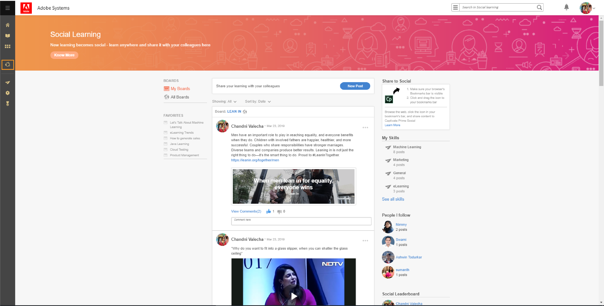
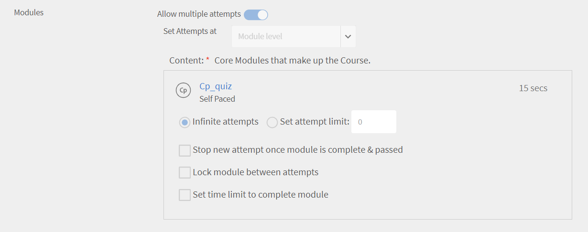

Learn about the new features and enhancements in Adobe Learning Manager

The April 2019 release of Adobe Learning Manager rolls out exciting new features and enhancements. It introduces Social Learning feature, manager dashboard, multiple attempts configuration for a learning object, importing and exporting xAPI statements, and other enhancements. Read on to know the new features and enhancements that are available in this release.

# Social Learning {#sociallearning}

Adobe Learning Manager introduces Social Learning to its vast repertoire of features. Social learning incorporates the element of peer learning using discussion boards. A feature that allows you with the flexibility to control which users have visibility of which boards and how they participate in them.

The Adobe Learning Manager Desktop App helps learners create content easily from their desktops – webcam videos, audio recordings, screenshots and screen capture recordings. Once learners install the social bookmarklet in their desktop browsers, they can share relevant content that they discover on the Web to these boards with ease.

The app uses gamification to motivate learners and encourage participation.

The AI-powered content moderation is an&nbsp;industry first that you can leverage to drive learning within your organization.

For more information, see [Social Learning](learners/feature-summary/social-learning-web-user.md).

 

# Manager Dashboard {#managerdashboard}

Managers play an important role in a team’s learning initiatives.

With the introduction of a dashboard, managers can keep track of learning activities and the performance of their respective teams.

## Learning Summary {#learningsummary}

Managers can view the summary of learning activities that the team undertakes in a specified time period. Senior Managers can even view the team structure and compare how different teams perform.

## Compliance Status {#compliancestatus}

Managers now see a Compliance dashboard that details the team’s overall compliance status. Managers can view learners who are non-compliant in selected learning objects. They can also identify those learners whose compliance deadlines are close.

## Team Skills {#teamskills}

With the new Dashboard managers can now view the top 5 skills in their respective teams. This gives them an understanding of the expertise levels of the team. And they can now identify employees talented in certain skills. Managers can also drive learning activities aimed at a set of skills. They can use the Adobe Learning Manager Skill Tracker to set up goals, forecast skill completion and suggest recommendations.

Managers will immediately see the Manager dashboard when they log in.

For more information, see [Manager dashboard](managers/feature-summary/manager-dashboard.md).

 

# Multiple attempts configuration {#multipleattemptsconfiguration}

Adobe Learning Manager now allows you to configure multiple attempts for your interactive eLearning content. Previously learners could reset the progress; now it allows authors to:

1. Configure the number of attempts.
1. Set a time limit to complete the module.
1. Lock the content for a specified time between each attempt.
1. Allow improvement of scores through multiple attempts even after completion.
1. Stop new attempts once learner completes a module.&nbsp;

 

# Import/ Export xAPI statements {#importexportxapistatements}

Capture your learning events from third party services in CSV format and then import them into Learning Manager as xAPI statements. Use FTP connector or Box connector to import xAPI statements into Learning Manager.&nbsp;

To export xAPI statements in Learning Manager use PowerBI connector.

For more information, see [Learning Manager connectors](integration-admin/feature-summary/connectors.md).

# QR code to enroll, complete, enroll & complete a course {#qrcodetoenrollcompleteenrollampcompleteacourse}

Adobe Learning Manager provides QR codes for courses. The administrator can print the QR codes to help learners quickly enroll into a course. Similarly, QR codes are available to mark enrollment, completion, and both.&nbsp;

Learners can simply use the Adobe Learning Manager device application to scan the respective QR code.

For more information, [click here](administrators/feature-summary/learning-programs.md#ShareQRcodewithlearnerstoenrollcompleteandenrollcompleteacourse).

 

# Audio compatibility in Learning Manager {#audiocompatibilityincaptivateprime}

Learning Manager now supports audio content in the content library. The completion criteria are based on the launch or based on audio consumption. Like other modules a course can be created using audio modules as well. Supported audio formats are MP3, WAV, and AMR, M4A.

For more information, see [Audio support in Learning Manager](system-requirements.md#Supportedcontentformats).

