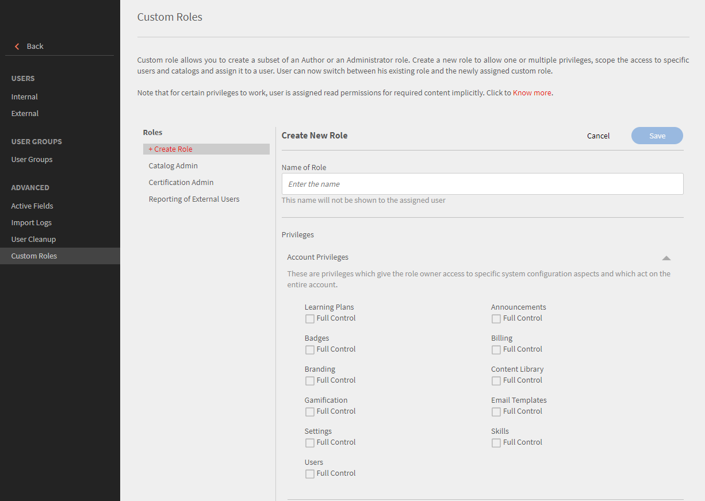
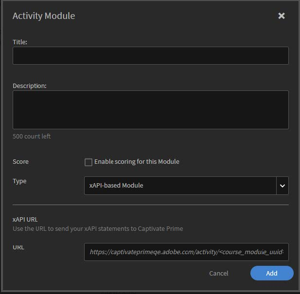

Learn about the new features and enhancements in Adobe Learning Manager

The August 2018 release of Adobe Learning Manager rolls out exciting new features and enhancements. It introduces configurable roles, custom fields, Zoom connector integration, learning program leaderboard, xAPI support, and other enhancements. Read on to know the new features and enhancements that are available in this release.

# Custom roles {#customroles}

Learning Manager introduces configurable role, a way to define custom roles and assign specific responsibilities to set of users. This feature enables you to assign responsibilities outside the purview of the individual’s existing role.

You can create a custom role to provide authoring capabilities limited to a particular catalog. You can also create a role dedicated to manage reporting. Such roles can then be assigned to individuals who are supposed to take up these specific responsibilities

.If you have a configurable role assigned, you can switch between your existing role and configurable role. To switch between roles, click your profile icon on the upper-right corner of Prime and select the role.

For more information, see&nbsp; [Custom roles](administrators/feature-summary/custom-role.md).

# Catalog labels {#cataloglabels}

This feature allows you to tag learning objects with specific fields and apply one or multiple values. These fields and values are displayed only to the Admin and Authors. They are not visible to Learners. Custom fields are added on account level and then applied to Catalogs. When a custom field is added to the catalog, it applies to all Learning Objects that are a part of the catalog. Use this feature to easily categorize data.&nbsp;For example, if you want to categorize Learning Objects based on their location, department, skills you could apply these fields and filter data.&nbsp; 

For more information, see&nbsp; [Catalog labels](administrators/feature-summary/catalog-labels.md).

# Zoom connector integration {#zoomconnectorintegration}

You can take advantage of this integration with Zoom connector to host classes. Zoom lets you launch audio and video conference calls and synchronize your user feed by entering the details of your account and integrating it. Once the connection is established, Authors can create a VC course with Zoom as the conferencing system. 

For more information, see [Learning Manager Connectors](integration-admin/feature-summary/connectors.md).

# Learning Program Leaderboard {#learningprogramleaderboard}

The Learning Program leaderboard allows Learners to see gamification points of themselves and other Learners. It helps to engage and motivate them to achieve their goals by using gaming techniques. Learners enrolled in a Learning Program instance would now be able to see each other’s’ points if gamification is enabled for that instance. Learners can compete with their colleagues to score points for various learning activities.

For more information, see [Gamification](learners/feature-summary/gamification.md).

# xAPI support {#xapisupport}

This release of Prime introduces support for xAPI to monitor user experience outside Prime. For example, you can use this feature to evaluate the activities of users on a third-party platform used for course consumption. While creating a module, Administrators can choose xAPI-based Module as the module Type. Enter the xAPI URL and Add the module. A detailed report of user experience for these modules can be downloaded as .csv files from the Excel reports option.

For more information, see&nbsp; [xAPI in Learning Manager](administrators/feature-summary/xapi.md).

# Other enhancements {#otherenhancements}

This release introduces the following enhancements in Learning Manager:

* Learner Transcript Enhancements: While downloading Learner Transcripts, you can now choose specific catalogs by enabling the check box. Transcript is only downloaded for the specified catalogs. If no catalog is selected, data is downloaded for all catalogs. This update also allows you to enable the download of module level information in the Learner transcript. Module names and the time spent on each module is fetched as a part of the transcript if this option is enabled. The Enable module level information check box is disabled by default.

For more information, see [Learner transcripts](administrators/feature-summary/learner-transcripts.md).&nbsp;

* Module update configuration: As an Administrator you can control the settings for module version updates. Use radio buttons to choose if you want changes to be applicable to all Learners or only to new enrolments.

* Certification recurrence configuration: As an Administrator, while creating a certification you can now choose the reassignment type. You can choose if you want the certificate to be reassigned based on completion date or on the basis on enrolment date.

For more information, see [Certifications](administrators/feature-summary/certifications.md)

* Ability to edit Author information for courses: Learning Manager allows you to edit Author names for courses. You can add one or more names in the Author field. It is not essential that the name you are adding must be a part of the system or the account. Use this feature to give due credits to Authors while using content created by them.

For more information, see [Creating Learning Objects](authors/feature-summary/courses.md).

* Enhancement to dashboard reports: Exported sheet of dashboard reports provides detailed information instead of report summary. The downloaded report follows the format of a Learner Transcript.

For more information, see [Reports](administrators/feature-summary/reports.md#main-pars_header_121829304).
