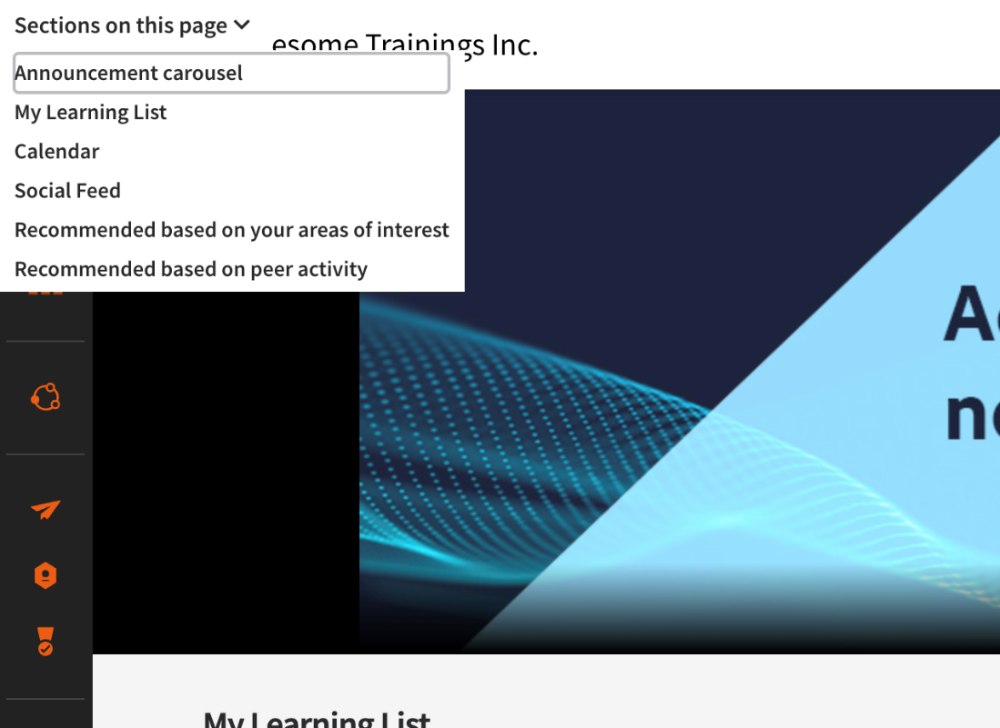

# New features summary {#new-features-summary}

Learn about the new features and enhancements in Adobe Learning Manager

The&nbsp;**August 2021**&nbsp;**release of Adobe Learning Manager**&nbsp;focuses on improving Learner Experience, Reporting, and Administrative workflows. Some of the highlights include:

* **Content marketplace:**&nbsp;Learning Manager now&nbsp;offers&nbsp;more than 70000 courses&nbsp;from&nbsp;varied&nbsp;domains, such as,&nbsp;Technology, Management,&nbsp;Leadership, and so on.
* **Enhanced&nbsp;Accessibility support:**&nbsp;Accessibility support for&nbsp;the learner&nbsp;role strengthens&nbsp;via enhanced&nbsp;keyboard navigation, screen reader capability,&nbsp;and contrast ratio compliance.&nbsp;
* **Rich Text Formatting:**&nbsp;Learning Manager now offers rich text&nbsp;editing&nbsp;for descriptions in&nbsp;courses, programs, certificates,&nbsp;and Job Aids. This allows authors&nbsp;to&nbsp;specify&nbsp;descriptions&nbsp;in&nbsp;rich text including hyperlinks, images and other text formatting options, as opposed to plain text.
* **Star Rating:**&nbsp;A learner can now rate a course&nbsp;on a 5-point scale. An&nbsp;Administrator can select between existing effectiveness rating or the&nbsp;5-star&nbsp;rating.&nbsp;
* **Badgr&nbsp;Integration:**&nbsp;Learners can now authorize Prime to automatically push badges they have earned in Prime to their&nbsp;Badgr&nbsp;account, from where they can share their badges in their social networks.
* **Export&nbsp;learning&nbsp;events to Salesforce:&nbsp;**Learning Manager&nbsp;now&nbsp;offers&nbsp;an ability to export some specific events in Prime like new user addition, enrollment and completion to a Salesforce tenant, and provide an ability to link these with the appropriate User object or Contact object in Salesforce.

Read on to know more.

# What's new and changed {#whatsnewandchanged}

## Content marketplace

Learning Manager now offer Content Marketplace for you to explore and purchase trainings. Explore 70,000+ courses that cover a range of topics, available in multiple formats. Choose from curated playlists that cater to a vast variety of roles and meet your learning and upskilling needs.&nbsp;

For more information, see [***Content marketplace***](administrators/feature-summary/content-marketplace.md).

## Star rating

A Learner can rate courses on a 5-point scale. If star rating is enabled for an account,&nbsp;learners can then rate a course on a scale of 1-5.&nbsp;The option to enable&nbsp;the rating is&nbsp;provided as a setting to&nbsp;the Administrator.&nbsp;The rating of the course will be visible to&nbsp;the Learner in all pages in&nbsp;the&nbsp;learner app. The Learner can also then sort the trainings based on the ratings.&nbsp;

For more information, see [***Star rating***](learners/feature-summary/courses.md#star-rating).

## Export learning records to Salesforce

Learning Manager now offers an ability to export learning records like transcript, user report, skill report to Salesforce.

For more information, see [***Export learning records***](integration-admin/feature-summary/connectors.md#export-training-report).

## Rich Text Editor

While creating a Course, Learning Program, Certification, or Job Aid, Authors can input different types of content such as text, image, or apply various text formatting options.

For more information, see Support for [***Rich Text Formatting***](authors/feature-summary/courses.md#rte).

## Badges from Badgr

Learners&nbsp;can&nbsp;integrate their learning platform account with their&nbsp;Badgr&nbsp;account. This&nbsp;enables learners to&nbsp;share badges to social websites via their&nbsp;Badgr&nbsp;account.&nbsp;Badgr&nbsp;also offers authenticable badges based on the&nbsp;backpack standard,&nbsp;which means the badges are verified.

For more information, see [***Badgr integration***](learners/feature-summary/badges.md).

# Other new features {#othernewfeatures}

## Exclusion of user groups {#importusersfromsalesforcecontacts}

At times you would want to exclude a small set of users from a large&nbsp;user&nbsp;group. This is required to enroll this specific set of users into training via Learning Plans or to setup the correct visibility of catalogs.&nbsp;In this release of Learning Manager, you can exclude learners or User Groups&nbsp;when you create a custom user group.

For more information, see [***Exclude user groups***](administrators/feature-summary/add-users-user-groups.md#exclusion).

## Immersive mobile web UI

Here’s what&nbsp;is new for the immersive mobile UI experience in this release:

* The Home, Catalog page, and the player are accessible.  
* Support for rich&nbsp;text&nbsp;in the course description.  
* Rate courses on a 5-point scale (1-lowest, 5-highest).
* Duration and format filters in Catalog.

## Reset course

An Administrator can reset the progress of a course inside a Learning Program.

If a Learner has taken the first three modules in a course, but fails a quiz in the third module, the Learner cannot proceed to the next course in the learning Program. The Administrator can go ahead and reset the attempt in the third module, When the Learner revisits the module, the Learner can then start afresh in the module.

For more information, see [***Rest a course***](administrators/feature-summary/learning-programs.md#reset-course-module).

## Pending approvals for courses

In this release of Learning Manager, Administrators can view pending approvals for courses. This allows stakeholders to track Managers if they are compliant with their employees' learnings.&nbsp;

Also, Administrators can approve course enrollment as needed.

## Power BI

You can export Training Reports to Power BI in this release of Learning Manager.

Training Reports can be exported to Power BI as part of the Unified Reports feature.

The Training Report will have two additional fields:

* Count of users who’ve shared feedback on a course  
* Average star rating for a course

## User Audit Trail Report filters

The User Audit Trail Report is a report, which contains the details of all operations done on a user, including addition, deletion, role changes, manager changes, etc.

In earlier releases of Learning Manager, the report consisted of filtering on dates. In this release, we’ve added filters for user and user groups in this report, so that you can customize and manage the data to be exported.&nbsp;

For more information, see [***User Audit Trail***](administrators/feature-summary/reports.md#user-audit-trail).

## Support for HTML packages in Job Aids

Job Aids now support standard HTML packages as a new type of content. With this enhancement, learners can open view and download the HTML package from within the Job Aid player.&nbsp;

For more information, see [***HTML support in Job Aids***](authors/feature-summary/job-aids.md#html).

## Quiz report

A Quiz report will contain data in different languages if the course is offered in multiple languages. Until now responses from different users were exported one below the other irrespective of the language in which the response is provided. In this release, in case the course is available in multiple languages, quiz responses provided in different languages will be added as additional columns in the Quiz Report. Thus, all responses of each language will be in separate columns.&nbsp;

Note that this does not affect the courses which are offered in&nbsp;one&nbsp;language only. Quiz report should export as it exports today. No change expected for such courses.

## Bulk purge of users

You can select the first 50 users and purge the users in one go. This allows Administrators to select 50 users at once and purge them together. This helps Administrators when they wish to purge users in bulk. It's always a best practice to check the users who are selected for purging. This is important to ensure only the correct set of users are getting purged.&nbsp; For more information, see the [***document***](administrators/feature-summary/purge-users.md).

# Enhanced features in this release {#enhanced}

## Learner experience

### Course card

Clicking on a card opens&nbsp;the course&nbsp;overview page. In earlier releases of Learning Manager, only a specific area on the card was clickable.&nbsp;Now the entire card is clickable.&nbsp;The change is applicable to all courses, programs, and certificate cards.

### Leaderboard

To enhance the accessibility support to add colleagues in the leaderboard timeline, the workflow to add colleagues is now enhanced as shown in below snapshot. It does not affect the functionality. Learners can continue to add/remove colleagues from their leaderboard timeline.

### Accessibility support for learner app

Multiple enhancements are implemented to strengthen the accessibility support for Learning Manager Learner role. As a part of these implementation, once user lands on the learner role and hits keyboard&nbsp;‘Tab’ button a&nbsp;quick navigation menu opens up. This allows learners relying on keyboard tabbing to navigate to a particular section of the page quickly. The navigation menu looks, as shown below:

 

### Job Aid

A Job Aid now gets added to a Learner's list when the Learner downloads the Job Aid. Earlier Job Aid was not getting added although a learner could download it and view it.

## Administrator experience

### Exclusion&nbsp;of user groups

At times you would want to exclude a set of users from getting enrolled to a course or getting access to a catalog.&nbsp;In this release of Learning Manager, you can exclude learners&nbsp;or User Groups. In the Add&nbsp;User Group&nbsp;dialog, the Exclude Learners&nbsp;section enables you to achieve so.

For example, if you want to set up a Learning Plan so that all users belonging to location = California except Store-5 (located in California) get enrolled.&nbsp;You can achieve this by creating a Custom User group which includes all users from group “California” and exclude “Store-5”. Then you can use such a custom group in Learning Plans, catalog visibility settings etc.&nbsp;

### Quiz report

A&nbsp;Quiz report will&nbsp;contain data in&nbsp;different languages if the course is offered in multiple languages.&nbsp;Until&nbsp;now responses from different users were exported one below the other irrespective of the language in which the response is provided. In this release,&nbsp;in case&nbsp;the course is available in multiple languages, quiz responses provided in different languages will be added as additional columns in the Quiz Report.&nbsp;Thus,&nbsp;all responses of each language will be in separate columns.&nbsp;

Note that this does not affect the courses which are offered in&nbsp;one language only. Quiz report should export as it exports today. No change expected for such&nbsp;trainings.&nbsp;&nbsp;

### Bulk purge of users

You can select the first&nbsp;50 users and purge the users in one go.&nbsp;This allows Administrators to select 50 users at once and purge them together. This helps Administrators when they wish to purge users in bulk.&nbsp;It's&nbsp;always a best practice to check the users who are selected for purging. This is important to ensure only the correct set of users are getting purged.&nbsp;

### Rich Text Editor&nbsp;support

Rich Text Editor support is extended&nbsp;for training, Job Aids for Authors and Admins.&nbsp;Learners can take advantage of Rich Text Editor&nbsp;while commenting on a social post or post in a board.

Descriptions added to trainings already continue to work without any impact. This release should not impact the existing descriptions.&nbsp;

Customers who have built custom visual interface&nbsp;should not see any impact to their existing descriptions. To utilize the new rich text formatted text, they should apply/load&nbsp;a CSS file provided by Learning Manager team. This will be made available on Learning Manager Help documentation after the release.&nbsp;&nbsp;

### Copy-paste email ids

In the Learner Transcripts dialog, you can generate Learner Transcripts&nbsp;for the email ids that you specify in the Email IDs section. Validate the email ids as well.

An additional tab, Email IDs tab is provided to copy paste email&nbsp;ids&nbsp;of learners to generate Learner Transcripts for those learners.

### Case-sensitivity&nbsp;changes

We have observed issues when user attributes&nbsp;are imported with different case sensitivity.&nbsp;For example,&nbsp;a user&nbsp;attribute ‘Location’ gets imported as “Location” and later gets imported as “location”. Note that the&nbsp;case of the&nbsp;letter&nbsp;“L” is different. In such cases, two user attributes are created in Learning Manager.&nbsp;

In&nbsp;this release, Learning Manager analyzes such incoming attributes and does not create&nbsp;two&nbsp;attributes because the case is different. In the above example,&nbsp;the name of the attribute remains&nbsp;“location” as that’s the label&nbsp;that&nbsp;was most recently imported.

Note that accounts having such attributes present in their accounts&nbsp;will observe their attributes getting merged once they import the user csv.&nbsp;In this release, for example, the attribute ‘Location’ will be removed as&nbsp;the&nbsp;CSV contains the label ‘location’. All values of ‘Location’,&nbsp;say ‘San Jose’, ‘Sydney’ will correctly get associated with the attribute name ‘location’.&nbsp;Therefore,&nbsp;there&nbsp;will not be any&nbsp;loss of data.

Let’s understand this with an example -&nbsp;

Let’s say, you imported an attribute “Location” with users having their values as “San Jose”, “Miami” etc. Later you imported the user csv again but this time the attribute was named “location”. Note that the case value of “l” has changed from “L” to “l”. In such case, platform would have created a different&nbsp;usergroup&nbsp;with attribute “location” which is different than previously created “Location”.&nbsp;Thus two groups would get created “Location -&nbsp;miami” and “location -&nbsp;miami”.&nbsp;Thus reports like Learner Transcript would also have 2 columns for the same attribute ‘Location’ and ‘location’.&nbsp;

With this release, platform understands that attributes are the same. Hence it retains the most recent case value provided&nbsp;i.e. ‘location’ in our example. Thus existing group of ‘Location - Miami’ would get modified to ‘location - Miami’ and users continue to exist in the same group.&nbsp;

Same concept holds true for the attribute values like “Miami”, “San Jose” etc. Thus&nbsp;if&nbsp;the value of “Miami” changes to “miami”&nbsp;in the user csv, platform does not create a new user group for&nbsp;miami. Instead it changes the existing user group from&nbsp;“location - Miami” to “location -&nbsp;miami” and all users continue to remain in the same group.&nbsp;

### Attribute values

In&nbsp;this release, Learning Manager preserves the case&nbsp;sensitivity&nbsp;of the user attribute and its value.&nbsp;For example,&nbsp;the case sensitivity of&nbsp;a&nbsp;user attribute&nbsp;is&nbsp;‘location’ and its value as ‘PARIS’ will be preserved and displayed in the same manner.&nbsp;In case&nbsp;of any issues,&nbsp;the&nbsp;Administrator can now edit the attribute name and values to correct any case sensitivity errors.&nbsp;

The Administrator can do this by&nbsp;visiting&nbsp;**Admin&nbsp;app&nbsp;> Users > User groups**&nbsp;and clicking on the group name.&nbsp;

### Date range label changes

While displaying dashboard reports&nbsp;for Administrator and Manager,&nbsp;the date ranges&nbsp;used to&nbsp;include the following duration filter:

* This month  
* Last 3 full months  
* Last 12 full months

In this release, the filters will feature exact dates, using which you can download the reports for the selected date filter. For example, the filters will now display:

* 1 May 2021 to today  
* 1 Feb 2021 to 30 April 2021  
* 1 May 2020 to 30 April 2021

This change will be visible in both Admin and Manager app.&nbsp;Note that the functionality remains the same. Providing the exact dates makes the functionality easy to understand.

# Release Notes {#releasenotes}

For information regarding current and previous releases of Learning Manager web app and device app, see the&nbsp; [***Release notes***](release-note/release-notes.md).

# Bug fixes {#bugfixes}

To see the bugs that are fixed in this update, refer to the&nbsp; [***Bugs fixed***](release-note/release-notes.md#bug-fixes)&nbsp;list.

# Known issues {#knownissues}

To see the known issues in this update, refer to [***Known issues***](release-note/release-notes.md#known-issues) list.

# System Requirements {#systemrequirements}

[Learning Manager system requirements](system-requirements.md)

# Previous releases of Learning Manager {#previousreleasesofcaptivateprime}

* [Learning Manager | February 2021 release](whats-new-february-2021.md)
* [Learning Manager | December 2020 release](whats-new-december-2020.md)
* [Learning Manager | August 2020 release](whats-new-august-2020.md)

# Have a question or an idea? {#haveaquestionoranidea}

<table> 
 <tbody>
  <tr> 
   <td></td> 
   <td>
If you have a question to ask or an idea to share, come and participate in the&nbsp;<a href="https://community.adobe.com/t5/captivate-prime/bd-p/captivate-prime?page=1&amp;sort=latest_replies&amp;filter=all" disablelinktracking="false"><strong><em>Adobe Learning Manager Community</em></strong></a>. We would love to hear from you and address your queries. 
</td> 
  </tr> 
 </tbody>
</table>

### More like this

* [Adobe Learning Manager product guide](https://www.adobe.com/products/captivateprime.html)
* [Adobe Learning Manager playlist](https://www.youtube.com/playlist?list=PLq21ukQtk0URntzGmTxsx7Qt8z9b9Elth)
* [Organize your training in Adobe Learning Manager | Ashwini Jaisim](https://elearning.adobe.com/2020/07/organize-your-trainings-in-adobe-captivate-prime/)
* [Add your Adobe Learning Manager Account URL to your Adobe Connect Central Account Summary Page](https://elearning.adobe.com/2019/10/add-adobe-captivate-prime-account-url-adobe-connect-central-account-summary-page/)

