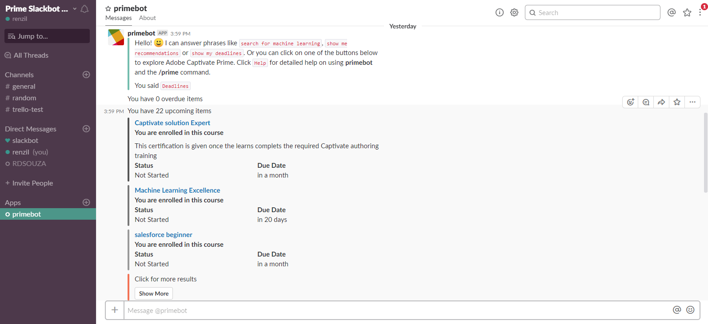

Learn about the new features and enhancements in Adobe Learning Manager

The May 2018 release of Adobe Learning Manager rolls out exciting new features and enhancements. It brings to you the capacity to purge users, manage tags, rename Learning Objects,&nbsp;Slack integration, and much more. Read on to know the new features and enhancements that are available in this release.

For a summary of features introduced in earlier releases of Learning Manager, see&nbsp; [Feature summary | earlier releases.](whats-new-march-2018.md#main-pars_text)

# GDPR compliance {#gdprcompliance}

Learning Manager is now compliant to GDPR. To know more about what GDPR is and how or why it applies to you as an Adobe Learning Manager customer, read [Learning Manager compliance to GDPR.](kb/prime-gdpr.md)

# Purge Users {#purgeusers}

Adobe Learning Manager now allows you to purge users. The feature removes all the personally identifiable information and learning records of the user from Learning Manager. To perform this action, Learning Manager Administrator should select the user and click Delete. Deleted users now appear in a new tab called User Cleanup. Administrators can now select a user in this section and perform the Purge action. This action is irrevocable.

This feature is a part of Learning Manager’s efforts to comply with GDPR requirements.

For more information, see [Purge Users](administrators/feature-summary/purge-users.md).

# Tag Management {#tagmanagement}

Administrators can now manage tags in Learning Manager. Use better tagging and manageable data base to help learners search better and get to appropriate search results quickly. You can manage redundant, misspelled, and irrelevant tags using this feature. Admins can also add, edit, delete, append, or replace tags. Under Manage section, on the navigation panel in the left, click Tags to make changes.

The Administrator can restrict permission of an Author to create tags.

For more information, see [Tags](administrators/feature-summary/tags.md).

# Renaming Learning Objects {#renaminglearningobjects}

Administrators can now rename Learning Objects in Learning Manager. You can customize the terminologies for your convenience and facilitate better understanding and ease for everyone. Some of the Learning Objects whose names can be changed include Courses, Learning Plans, Learning Programs, Certifications, Job Aids, and Catalogs. For example, if you rename course to chapter, every instance where  course  is mentioned appears as  chapter . To make changes, download the sample terminology CSV, edit it, and upload the same. This feature is only available in English.

For more information, see [Renaming Learning Objects.](administrators/feature-summary/settings.md#main-pars_header_1570157145)

# Gamification Reports {#gamificationreports}

As an administrator, you can now download gamification transcripts in CSV format. You can either download the report for  individual  user or user groups.

User name , user email,  users’s  UUID, total user points scored,  breakup  of points collected,  name  of groups the user plays in,  name  of the manager, and active field values are all fetched in the report. Administrators can use this report to evaluate and understand user rankings at the organization level or for a specific group.

For more information, see [Gamification reports.](administrators/feature-summary/reports.md#main-pars_header_310255383)

# Learning Manager integration with Slack {#captivateprimeintegrationwithslack}

This release introduces  Primebot , a Slack bot for Learning Manager. Slack users can install the Adobe Learning Manager app from the Slack App Directory into their Slack teams, and explore Learning Manager content from right within Slack. You can interact with  Primebot  to search for new courses, view recommendations and get notified of upcoming deadlines in Learning Manager. You can also enroll and jump straight to their learning from within Slack, thus letting them rapidly advance their learning journeys.

Learning Manager app for Slack is currently supported only in US instance and not in European instance of Learning Manager.

For more information, see&nbsp; [Learning Manager integration with Slack.](integration-admin/feature-summary/integration-with-slack.md)

# Learning Manager integration with PowerBI {#captivateprimeintegrationwithpowerbi}

Use the integration with Power BI connector to take advantage of your existing Power BI accounts to analyze and visualize learning data from Prime within Power BI. During configuration, the integration administrator can set up their Power BI workspace to be incrementally populated with two live datasets - learner transcript and user skill reports. You can then use all the features and power of Power BI to develop, deploy, and distribute custom dashboards as you desire in their organizations.

For more information, see&nbsp; [Power BI connector](integration-admin/feature-summary/connectors.md#main-pars_header_349639618).
