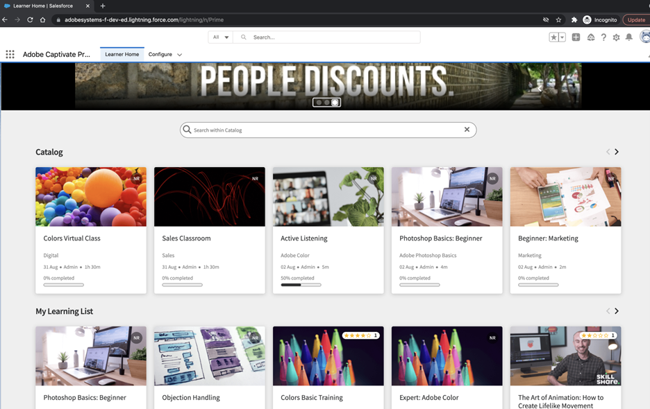

# What's new in the October 2021 release of Adobe Learning Manager {#whats-new-in-the-october-release-of-adobe-learning-manager}

Learn about the new features and enhancements in Adobe Learning Manager

# What's new and changed {#whatsnewandchanged}

## Learning Path

The&nbsp;**October 2021**&nbsp;**release of Adobe Learning Manager**&nbsp;introduces the concept of&nbsp;Learning Paths.&nbsp;

**Note: The&nbsp;Settings&nbsp;> General&nbsp;page has a new option to enable&nbsp;extended capabilities of&nbsp;Learning Paths. If this option is enabled, you can add&nbsp;Learning Paths&nbsp;in another&nbsp;Learning Path. You cannot change the option once it is enabled.**

Learning Paths replace our existing feature of Learning Programs. Imagine Learning Programs getting powerful enhancements without dropping any existing capabilities.&nbsp;Also,&nbsp;the feature gets branded as a Learning Path.&nbsp;

Learning Manager&nbsp;Learning Programs&nbsp;are renamed to&nbsp;Learning Paths.&nbsp;This change happens immediately&nbsp;after the release and&nbsp;the terminology of&nbsp;Learning Path&nbsp;is&nbsp;reflected in all roles. But the functionality of the Learning Programs&nbsp;(now called **Learning Paths**)&nbsp;doesn’t&nbsp;change immediately. Learners can continue to consume Learning Programs (now called Learning Paths) and Authors/Admins can continue to create them as well.&nbsp;Learning Paths bring to you a range of functionalities. Some of them are available immediately after the release. Admins/Authors can start using them. Extended capabilities like “Sections”, “adding Learning Path in another Path”&nbsp;etc&nbsp;are disabled.&nbsp;To take benefit of&nbsp;extended&nbsp;functionalities&nbsp;which come&nbsp;with this enhancement, Administrator should enable the setting as mentioned below. Once enabled,&nbsp;extended&nbsp;capabilities of Learning Path will become available.&nbsp;

### Headless&nbsp;Learning Manager interface

Users with headless&nbsp;interface do not get affected. APIs continue to work even after enabling ‘Learning Path’.&nbsp;End user learners can continue to consume the Programs (now called – Learning Path) on the headless interface.&nbsp;To take advantage of&nbsp;the added&nbsp;functionality of Learning Path, API support is available. Customers can use&nbsp;appropriate API&nbsp;attributes and build the required functionality.&nbsp;

### Advantages of Learning Path

1. Assign a skill and skill level to a Learning Path directly. No need&nbsp;to match&nbsp;skill credits. Once&nbsp;the learner&nbsp;completes a Learning Path, he/she achieves the mentioned skill level.&nbsp;
1. Ability to embed an existing Learning Path into a new Learning Path. Embedding capability is available only for one level of embedding.&nbsp;Thus,&nbsp;a Learning Path already&nbsp;containing&nbsp;an embedded&nbsp;Path&nbsp;cannot be embedded in a new Path.&nbsp;
1. Ability to add pre-requisites,&nbsp;Job Aids and resources at a Learning Path level.&nbsp;
1. Ability to create sections. Each section can have a title.&nbsp;
1. Ability to make sections mandatory and setup completion criteria.

Sharing catalogs between parent account and peer accounts is not possible if the parent account has the option&nbsp;Learning Paths&nbsp;(**Settings > General**) enabled and the peer account has the option disabled.

## Brand New Salesforce App

Learning Manager now offers a brand-new Salesforce App package. Once installed and configured in SFDC, Sales employees can perform their training activities within the SFDC portal. This app allows SFDC users to explore new&nbsp;training, view recommendations and consume them right inside the SFDC portal. Users also get the announcements sent by Administrators in&nbsp;the&nbsp;form of mastheads right inside the app within the SFDC portal.&nbsp;

Please reach out to your CSM or support to get access to the SFDC package and install it. This package is not available on SFDC exchange.

 

## Content Marketplace

Content Marketplace was recently launched in the month of August. It offers thousands of training courses and manually curated playlists covering a wide variety of topics. In this release, we’ve enhanced the Content Marketplace by adding a&nbsp;**Content Hub**&nbsp;for&nbsp;Admins and&nbsp;Subject matter experts.

For more information, see [***Content Hub***](administrators/feature-summary/content-marketplace.md#content-hub).

## Reports

The&nbsp;Learner Transcript&nbsp;contains three new columns to accommodate the changes:&nbsp;

* Embedded Path:&nbsp;These rows will show the name of the embedded Learning Program.&nbsp;&nbsp;
* Embedded Path ID:&nbsp;These rows will show the ids of the embedded Learning Program&nbsp;&nbsp;
* Embedded Path Language:&nbsp;These rows will display the language in which the Learning Program was created.&nbsp;

The Training Report also contains these columns:&nbsp;

* Embedded Path&nbsp;
* Embedded Path ID&nbsp;
* Embedded Course ID&nbsp;

These columns also appear in the reports which get exported using Connectors. Here are the details -&nbsp;&nbsp;

### Salesforce&nbsp;

**Existing connections**

If the option Learning Path is&nbsp;disabled&nbsp;in the Admin account,&nbsp;no rows and columns are added in the report.&nbsp;

If the option Learning Path is&nbsp;enabled&nbsp;in the&nbsp;Admin&nbsp;account,&nbsp;the column "Type" will be populated with Learning Path in case learners are enrolled to it.&nbsp;

**New connections**

If the option Learning Path is&nbsp;disabled&nbsp;in the&nbsp;Admin&nbsp;account,&nbsp;the training report will consist of the following columns, but will not contain any data.&nbsp;

* Embedded Path: Displays the name of the Learning Program&nbsp;
* Embedded Path ID: Displays the IDs for the Learning Program.&nbsp;
* Embedded Course ID: Displays the IDs of courses that are inside a Learning Path.&nbsp;&nbsp;

Also, for new connections in accounts where Learning Path is enabled, the three new columns will appear, and all data will flow.&nbsp;

In addition, the report will contain the column type&nbsp;Learning Path (Higher Level)&nbsp;for all learners who are&nbsp;enrolled in&nbsp;a Learning Path.&nbsp;

In the&nbsp;Type&nbsp;column,&nbsp;the Learning&nbsp;Program will be renamed as&nbsp;Learning&nbsp;Path. For existing connections, there will be no change.&nbsp;&nbsp;

### Power BI&nbsp;

**Admin:&nbsp;Learning Transcripts and Unified Report**

**Existing connections**

If the option Learning Path is&nbsp;disabled&nbsp;in the&nbsp;Admin&nbsp;account, no rows and columns are added in the reports.&nbsp;

If the option Learning Path is&nbsp;enabled&nbsp;in the&nbsp;Admin&nbsp;account, the report will contain the column type Learning Path (Higher Level) for all learners who are enrolled&nbsp;in&nbsp;a Learning Path.&nbsp;

**New connections**

If the option Learning Path is&nbsp;disabled&nbsp;in the&nbsp;Admin&nbsp;account, the training report will consist of the following columns:&nbsp;

* Embedded Path: Displays the name of the Learning Program&nbsp;

* Embedded Path ID: Displays the IDs for the Learning Program.&nbsp;
* Embedded Course ID: Displays the IDs of courses that are inside a Learning Path.&nbsp;

In addition, the report will contain the column type Learning Path (Higher Level) for all learners who are enrolled to a Learning Path.&nbsp;

In the Type column, Learning Program will be renamed as Learning Path. For existing connections, there will be no change. However, for new connections, the changes will be reflected&nbsp;after&nbsp;30 days.&nbsp;

**Training Report:&nbsp;Unified Report&nbsp;**

**Existing connections**

If the option Learning Path is&nbsp;disabled&nbsp;in the&nbsp;Admin&nbsp;account, no rows and columns are added in the reports.&nbsp;

If the option Learning Path is&nbsp;enabled&nbsp;in the&nbsp;Admin&nbsp;account, the report will contain the&nbsp;column "Type" will contain new value "Learning&nbsp;Path(Higher level) wherever applicable".&nbsp;

**New connections**

If the option Learning Path is&nbsp;disabled&nbsp;in the&nbsp;Admin&nbsp;account, the training report will consist of the following columns:&nbsp;

* Embedded Path: Displays the name of the Learning Program&nbsp;
* Embedded Path ID: Displays the IDs for the Learning Program.&nbsp;
* Embedded Course ID: Displays the IDs of courses that are inside a Learning Path.&nbsp;

In addition, the report will contain the column type Learning Path (Higher Level) for all learners who are enrolled to a Learning Path.&nbsp;

In the Type column, Learning Program will be renamed as Learning Path. For existing connections, there will be no change. However, for new connections, the changes will be reflected&nbsp;after 30 days.&nbsp;

### Marketo&nbsp;

There is no change in reports caused by changes in Learning Path.

## Session summary report

This release of Learning Manager adds the&nbsp;Session Summary Report, which&nbsp;contains all sessions planned for a learner within a specified date.

This allows the admin to export all the Virtual and Classroom session details falling under the given date range. Admin can also export the session report with respect to&nbsp;specific&nbsp;training&nbsp;or&nbsp;Instructors.

For more information, see [***Reports***](administrators/feature-summary/reports.md).

## Search enhancements

This release of Learning Manager enhances learner’s search capability by supporting word-based search in addition to phrase-based search. Here’ how it works:

In the Learner app, searching for courses is now more precise and&nbsp;produces&nbsp;more relevant search results. When the learner enters the search phrase&nbsp;say,&nbsp;‘Performance Management’,&nbsp;typeahead results gives you the results based on complete phrase match. This is an existing behavior. But if you search for all results by hitting ‘Enter, then Learning Manager searches for individual words in addition to phrase search and&nbsp;combines the results in your search results.&nbsp;Thus,&nbsp;in such a case these three items will get searched “Performance Management”, “Performance” and “Management”.&nbsp;

This feature is also available via APIs. Reach out to the CSM/Support for details.

## Player TOC enhancements

As part of the changes&nbsp;caused by&nbsp;Learning Path-related changes,&nbsp;we have&nbsp;revamped the Fluidic Player&nbsp;TOC. Now all training that&nbsp;is&nbsp;part of a Learning Path&nbsp;is&nbsp;available in the TOC.

In previous releases, if a learner opened a training that is a part of a Learning Program, only that training opened in the TOC. Also, navigating between training or jumping from one training to another was not possible.

Now, in the Fluidic Player TOC, you can get a complete view of all training available in the Learning Path. In this enhanced TOC, the first level training in the TOC is depicted by a diamond. You can expand each level and jump to any module.

Note that this feature is available if the training is launched from the native web app Learner Immersive Home page. It is also available in headless scenarios where customers have embedded the Fluidic Player in custom websites.&nbsp;

This feature is currently not available when a training is launched from&nbsp;the training&nbsp;page in the native web interface. In this case, if a Learning Path/Program is launched, Fluidic Player will continue to show the modules of the course which gets launched. The TOC icons will be the newly built icons.&nbsp;

## Learning Manager widgets for headless user Interface

Learning Manager offers widgets, which can be embedded to your AEM or non-AEM based websites. This becomes a convenient way for customers to build their headless interface.&nbsp;

In this update, Learning Manager introduces a new widget ‘Catalog widget’, which displays the trainings from a particular catalog of Learning Manager. Simply configure the widget to provide the catalog ID from where you wish to fetch the trainings. You can also fetch the trainings based on other filters like – Skill name&nbsp;and&nbsp;Tag name.&nbsp;

Embed the widget in your headless customer interface. Once learners visit the page, this widget will display the trainings based on the configuration, provided the learner has visibility to these trainings. A learner can simply click to launch the training content and take the training immediately.&nbsp;&nbsp;

In this update, Learning Manager also supports&nbsp;a contemporary style&nbsp;of widget. This style is meant to highlight&nbsp;the minimum&nbsp;but important metadata of the training. In addition, you can even customize the colors and fonts of this style to match it with your branding requirements.

For more information, see [***Integrate Learning Manager and AEM***](integrate-aem-captivate-prime.md).

## Mark completion for individual course inside a certification

At present, an Admin is only able to mark a Learner as ‘Complete’ for the entire certification. In this release, the&nbsp;Admin&nbsp;can mark each course as completed inside a certification.

The&nbsp;Admin&nbsp;will be able to see the list of courses which is part of the certification. From there, the&nbsp;Admin&nbsp;can select the course, and mark it as complete from the action dropdown if required.&nbsp;

A new Course drop-down list is added to the page.&nbsp;

The selected course will be applicable only for marking completion.

## Enable/Disable Hide Unfilled Profile Attributes

In&nbsp;previous&nbsp;releases, you could hide filled profile attributes (active fields) when a learner logs on to Prime. In this release of Learning Manager, you can hide the entire ‘Complete your profile’ page from the learners.&nbsp;Thus,&nbsp;this page will not popup once the learner logs in.&nbsp;

Note that the existing default&nbsp;behavior&nbsp;does not change. This is an optional capability now available to Administrators.

## API changes

### Learning Path-related changes

**Note:**&nbsp;The APIs still&nbsp;use the terminology&nbsp;Learning&nbsp;Program&nbsp;instead of Learning Path&nbsp;to maintain&nbsp;backward compatibility.&nbsp;By default, Get/LOs will not return the enhanced&nbsp;Learning&nbsp;Paths. You must use an extra parameter&nbsp;to&nbsp;get those Learning Objects.

**Learning Objects API**

A new field called&nbsp;*isEnhancedLP&nbsp;*is added to the learning Object model for Learning Program, which takes the value true/false.&nbsp;This flag signifies if the Learning&nbsp;Path&nbsp;is a conventional&nbsp;one or the Learning Path contains a nested Learning Path and course sequences.

**New filter**

There is a filter&nbsp;ignoreEnhancedLP,&nbsp;added in GET /learningObjects&nbsp;API,&nbsp;when set to true,&nbsp;ignores&nbsp;an enhanced Learning Path. When the filter is false, all Learning Paths (enhanced and conventional) are returned.

**Embedded Learning Program**

To maintain backward compatibility, we’ve&nbsp;provided&nbsp;subLOs&nbsp;for&nbsp;ordered Learning&nbsp;Paths. For&nbsp;previously created Learning Programs,&nbsp;we will continue to&nbsp;provide&nbsp;subLOs&nbsp;in order.&nbsp;

```
"subLOs": { "data": [ { "id": "course:3978316", "type": "learningObject" }, { "id": "learningProgram:3978316", "type": "learningObject" } ] }
```

**Sections**

The information in the sections&nbsp;is&nbsp;added in the response.

```
"sections:[ { id: setion_01, mandatory = true; mandatoryLOCount:2, loIds: [course:1125882,course:11258827], "localizedMetadata": [ { "name": "section name", "locale": "en-US" } ], }, { id: section_02, mandatory = true; mandatoryLOCount:1 loIds: [learningProgram:123], "localizedMetadata": [ { "name": "LP2", "locale": "en-US" } ], } ]
```

**userBadges**

This is a new API and is for Administrators.&nbsp;The&nbsp;userBadges&nbsp;API has two new parameters,&nbsp;userId&nbsp;and&nbsp;loId. The API returns information, among others, about the badge that the user has achieved after taking a course.&nbsp;All badges that the user has achieved&nbsp;and assigned&nbsp;will be&nbsp;returned.

**skillInterest**

This is a new API. The API is for both Administrators and Learners.&nbsp;Here are the operations that you can perform with the API:

**Search**

The /skillinterest/search allows you to retrieve a list of&nbsp;skill interest that contains the input query name.&nbsp;You can also search based on Admin-defined or Industry-aligned skills.

GET /skillinterest/search&nbsp;returns&nbsp;the following response:
<pre>{ "data": [&nbsp;{ "id": "string", "type": "string", "attributes":&nbsp;{ "name": "string" }&nbsp;} ]&nbsp;}
</pre>The parameters are as follows:

<table border="0" cellpadding="0" cellspacing="0" width="403"> 
 <tbody> 
  <tr> 
   <td height="21" width="147"><p>&nbsp;</p> <p>Parameter&nbsp;</p> <p>&nbsp;</p> </td> 
   <td width="64"><p>&nbsp;</p> <p>Value&nbsp;</p> <p>&nbsp;</p> </td> 
   <td width="64"><p>&nbsp;</p> <p>Description&nbsp;</p> <p>&nbsp;</p> </td> 
   <td width="64"><p>&nbsp;</p> <p>Type&nbsp;</p> <p>&nbsp;</p> </td> 
   <td width="64"><p>&nbsp;</p> <p>Data type&nbsp;</p> <p>&nbsp;</p> </td> 
  </tr> 
  <tr> 
   <td height="21"><p>&nbsp;</p> <p>page[cursor]&nbsp;</p> <p>&nbsp;</p> </td> 
   <td><p>&nbsp;</p> <p>&nbsp;</p> <p>&nbsp;</p> </td> 
   <td><p>&nbsp;</p> <p>The last cursor till the records is fetched.&nbsp;</p> <p>&nbsp;</p> </td> 
   <td><p>&nbsp;</p> <p>query&nbsp;</p> <p>&nbsp;</p> </td> 
   <td><p>&nbsp;</p> <p>string&nbsp;</p> <p>&nbsp;</p> </td> 
  </tr> 
  <tr> 
   <td height="21"><p>&nbsp;</p> <p>page[limit]&nbsp;</p> <p>&nbsp;</p> </td> 
   <td><p>&nbsp;</p> <p>10&nbsp;</p> <p>&nbsp;</p> </td> 
   <td><p>&nbsp;</p> <p>Maximum number of records that are displayed on a page. The maximum value is 10.&nbsp;</p> <p>&nbsp;</p> </td> 
   <td><p>&nbsp;</p> <p>query&nbsp;</p> <p>&nbsp;</p> </td> 
   <td><p>&nbsp;</p> <p>integer&nbsp;</p> <p>&nbsp;</p> </td> 
  </tr> 
  <tr> 
   <td height="21"><p>&nbsp;</p> <p>nameStartsWith&nbsp;</p> <p>&nbsp;</p> </td> 
   <td><p>&nbsp;</p> <p>&lt;skill&gt;&nbsp;</p> <p>&nbsp;</p> </td> 
   <td><p>&nbsp;</p> <p>The skill interest to search for.&nbsp;</p> <p>&nbsp;</p> </td> 
   <td><p>&nbsp;</p> <p>query&nbsp;</p> <p>&nbsp;</p> </td> 
   <td><p>&nbsp;</p> <p>string&nbsp;</p> <p>&nbsp;</p> </td> 
  </tr> 
  <tr> 
   <td rowspan="2" height="124"><p>&nbsp;</p> <p>filter.skillInterestTypes&nbsp;</p> <p>&nbsp;</p> </td> 
   <td><p>&nbsp;</p> <p>ADMIN_DEFINED&nbsp;</p> <p>&nbsp;</p> </td> 
   <td rowspan="2"><p>&nbsp;</p> <p>The type of skill interest. Choose if the type is external or internal.&nbsp;</p> <p>&nbsp;</p> </td> 
   <td rowspan="2"><p>&nbsp;</p> <p>query&nbsp;</p> <p>&nbsp;</p> </td> 
   <td rowspan="2"><p>&nbsp;</p> <p>string&nbsp;</p> <p>&nbsp;</p> </td> 
  </tr> 
  <tr> 
   <td height="20"><p>INDUSTRY_ALIGNED&nbsp;</p> </td> 
  </tr> 
 </tbody> 
</table>

**Delete**

The API deletes a user skill interest.

DELETE /users/{userId}/skillInterest/{id}&nbsp;contains the following parameters:

<table border="0" cellpadding="0" cellspacing="0" width="403"> 
 <tbody> 
  <tr> 
   <td height="21" width="147"><p>&nbsp;</p> <p><b>Parameter&nbsp;</b></p> <p>&nbsp;</p> </td> 
   <td width="64"><p>&nbsp;</p> <p><b>Value&nbsp;</b></p> <p>&nbsp;</p> </td> 
   <td width="64"><p>&nbsp;</p> <p><b>Description&nbsp;</b></p> <p>&nbsp;</p> </td> 
   <td width="64"><p>&nbsp;</p> <p><b>Type&nbsp;</b></p> <p>&nbsp;</p> </td> 
   <td width="64"><p>&nbsp;</p> <p><b>Data type</b>&nbsp;</p> <p>&nbsp;</p> </td> 
  </tr> 
  <tr> 
   <td height="21"><p>&nbsp;</p> <p>id&nbsp;</p> <p>&nbsp;</p> </td> 
   <td><p>&nbsp;</p> <p>&nbsp;</p> <p>&nbsp;</p> </td> 
   <td><p>&nbsp;</p> <p>The id of the skill for which the skill interest must be deleted.&nbsp;</p> <p>&nbsp;</p> </td> 
   <td><p>&nbsp;</p> <p>query&nbsp;</p> <p>&nbsp;</p> </td> 
   <td><p>&nbsp;</p> <p>string&nbsp;</p> <p>&nbsp;</p> </td> 
  </tr> 
  <tr> 
   <td rowspan="2" height="124"><p>&nbsp;</p> <p>filter.skillInterestTypes&nbsp;</p> <p>&nbsp;</p> </td> 
   <td><p>&nbsp;</p> <p>ADMIN_DEFINED&nbsp;</p> <p>&nbsp;</p> </td> 
   <td rowspan="2"><p>&nbsp;</p> <p>The type of skill interest. Choose if the type is external or internal.&nbsp;</p> <p>&nbsp;</p> </td> 
   <td rowspan="2"><p>&nbsp;</p> <p>query&nbsp;</p> <p>&nbsp;</p> </td> 
   <td rowspan="2"><p>&nbsp;</p> <p>string&nbsp;</p> <p>&nbsp;</p> </td> 
  </tr> 
  <tr> 
   <td height="21"><p>INDUSTRY_ALIGNED&nbsp;</p> </td> 
  </tr> 
  <tr> 
   <td height="20"><p>&nbsp;</p> <p>userId&nbsp;</p> <p>&nbsp;</p> </td> 
   <td><p>&nbsp;</p> <p>&nbsp;</p> <p>&nbsp;</p> </td> 
   <td><p>&nbsp;</p> <p>The Id of the user for whom&nbsp;the skill interest is removed.&nbsp;</p> <p>&nbsp;</p> </td> 
   <td><p>&nbsp;</p> <p>query&nbsp;</p> <p>&nbsp;</p> </td> 
   <td><p>&nbsp;</p> <p>string&nbsp;</p> <p>&nbsp;</p> </td> 
  </tr> 
 </tbody> 
</table>

**Add**

The API adds a user skill interest.

POST /users/{userId}/skillInterest/{id}&nbsp;contains the following parameters:

<table border="0" cellpadding="0" cellspacing="0" width="403"> 
 <tbody> 
  <tr> 
   <td height="21" width="147"><p>&nbsp;</p> <p><b>Parameter&nbsp;</b></p> <p>&nbsp;</p> </td> 
   <td width="64"><p>&nbsp;</p> <p><b>Value&nbsp;</b></p> <p>&nbsp;</p> </td> 
   <td width="64"><p>&nbsp;</p> <p><b>Description&nbsp;</b></p> <p>&nbsp;</p> </td> 
   <td width="64"><p>&nbsp;</p> <p><b>Type&nbsp;</b></p> <p>&nbsp;</p> </td> 
   <td width="64"><p>&nbsp;</p> <p><b>Data type</b>&nbsp;</p> <p>&nbsp;</p> </td> 
  </tr> 
  <tr> 
   <td height="21"><p>&nbsp;</p> <p>id&nbsp;</p> <p>&nbsp;</p> </td> 
   <td><p>&nbsp;</p> <p>&nbsp;</p> <p>&nbsp;</p> </td> 
   <td><p>&nbsp;</p> <p>The id of the skill for which the skill interest must be&nbsp;added.&nbsp;</p> <p>&nbsp;</p> </td> 
   <td><p>&nbsp;</p> <p>query&nbsp;</p> <p>&nbsp;</p> </td> 
   <td><p>&nbsp;</p> <p>string&nbsp;</p> <p>&nbsp;</p> </td> 
  </tr> 
  <tr> 
   <td rowspan="2" height="124"><p>&nbsp;</p> <p>filter.skillInterestTypes&nbsp;</p> <p>&nbsp;</p> </td> 
   <td><p>&nbsp;</p> <p>ADMIN_DEFINED&nbsp;</p> <p>&nbsp;</p> </td> 
   <td rowspan="2"><p>&nbsp;</p> <p>The type of skill interest. Choose if the type is external or internal.&nbsp;</p> <p>&nbsp;</p> </td> 
   <td rowspan="2"><p>&nbsp;</p> <p>query&nbsp;</p> <p>&nbsp;</p> </td> 
   <td rowspan="2"><p>&nbsp;</p> <p>string&nbsp;</p> <p>&nbsp;</p> </td> 
  </tr> 
  <tr> 
   <td height="21"><p>INDUSTRY_ALIGNED&nbsp;</p> </td> 
  </tr> 
  <tr> 
   <td height="20"><p>&nbsp;</p> <p>userId&nbsp;</p> <p>&nbsp;</p> </td> 
   <td><p>&nbsp;</p> <p>&nbsp;</p> <p>&nbsp;</p> </td> 
   <td><p>&nbsp;</p> <p>The Id of the user for&nbsp;whom&nbsp;the skill interest is&nbsp;added.&nbsp;</p> <p>&nbsp;</p> </td> 
   <td><p>&nbsp;</p> <p>query&nbsp;</p> <p>&nbsp;</p> </td> 
   <td><p>&nbsp;</p> <p>string&nbsp;</p> <p>&nbsp;</p> </td> 
  </tr> 
 </tbody> 
</table>

**Get details of skill interest**

The API gets additional details, such as, id,&nbsp;user_id,&nbsp;skill_id, created date and source of creation.

GET /users/{userId}/skillInterests&nbsp;has the following parameters:

<table border="0" cellpadding="0" cellspacing="0" width="403"> 
 <tbody> 
  <tr> 
   <td height="21" width="147"><p>&nbsp;</p> <p><b>Parameter&nbsp;</b></p> <p>&nbsp;</p> </td> 
   <td width="64"><p>&nbsp;</p> <p><b>Value&nbsp;</b></p> <p>&nbsp;</p> </td> 
   <td width="64"><p>&nbsp;</p> <p><b>Description&nbsp;</b></p> <p>&nbsp;</p> </td> 
   <td width="64"><p>&nbsp;</p> <p><b>Type&nbsp;</b></p> <p>&nbsp;</p> </td> 
   <td width="64"><p>&nbsp;</p> <p><b>Data type</b>&nbsp;</p> <p>&nbsp;</p> </td> 
  </tr> 
  <tr> 
   <td height="21"><p>&nbsp;</p> <p>page[offset]&nbsp;</p> <p>&nbsp;</p> </td> 
   <td><p>&nbsp;</p> <p>&nbsp;</p> <p>&nbsp;</p> </td> 
   <td><p>&nbsp;</p> <p>The starting value of the records to be displayed in page&nbsp;</p> <p>&nbsp;</p> </td> 
   <td><p>&nbsp;</p> <p>query&nbsp;</p> <p>&nbsp;</p> </td> 
   <td><p>&nbsp;</p> <p>string&nbsp;</p> <p>&nbsp;</p> </td> 
  </tr> 
  <tr> 
   <td height="21"><p>&nbsp;</p> <p>page[limit]&nbsp;</p> <p>&nbsp;</p> </td> 
   <td><p>&nbsp;</p> <p>10&nbsp;</p> <p>&nbsp;</p> </td> 
   <td><p>&nbsp;</p> <p>Maximum number of records that are displayed on a page. The maximum value is 10.&nbsp;</p> <p>&nbsp;</p> </td> 
   <td><p>&nbsp;</p> <p>query&nbsp;</p> <p>&nbsp;</p> </td> 
   <td><p>&nbsp;</p> <p>integer&nbsp;</p> <p>&nbsp;</p> </td> 
  </tr> 
  <tr> 
   <td height="21"><p>&nbsp;</p> <p>sort&nbsp;</p> <p>&nbsp;</p> </td> 
   <td><p>&nbsp;</p> <p>dateCreated&nbsp;</p> <p>&nbsp;</p> </td> 
   <td><p>&nbsp;</p> <p>The sort type to be applied.&nbsp;</p> <p>&nbsp;</p> </td> 
   <td><p>&nbsp;</p> <p>query&nbsp;</p> <p>&nbsp;</p> </td> 
   <td><p>&nbsp;</p> <p>string&nbsp;</p> <p>&nbsp;</p> </td> 
  </tr> 
  <tr> 
   <td height="21"><p>&nbsp;</p> <p>userId&nbsp;</p> <p>&nbsp;</p> </td> 
   <td><p>&nbsp;</p> <p>&nbsp;</p> <p>&nbsp;</p> </td> 
   <td><p>&nbsp;</p> <p>The Id of the user whose data is being requested.&nbsp;</p> <p>&nbsp;</p> </td> 
   <td><p>&nbsp;</p> <p>path&nbsp;</p> <p>&nbsp;</p> </td> 
   <td><p>&nbsp;</p> <p>string&nbsp;</p> <p>&nbsp;</p> </td> 
  </tr> 
  <tr> 
   <td rowspan="2" height="124"><p>&nbsp;</p> <p>filter.skillInterestTypes&nbsp;</p> <p>&nbsp;</p> </td> 
   <td><p>&nbsp;</p> <p>ADMIN_DEFINED&nbsp;</p> <p>&nbsp;</p> </td> 
   <td rowspan="2"><p>&nbsp;</p> <p>The type of skill interest. Choose if the type is external or internal.&nbsp;</p> <p>&nbsp;</p> </td> 
   <td rowspan="2"><p>&nbsp;</p> <p>query&nbsp;</p> <p>&nbsp;</p> </td> 
   <td rowspan="2"><p>&nbsp;</p> <p>string&nbsp;</p> <p>&nbsp;</p> </td> 
  </tr> 
  <tr> 
   <td height="20"><p>INDUSTRY_ALIGNED&nbsp;</p> </td> 
  </tr> 
 </tbody> 
</table>

**Jobs**

Now the Job&nbsp;api&nbsp;will have the capability to export a Session Report.

Job API&nbsp;supports&nbsp;new&nbsp;jobType&nbsp;named&nbsp;“generateSessionReport”, that you can specify in the request&nbsp;body, and get the details of the session summary report.&nbsp;This API is applicable only for VC and classroom sessions.

The payload also supports either&nbsp;courseIds&nbsp;or&nbsp;instructorIds&nbsp;as property, but&nbsp;**NOT&nbsp;**both.

```
\{ "data": { "type": "job", "attributes": { "description": "description of your choice", "jobType": "generateSessionReport", "payload":{ "fromDate": "2021-08-24T09:00:00.000Z", "toDate": "2021-08-31T18:00:59.999Z", "courseIds" :"course:4992782,course:4992811,course:5071907" } } } }
```

# Enhanced features in this release {#Whatsnewandchanged-1}

## Learning Path

From this release, we are enhancing the functionality of Learning Programs significantly; and it will be called Learning Path.&nbsp;Learners can continue to consume Learning Programs (now called Learning Paths) and Authors/Admins can continue to create them as well. Learning Paths bring to you a range of functionalities. Some of them are available immediately after the release. Admins/Authors can start using them. Extended capabilities like “Sections”, “adding Learning Path in another Path”&nbsp;etc&nbsp;are disabled and can be enabled by checking the&nbsp;checkbox&nbsp;mentioned below.&nbsp;

Note that the existing feature of Learning Programs will be renamed to&nbsp;Learning Path&nbsp;immediately&nbsp;after the release.&nbsp;In case&nbsp;you wish to continue calling it as&nbsp;Learning Programs, we recommend you to use the&nbsp;‘Terminologies’&nbsp;feature to apply the required terminology. This way you can&nbsp;continue&nbsp;to use the word Learning Program.

## Leaning Path-related changes

Here is a summary of the changes that are expected in this release of Learning Manager.

The changes depend on the&nbsp;flag Learning Paths in&nbsp;**Settings > General** in the Admin app.

<table border="0" cellpadding="0" cellspacing="0" width="339"> 
 <tbody> 
  <tr> 
   <td height="21" width="147"><p>&nbsp;</p> <p><b>Report&nbsp;</b></p> <p>&nbsp;</p> </td> 
   <td width="64"><p>&nbsp;</p> <p><b>Changes in the report immediately after the release (with&nbsp;check-box is&nbsp;unchecked)&nbsp;</b></p> <p>&nbsp;</p> </td> 
   <td width="64"><p>&nbsp;</p> <p><b>Changes in report after&nbsp;checking&nbsp;the check-box. i.e.&nbsp;once new Learning Path capabilities are enabled.&nbsp;</b></p> <p>&nbsp;</p> </td> 
   <td width="64"><p>&nbsp;</p> <p><b>Changes in report&nbsp;that will be made&nbsp;after 30 days after the release.&nbsp;</b></p> <p>&nbsp;</p> </td> 
  </tr> 
  <tr> 
   <td rowspan="7" height="141"><p>&nbsp;</p> <p>Learner&nbsp;Transcript&nbsp;&nbsp;</p> <p>&nbsp;</p> </td> 
   <td><p>&nbsp;</p> <p>A new column will be introduced:&nbsp;Embedded_Course_IDThis&nbsp;column will have values populated when course is part of a Learning Program&nbsp;Or&nbsp;Certification.&nbsp;</p> <p>&nbsp;</p> </td> 
   <td><p>&nbsp;</p> <p>Column 'Type' = 'Learning Path (Higher Level)' will be displayed when Learner is enrolled to a Learning Path&nbsp;</p> <p>&nbsp;</p> </td> 
   <td rowspan="7"><p>&nbsp;</p> <p>Under&nbsp;‘Type’&nbsp;column, 'Learning Program' will be renamed as 'Learning Path'. This is irrespective&nbsp;of the status of the Learning Path&nbsp;check-box,&nbsp;if&nbsp;enabled/disabled.&nbsp;</p> <p>&nbsp;</p> </td> 
  </tr> 
  <tr> 
   <td height="20">It will be seen towards the extreme right end of the report.&nbsp;</td> 
   <td><p>1. In addition, there are two new columns:&nbsp;</p> </td> 
  </tr> 
  <tr> 
   <td height="20">&nbsp;</td> 
   <td>Embedded Path:&nbsp;These rows will&nbsp;display&nbsp;the&nbsp;name of the&nbsp;embedded Learning Program.&nbsp;</td> 
  </tr> 
  <tr> 
   <td height="20">&nbsp;</td> 
   <td><p>2. This column will be displayed after the 'Type' column&nbsp;</p> </td> 
  </tr> 
  <tr> 
   <td height="20">&nbsp;</td> 
   <td>&nbsp;</td> 
  </tr> 
  <tr> 
   <td height="20">&nbsp;</td> 
   <td>Embedded Path ID:&nbsp;These rows will&nbsp;display&nbsp;the ids of the embedded Learning Program.&nbsp;This column will be displayed&nbsp;right next to&nbsp;'Embedded_Course_ID'&nbsp;</td> 
  </tr> 
  <tr> 
   <td height="21">&nbsp;</td> 
   <td>Note:&nbsp;The&nbsp;Embedded_Course_ID&nbsp;column will be displayed irrespective of&nbsp;the status of the Learning Path&nbsp;check-box,&nbsp;checked/unchecked.&nbsp;</td> 
  </tr> 
  <tr> 
   <td height="21"><p>&nbsp;</p> <p>Learners’&nbsp;Learner&nbsp;Transcript&nbsp;&nbsp;</p> <p>&nbsp;</p> </td> 
   <td><p>&nbsp;</p> <p>Same as above.&nbsp;</p> <p>&nbsp;</p> </td> 
   <td><p>&nbsp;</p> <p>Same as above,&nbsp;except there&nbsp;will be&nbsp;no 'Type' column in&nbsp;the&nbsp;Learner&nbsp;Transcript.&nbsp;</p> <p>&nbsp;</p> </td> 
   <td><p>&nbsp;</p> <p>Not&nbsp;Applicable&nbsp;</p> <p>&nbsp;</p> </td> 
  </tr> 
  <tr> 
   <td rowspan="6" height="121"><p>&nbsp;</p> <p>Training Report&nbsp;</p> <p>&nbsp;</p> </td> 
   <td rowspan="6"><p>&nbsp;</p> <p>Same as above.&nbsp;&nbsp;</p> <p>&nbsp;</p> </td> 
   <td><p>&nbsp;</p> <p>There are three new columns:&nbsp;</p> <p>&nbsp;</p> </td> 
   <td rowspan="6"><p>&nbsp;</p> <p>Under Type column, 'Learning Program' will be renamed as 'Learning Path'. This is irrespective of the status of the Learning Path check-box, if enabled/disabled.&nbsp;</p> <p>&nbsp;</p> </td> 
  </tr> 
  <tr> 
   <td height="20">Embedded Path:&nbsp;These rows will show the&nbsp;name of the&nbsp;embedded Learning Program.&nbsp;</td> 
  </tr> 
  <tr> 
   <td height="20">Embedded Path ID:&nbsp;These rows will show the ids of the embedded Learning Program&nbsp;</td> 
  </tr> 
  <tr> 
   <td height="20">Embedded Path Language:&nbsp;These rows will display the language in which the&nbsp;Learing&nbsp;Program was created.&nbsp;</td> 
  </tr> 
  <tr> 
   <td height="20">&nbsp;</td> 
  </tr> 
  <tr> 
   <td height="21"><p>Also,&nbsp;Column 'Type' = 'Learning Path (Higher Level)' will be displayed when Learner is enrolled to a Learning Path.&nbsp;</p> </td> 
  </tr> 
  <tr> 
   <td height="20"><p>&nbsp;</p> <p>Content Audit Trail&nbsp;</p> <p>&nbsp;</p> </td> 
   <td><p>&nbsp;</p> <p>Learning Path' will be shown for LPs (irrespective of flag is enabled or disabled)&nbsp;</p> <p>&nbsp;</p> </td> 
   <td><p>&nbsp;</p> <p>Learning Path (Higher Level)' will be shown wherever enhanced&nbsp;Learning&nbsp; Path&nbsp;is referred.&nbsp;</p> <p>&nbsp;</p> </td> 
   <td><p>&nbsp;</p> <p>NA&nbsp;</p> <p>&nbsp;</p> </td> 
  </tr> 
 </tbody> 
</table>

## Enrollment&nbsp;Data/Details on Unenrolled Learners

Often users need to audit the&nbsp;enrollment&nbsp;or&nbsp;unenrollment&nbsp;dates for accountably audits, which would benefit in cases that concern regulatory training requirements.

In this release, the&nbsp;Enrollment&nbsp;date and&nbsp;unenrollment&nbsp;date columns are now distinct, which enables you to get a better picture of&nbsp;enrollment.

New column “Unenrollment&nbsp;Date (UTC&nbsp;TimeZone)” gets introduced at the extreme right of the transcript report. This column mentions the&nbsp;unerollment&nbsp;date&nbsp;incase&nbsp;user has been unenrolled.&nbsp;

After this release, the platform will keep a record of the&nbsp;enrollment&nbsp;date even after un-enrollment.&nbsp;Thus,&nbsp;both&nbsp;enrollment&nbsp;date and un-enrollment&nbsp;date will be mentioned for all&nbsp;unenrollments&nbsp;occurring&nbsp;after the release. For&nbsp;unenrollments&nbsp;which have happened already before&nbsp;the release, date for the&nbsp;enrollment&nbsp;column will remain empty.&nbsp;

The Learning Transcript report contains both the columns.

## Time zone&nbsp;information in&nbsp;emails

When a&nbsp;reminder&nbsp;email&nbsp;is sent to the Learner it only sends the Date and Time. In this update of Learning Manager,&nbsp;the Time zone&nbsp;information is appended to the date and time.&nbsp;Functionality&nbsp;remains&nbsp;the same. To have better clarity the&nbsp;time zone&nbsp;code will be added after the date/time information.&nbsp;

## Changes expected in Connectors

### Due to Learning Path

Reports which get exported from Connectors will undergo changes. As always there are no changes expected immediately after the release. Hence your existing connections should continue to&nbsp;work immediately after the release. We have attached a separate snapshot in this email with a table explaining all the changes you can expect in different connectors when&nbsp;the Learning Path feature is enabled (checked) or disabled (unchecked). Note that there are certain changes expected 30 days after the release. Same has been explained in the snapshot. Look for a snapshot “Appendix-1” in the email you must have received from your&nbsp;CSM.&nbsp;

### Unenrollment&nbsp;Date column&nbsp;gets added

Learner Transcript report will contain a new column&nbsp;Unenrollment&nbsp;Date (UTC&nbsp;TimeZone)&nbsp;to the extreme right of the report. This column will be added only when new connections are created for -&nbsp;

* Salesforce connector
* Power BI (export Learner Transcript and Unified Reports)
* Marketo&nbsp;connector

### Language information gets added

Two new columns Training language and Sub Training language gets added to the Training Report. This report gets added only when a new connection is established for - `Power BI (unified report)`

&nbsp;

## Video announcement in headless scenario

Attributes required to playback video&nbsp;announcement&nbsp;in headless user interface is set to change.&nbsp;

In&nbsp;case customers are showcasing video announcements in headless custom user interface, please note that additional attributes need to be passed to fetch the video announcement.&nbsp;

This change will be implemented 30 days after the actual release.&nbsp;Thus,&nbsp;learners are not affected immediately after the release. But customers should carry out below changes within 30 days after the release.&nbsp;

**Current production behavior:**

video_id&nbsp;= video to be played

**New behavior:**

* video_id: The video to be played.
* asset_id: Internal resource ID obtained in APIs.
* asset_type: Type of the asset.&nbsp;Valid values are: resource, announcement,&nbsp;jobaid, post, comment.
* context: Weather formal or informal. In formal if invoked from social and formal in rest of the cases.
* auth_token: oauth&nbsp;token of the client.

## External login text change

On the learner login page, we’ve changed the text from&nbsp;**Partner Login&nbsp;For**&nbsp;to&nbsp;**Login For**.

## Changes in Learner Transcripts dialog

In the **Learner Transcripts** dialog,&nbsp;the interface for the drop-downs have changed.&nbsp;We have now replaced check-box selection behavior with a tick. This component improves the accessibility aspect of the interface. There is no change in the functionality&nbsp;of Learner Transcript feature.

* The&nbsp;**Search&nbsp;**field no longer exists for the filters. The options are now available in alphabetical order, so that you can easily locate the option (s).
* The&nbsp;**Learner Transcripts**&nbsp;dialog is accessible-friendly and Section 508-compliant.

# Release Notes {#releasenotes}

For information regarding current and previous releases of Learning Manager web app and device app, see the&nbsp; [***Release notes***](release-note/release-notes.md).

# Bug fixes {#bugfixes}

To see the bugs that are fixed in this update, refer to the&nbsp; [***Bugs fixed***](release-note/release-notes.md#bug-fixes)&nbsp;list.

# Known issues {#knownissues}

To see the known issues in this update, refer to [***Known issues***](release-note/release-notes.md#known-issues) list.

# System Requirements {#systemrequirements}

[Learning Manager system requirements](system-requirements.md)

# Previous releases of Learning Manager {#previousreleasesofcaptivateprime}

* [Learning Manager | August 2021 release](whats-new-august-2021.md)
* [Learning Manager | February 2021 release](whats-new-february-2021.md)
* [Learning Manager | December 2020 release](whats-new-december-2020.md)
* [Learning Manager | August 2020 release](whats-new-august-2020.md)

# Have a question or an idea? {#haveaquestionoranidea}

<table> 
 <tbody>
  <tr> 
   <td></td> 
   <td><p>If you have a question to ask or an idea to share, come and participate in the&nbsp;<a href="https://community.adobe.com/t5/captivate-prime/bd-p/captivate-prime?page=1&amp;sort=latest_replies&amp;filter=all" disablelinktracking="false"><strong><em>Adobe Learning Manager Community</em></strong></a>. We would love to hear from you and address your queries.<br> </p></td> 
  </tr> 
 </tbody>
</table>

### More like this

* [Adobe Learning Manager product guide](https://www.adobe.com/products/captivateprime.html)
* [Adobe Learning Manager playlist](https://www.youtube.com/playlist?list=PLq21ukQtk0URntzGmTxsx7Qt8z9b9Elth)
* [Organize your training in Adobe Learning Manager | Ashwini Jaisim](https://elearning.adobe.com/2020/07/organize-your-trainings-in-adobe-captivate-prime/)
* [Add your Adobe Learning Manager Account URL to your Adobe Connect Central Account Summary Page](https://elearning.adobe.com/2019/10/add-adobe-captivate-prime-account-url-adobe-connect-central-account-summary-page/)

