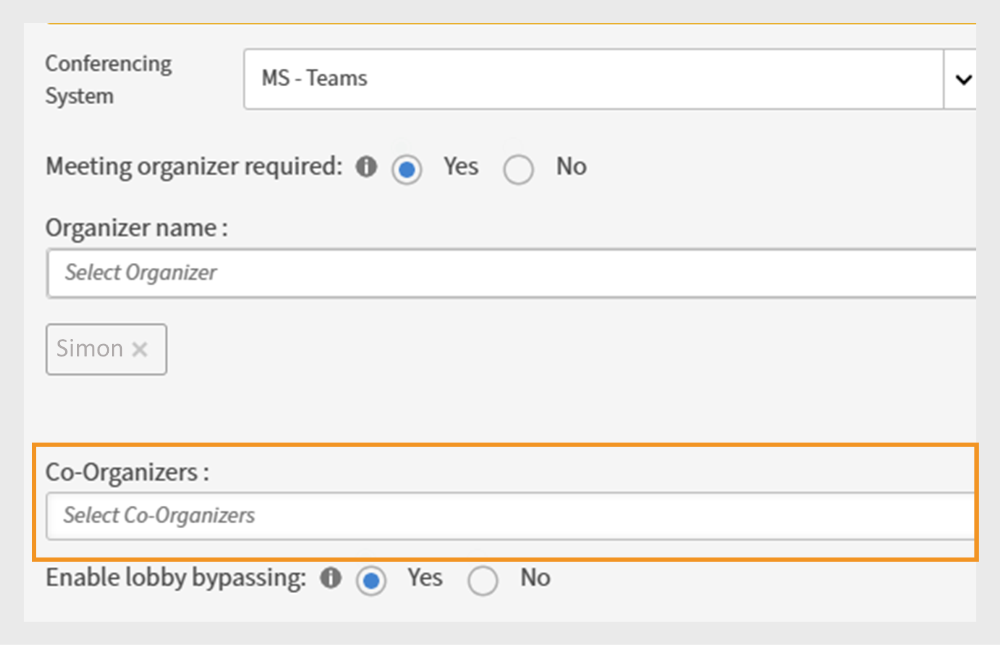

# What's new in Adobe Learning Manager October 2025 release

## Language-based learner progress

Currently, the Adobe Learning Manager tracks learner progress only for the selected locale language, causing significant progress loss when switching languages/locales in the player. This limitation can lead to a poor user experience, as learners may lose their progress when accessing content in different languages. The progress for each module in the player is tracked at both the user and module levels. This leads to a situation where a user's progress is overridden when they switch back to a previously used locale for the same module.

For example, if a learner achieves 75% progress in locale A (English) and then switches to locale B (Spanish), upon returning to locale A, their progress resets to 0% instead of resuming from 75%.

>[!NOTE]
>
>The Video content type does not support language-based progress.

To resolve these limitations, the feature has been enhanced to support locale-specific progress tracking:

* **Locale-specific storage**: When a learner switches locales (for example, from Locale A to Locale B) within the player, the Adobe Learning Manager now saves the progress state separately for each locale of the content.
* **Progress resumption**: When the user switches back to a previously used locale (from Locale B back to Locale A), the content resumes from where they left off in that specific locale.
* **Independent progress tracking**: Each locale maintains its own state of progress, allowing learners to explore content in multiple languages without losing their individual progress in each language.

View [My Learning](/help/migrated/learners/feature-summary/courses.md#language-based-progress-management) article for more information.

## Incremental and multi-incremental support for custom roles

Adobe Learning Manager now supports incremental and multi-incremental imports for custom roles and role assignments. This enhancement makes it easier for administrators to manage roles by uploading only new or modified data, instead of re-uploading the entire dataset every time.
Adobe Learning Manager also supports up to 20 incremental user CSVs and their corresponding custom roles CSVs, making it suitable for large-scale operations.

**What's new**

* Administrators can now upload role and user-role files (role.csv and user_role.csv) incrementally, along with user files (user.csv), instead of always doing full uploads.
* Each user import (user1.csv) is linked with its own role and role-mapping files (user1_role.csv, user1_user_role.csv), stored in separate FTP folders.
* Three additional columns have been added to the following CSVs:

    * User Registration State in user.csv
    * Role State in role.csv
    * User Role State in user_role.csv
* The Adobe Learning Manager now captures add, update, and delete actions in the user audit and custom role reports, giving administrators better visibility into changes.

>[!NOTE]
>
>These changes are applicable only to the accounts that use incremental users.

View [Incremental and multi-incremental support for custom roles](/help/migrated/integration-admin/feature-summary/configure-role-csv-files.md#incremental-and-multi-incremental-support-for-custom-roles) article for more information.

## Support for vimeo URLs in activity module

The Activity module now supports embedding Vimeo URLs, similar to YouTube embeds. This enhancement allows administrators to add Vimeo video links directly into the Activity module. When authors create a course and add an Activity module, they now see an option to include a Vimeo URL. Similar to how YouTube links are added, authors can paste a Vimeo link directly into the module setup. Once published, learners can play the Vimeo video seamlessly within the Learner app without being redirected outside the platform.

**Use cases**

* Many organizations rely on Vimeo for hosting training videos, product demos, or compliance content due to its professional features and secure access controls. These videos can now be seamlessly integrated into Adobe Learning Manager courses.
* Learners no longer need to leave the Learning Manager app to view Vimeo content. This reduces distractions and ensures learners remain engaged within the training environment.

View [Add modules](/help/migrated/authors/feature-summary/courses.md#add-modules) article for more information.

## Time Zone information for CR/VC modules

Time zone details are now displayed for Classroom (CR) and Virtual Classroom (VC) modules on the Course Overview page, Instance page, Learner Preview page, and in calendar widget. Learners and administrators can clearly see the time zone associated with scheduled sessions across key pages and calendar invites. Learners can better plan and join sessions without time zone misunderstandings. This enhancement is available only in the new Learner app.

**Use cases**

* Learners in different regions can confirm the session time in the correct time zone.
* Clear time zone visibility helps avoid missed sessions or incorrect calendar planning.
* Managers previewing sessions as learners can also view exact time zone details.

## Auto-populate support for author name in course creation

During course creation, the **[!UICONTROL Author(s)]** field is now automatically populated with the name of the author who is creating the course. Authors no longer need to manually enter their own names. Additional authors can still be added or updated as needed.

**Use cases**

* For organizations with strict content ownership rules, auto-population ensures the author is always correctly attributed.
* When editing an existing course, authors can update or add co-authors without losing the auto-populated entry.

## Search external profiles in change profile Workflow

Previously, administrators scrolled through the entire list of external profiles and manually selected the desired profile when reassigning learners. This made the process time-consuming, especially for accounts with many profiles.

With this enhancement, administrators and custom administrators can now search for external profiles directly in the tab during the change profile workflow. This update streamlines the process of updating and managing learner profiles, making it faster and more efficient.

**Use cases**

* In accounts with hundreds of external profiles (e.g., franchise locations, partner companies, or regional groups), admins can now locate the exact profile instantly using search, reducing errors and saving time.
* During organizational changes, such as mergers or department realignments, learners may need to be moved in bulk to new external profiles. The search-based reassignment makes this task smoother and more accurate.

View [Change the external profile](/help/migrated/administrators/feature-summary/add-users-user-groups.md#change-profile) article for more information. 

## Add a co-organizer for Microsoft Teams sessions

Previously, administrators could only assign a single organizer to Microsoft Teams sessions. With this enhancement, administrators can now add co-organizers to a session. A new field, [!UICONTROL Co-Organizer], has been introduced in Microsoft Teams sessions, allowing authors to assign additional organizers alongside the primary organizer. 

Authors can assign multiple co-organizers for each Teams session. Co-organizers have the same access and permissions as the primary organizer. Up to 10 organizers can be added per session, providing greater flexibility and improved session management.

**Use cases**

* When conducting large-scale sessions with many learners, co-organizers can help manage attendance, moderate discussions, and monitor chat while the primary organizer focuses on delivering the training.


_Virtual Classroom section where administrators can add Co-organizer to Microsoft Teams Sessions_

## Download interested learners report for courses

Administrators can now view and export a list of learners who have registered interest in a course. When no active course instances are available (all instances retired), learners can use the **[!UICONTROL Register Interest]** option on the Course Overview page. 

Administrators can then access this list and download it as a report. **[!UICONTROL Interested Learners]** button has been added to the course page when no active instances are available and it displays the learner's name and the date they registered interest on the administrator UI. Administrators can export **[!UICONTROL Interested Learners report]** by selecting **[!UICONTROL Actions]**.


_Course overview section where learners can view the Register Interest option_

View [Download the interested learner](/help/migrated/administrators/feature-summary/courses.md#download-the-interested-learner-report) report for more information.

## Reset recommendations in Salesforce app

**Overview**

Previously, learners using the Adobe Learning Manager Salesforce app could only select roles and recommendation preferences once. If their role changed, they were required to access the native Adobe Learning Manager app to update their profile and receive relevant course recommendations.
Learners who change job roles, teams, or responsibilities can quickly reset their preferences to receive updated and relevant course recommendations all within the Salesforce app.

**What's new**

Adobe Learning Manager now features a  **[!UICONTROL Reset Interests]** button within the Salesforce app. Learners can now reset their roles and learning preferences without needing to leave Salesforce or sign in into the native Adobe Learning Manager app. 

**Use cases**

* By removing the need to switch to the native Adobe Learning Manager app, the learning journey is smoother, encouraging ongoing engagement and consumption of recommended content through Salesforce.
* Administrators benefit from higher rates of learning completion and better alignment between user roles and recommended content, without extra support or guidance on switching platforms.

View [Reset recommendations in Salesforce app](/help/migrated/learners/feature-summary/sfdc-app.md#reset-recommendations-in-salesforce-app) article for more information.

## Experience Builder

Experience Builder is a no-code/low-code tool in Adobe Learning Manager that helps you create customized learning portals. It allows you to design branded, user-friendly learning portals without needing technical skills or extensive coding knowledge.
With Experience Builder, you can create new pages, menus, and widgets to deliver personalized learning experiences for your audience quickly and easily. With Experience Builder, you can quickly create new pages, menus, and widgets to deliver personalized learning experiences for your audience.

**Problem statement**

Before Experience Builder, organizations faced several challenges:

1. **Limited customization**: Portals had fixed designs with few options to reflect your brand. Administrators could only make basic changes, such as modifying headers, footers, or colors, which limited the ability to create unique experiences.
2. **Cost**: Building custom portals required expensive developers and long timelines, often taking 6 to 9 months to complete. This approach increased the total cost of ownership and delayed deployment.
3. **Generic experiences**: Everyone saw the same content, even if it wasn't relevant to their role or needs. This lack of personalization reduced learner engagement and satisfaction.
4. **Technical barriers**: Non-technical administrators struggled to create or update portals because they needed coding knowledge or external support.

Experience Builder solves these problems by providing a simple, no-code/low-code solution for creating personalized, branded portals.

It allows administrators to design portals that meet their organization's needs without relying on technical expertise or external developers.

**Use cases**

**Branded portals**: Create a portal that matches your company's website with logos, colors, and layouts. For example, a healthcare company can design a portal that reflects its corporate branding while delivering learning content.

**Role-based learning**: Build pages tailored to specific roles. Sales teams can view product training, while engineers access technical courses.

**Product training**: Set up dedicated pages for different products, such as Photoshop or Illustrator, with widgets displaying courses, certifications, and related resources.

View this article for more information. 

## Calendar widget enhancement

## Social tagging

Social learning boards now support user tagging functionality, enabling more targeted discussions and improved collaboration within learning communities. Learners can be tagged in social learning posts and comments through the learner app, APIs, and Adobe Learning Manager reference site.

**What's new**

* **@username tagging**: Users can tag other board members using the "@username" format.
* **Scope-restricted tagging**: Only users with access to the specific board can be tagged, ensuring privacy and relevance.
* **Multi-channel notifications**: Tagged users receive both in-app and email notifications with direct links to relevant posts or comments.

**Key features**

* Users outside the board's scope cannot be tagged, preventing unwanted notifications.
* If a tagged user is deleted from the system, their mention appears as "anonymous".
* Tagging user groups or "@all" is not permitted to prevent notification spam.

**Use cases**

* Healthcare professionals seeking input from specific colleagues on medical cases.
* Subject matter experts being consulted on specialized topics.
* Team discussions requiring input from specific stakeholders.
* Knowledge sharing sessions with targeted expert involvement.

View [User tagging in social learning boards](/help/migrated/learners/feature-summary/social-learning-web-user.md#tag-users-in-social-board-posts) article for more information.

## Scoped announcement permissions for custom administrators

**Overview**

Custom administrators can now create announcements, but only for their assigned user groups or catalogs. This prevents unintended communication across organizational boundaries.

**What's new**

* Custom administrators can only create announcements for users within their assigned scope.
* Announcements can be scoped to specific user groups or catalogs.
* Full administrators maintain visibility and control over all announcements, including those created by scoped custom administrators.

**Key benefits**

* Targeted communication ensuring announcements reach only relevant audiences.
* Reduced information overload by preventing irrelevant notifications from reaching unintended users.
* Maintains organizational boundaries and prevents accidental cross-communication.

**Important considerations**

* If a custom administrator's scope changes, affected announcements display a warning icon and require individual scope resets.
* Each announcement must be updated individually when scope changes occur.
* The Notification Announcement report shows only learners within the custom administrator's assigned scope.

**Use cases**

* Franchise organizations where regional managers need to communicate only with their franchisees.
* Large organizations with regional or departmental administrators targeting announcements to their teams.

View [Create announcement for the assigned scope](/help/migrated/administrators/feature-summary/announcements.md#create-announcement-for-the-assigned-scope) article for more information.

## Calendar widget shows past and upcoming sessions

Learners can now see both past and upcoming sessions in the calendar widget. They can move through the calendar to any date and check the session details. This means they can review sessions that have already happened, helping them track what they missed or attended. They can also view all upcoming sessions for the next 12 months, including the current month, making it easier to plan ahead and manage their schedules.

View [Calendar](/help/migrated/learners/feature-summary/learner-home-page.md#calendar) article for more information. 

## Custom role selection during course publishing from Adobe Captivate

When publishing content from Adobe Captivate to Adobe Learning Manager, if a user has multiple custom roles, they will be prompted to select the specific custom role under which the course should be published. This ensures that the correct role ownership and permissions are applied to the published course, preventing confusion and maintaining proper access control.

View [Publish a project to Adobe Learning Manager (ALM)](https://helpx.adobe.com/in/captivate/help/publish-projects-adobe-captivate.html#publish-to-alm) article for more information.

## Configurable user ID preference for SCORM reporting

Some customers need the learner's UUID instead of the user_id for SCORM content completion to improve tracking accuracy and avoid double licensing across different learning programs. To support this, a new account-level setting called reporting_userid_preference has been added to the ACAP Admin. This setting allows the UUID to be sent in place of the user_id when learners complete SCORM content.

>[!NOTE]
>
> Contact our Customer Support team at [learningmanagersupport@adobe.com](mailto:learningmanagersupport@adobe.com) to configure this setting.

The new attribute `reportingUserIdPreference` has been introduced to `get /account` track the user ID preferences.

## Enhancements to the Saved by Me Widget

Learners can easily access their bookmarked courses through the Saved by Me strip on the learner homepage. Clicking on this strip directs learners to the catalog page, where all courses they have saved are displayed along with the total count of bookmarked courses.

Within the catalog, learners can apply additional filters to narrow down their search. When a filter is applied, only the courses that meet the selected criteria are shown. Previously bookmarked courses do not appear automatically unless they match the applied filter.

View [Configure saved courses widgets in AEM sites](/help/migrated/integrate-aem-learning-manager.md#configure-my-saved-courses-widgets-in-aem-sites) article for more information.

## Support to display original author names in shared courses

Previously, when a course was shared with a peer account, the author appeared as External Author in the peer account. Now, author names display the original name, regardless of whether they are internal users of the main account or legacy authors (i.e., any name entered as a string in the author field during course creation). Selecting an author name shows the number of courses that author has shared with the peer account; however, these authors are not real users within the peer account.

If a user is deleted in the main account, their data is removed there, but the author information remains in any peer accounts where the content has been shared.

In the Learning Objects API, author information is now returned differently for shared courses and main account courses:

* Shared courses (Peer Account): Author information is returned under the `authorDetails` attribute.
* Main account Courses: Author information continues to be returned under the `authors` attribute.

>[!NOTE]
>
>This is a flag-based feature, contact our Customer Support team at [learningmanagersupport@adobe.com](mailto:learningmanagersupport@adobe.com) to enable this option. 

## Search visibility for lower order learning objects

Previously, search results did not consistently display individual courses when they were part of higher-order learning objects such as Learning Paths or Certifications. If a learner was enrolled only in a Learning Path or Certification, the search returned only the higher-order structure and not the individual course. 

With this enhancement, learners can now see individual courses in search results, even when those courses are part of Learning Paths or Certifications. A new administrator setting, **[!UICONTROL Show all enrolled courses in search results]**, has been introduced. When enabled, this setting ensures that searching for a specific course always displays the course itself along with any related Learning Paths or Certifications.

In the `GET /learningObjects` API, a new parameter `filter.ignoreHigherOrderLOEnrollment` has been introduced to refine search results.

Set `filter.ignoreHigherOrderLOEnrollment=true` to list courses that are part of a higher-order Learning Object (such as a Learning Path or Certification) where the learner is already enrolled.

By default, the value is false, which means courses that are only part of a higher-order Learning Object, and where the learner is not directly enrolled, will not be listed.


## API changes

### Migration API enhancements

Adobe Learning Manager now supports the migration of various data objects into an account via the migration process. This process can be initiated via both APIs and the User Interface. When a migration fails, errors are available for download via the interface. These errors are useful in debugging migration errors and managing the migration runs. 

With this release, the error logs will also be available to download via the APIs for efficient, programmatic error tracking and debugging.

**API changes**

There is a new migration API, `runStatus`, which allows integration administrators to check the status of migration runs triggered via the API, something not possible in previous versions of Adobe Learning Manager. 

Additionally, `runStatus` API now provides a direct link to download error logs (CSV) for completed runs. Note that the link is valid for seven days only, and the logs are retained for one month.

The `startRun` API's response has been updated to include the migration project ID, sprint ID, and sprint run ID, which are required to query the new status endpoint. 

#### runStatus API

**Description**

Retrieves the status of an existing migration run.

**Endpoint**

```
GET /bulkimport/runStatus
```

**Parameters**

* **migrationProjectId**: (Required). A unique identifier for a migration project. A migration project is used to transfer data and content from an existing Learning Management System (LMS) to Adobe Learning Manager. Each migration project can consist of multiple sprints, which are smaller units of migration tasks.

* **sprintId**: (Required). A unique identifier for a sprint within a migration project. A sprint is a subset of migration tasks that includes specific learning items (e.g., courses, modules, learner records) to be migrated from an existing LMS to Adobe Learning Manager. Each sprint can be executed independently, allowing for phased migration.

* **sprintRunId**: (Required). A unique identifier used to track the execution of a specific sprint within a migration project. It's associated with the actual migration process for the items defined in a sprint. The sprintRunId helps in monitoring, troubleshooting, and managing the migration job.

**Response**

```
{
  "sprintId": 2510080,
  "sprintRunId": 2740845,
  "migrationProjectId": 2509173,
  "startTime": 1746524711052,
  "endTime": 1746524711052,
  [
    {
      "id": 2609923,
      "lastHeartbeatTime": 1746524711052,
      "objectName": "content",
      "jobState": "COMPLETED",
      "errorCsvLink": "",
      "errorLogLink": "migration/5830/2509173/2510080/2740845/content_err.csv",
      "sequenceNumber": 1
    },
    {
      "id": 2609922,
      "lastHeartbeatTime": 1746524713577,
      "objectName": "course",
      "jobState": "WAITING_IN_QUEUE",
      "errorCsvLink": "",
      "errorLogLink": null,
      "sequenceNumber": 2
    }
  ]
}
```

#### startRun API

The `startRun` API response was updated to include three additional fields- migrationProjectId, sprintId, and sprintRunId. These fields allow users to track and query the status of specific migration runs using the new runStatus API.

```
curl -X GET --header 'Accept: text/html' 'https://learningmanager.adobe.com/primeapi/v2/bulkimport/runStatus?migrationProjectId=001&sprintId=10001&sprintRunId=7'
```

Produces the following response. The response contains:

* `migrationId`
* `sprintId`
* `sprintRunId`

**Response**

```
{
  "status": "OK",
  "title": "BULKIMPORT_RUN_INITIATED_SUCCESSFULLY",
  "source": {
    "info": "Success",
    "migrationInfo": {
      "migrationProjectId": "001",
      "sprintId": "10001",
      "sprintRunId": "7"
    }
  }
}
```

### Social API changes (user tag, comments, and replies)

Adobe Learning Manager now supports @user tagging functionality in Social Learning boards, enabling learners to mention and notify peers within posts, comments, and replies. This feature enhances collaboration and content discovery across the platform.

This release introduces new API capabilities to support user mentions, including enhanced POST and GET endpoints, as well as a new search functionality for tagged users.

**API changes overview**

* Updated POST APIs for creating posts/comments/replies with user mentions
* Updated GET APIs with user mention data in responses

**Format of user mentions**

A user is mentioned using the format: @(user:userId)

#### Create post with mentions

**Endpoint**

```
POST /primeapi/v2/posts
```

**Description**

Create a new social learning post with user mentions.

**Request body**

```
{
  "data": {
    "type": "post",
    "attributes": {
      "boardId": 13282,
      "accountId": 11152,
      "text": "<p>This is a new post mentioning @[user:11257229]</p>",
      "createdByUserId": 11257228,
      "postType": "discussion"
    },
    "id": null
  }
}
```

**Response**

Standard post creation response with mention data included in the _userMentions_ relationship.

#### Create comment with mentions

**Endpoint**

```
POST /primeapi/v2/comments
```

**Description** 

Add a comment to a post with user mentions.

**Request body**

```
{
  "data": {
    "type": "comment",
    "attributes": {
      "postId": 20746,
      "accountId": 11152,
      "text": "<p>Test Comment @[user:11257229]</p>",
      "createdByUserId": 11257228,
      "commentLevel": 0
    },
    "id": null
  }
}
```

#### Create reply with mentions

**Endpoint**

```
POST /primeapi/v2/replies
```

**Description**

Reply to a comment with user mentions.

**Request body**

```
{
  "data": {
    "type": "reply",
    "attributes": {
      "postId": 20746,
      "accountId": 11152,
      "text": "<p>Thanks for the update @[user:11257229]</p>",
      "createdByUserId": 11257228,
      "commentLevel": 1,
      "parentCommentId": 55621
    },
    "id": null
  }
}
```

#### Retrieve posts with mentions

**Endpoint**

```
GET /primeapi/v2/posts/{id}
```

**Description**

Retrieve post details, including mentioned users.

**Response**

```
{
  "links": {
    "self": "https://learningmanager.adobe.com/primeapi/v2/posts/7522"
  },
  "data": {
    "id": "7522",
    "type": "post",
    "attributes": {
      "commentCount": 3,
      "dateCreated": "2025-06-10T11:33:29.000Z",
      "dateUpdated": "2025-06-25T14:52:04.000Z",
      "downVote": 0,
      "postingType": "DEFAULT",
      "richText": "<p>my updated fourth post @[user:14707776] second mention my first post</p>",
      "state": "ACTIVE",
      "text": "my updated fourth post @[user:14707776] second mention my first post",
      "upVote": 0,
      "viewsCount": 0
    },
    "relationships": {
      "createdBy": {
        "data": {
          "id": "14707776",
          "type": "user"
        }
      },
      "parent": {
        "data": {
          "id": "3971",
          "type": "board"
        }
      },
      "userMentions": {
        "data": [
          {
            "id": "14707776",
            "type": "user"
          }
        ]
      }
    }
  },
  "included": [
    {
      "id": "14707776",
      "type": "user",
      "attributes": {
        "avatarUrl": "https://cpcontents.adobe.com/public/images/default_user_avatar.svg",
        "binUserId": "45664b87-75a3-43ec-b0b7-5064958eac6f",
        "email": "user@example.com",
        "enrollOnClick": false,
        "fields": {
          "Location": "BLR"
        },
        "gamificationEnabled": true,
        "lastLoginDate": "2025-06-27T11:21:17.000Z",
        "name": "John Doe",
        "pointsEarned": 1690,
        "pointsRedeemed": 0,
        "preferredResolution": "AUTO",
        "profile": "admin",
        "roles": [
          "Learner",
          "Admin",
          "Author",
          "Instructor",
          "Integration Admin",
          "Manager"
        ],
        "state": "ACTIVE",
        "userType": "Internal"
      },
      "relationships": {
        "account": {
          "data": {
            "id": "9238",
            "type": "account"
          }
        }
      }
    }
  ]
}
```

### Social API changes (user search)

**Endpoint**

```
GET /primeapi/v2/users/search?q={searchTerm}&context=tagging
```

**Description**

Search for users available for tagging based on social scope settings.

**Request parameters**


* q (required): Search term (minimum 3 characters).
* context: Set to "tagging" to get users eligible for mentions.
* boardId (optional): Board ID to filter users based on access permissions.

**Response**

```
{
  "data": [
    {
      "id": "11257229",
      "type": "user",
      "attributes": {
        "name": "Jane Smith",
        "email": "jane.smith@example.com",
        "avatarUrl": "https://cpcontents.adobe.com/public/images/default_user_avatar.svg",
        "userType": "Internal",
        "state": "ACTIVE"
      }
    }
  ]
}
```

### Learner API enhancements for quiz performance tracking

The `GET /loResourceGrades` API has been enhanced to provide detailed quiz performance data, enabling more sophisticated analytics and automated decision-making.

**What's new**

The API response now includes two additional fields:

* **[!UICONTROL highestScore]**: The best score achieved by a learner across all quiz attempts
* **[!UICONTROL maxScore]**: The total possible score for the quiz

**API response example**

```
{
    "links": {
        "self": "https://learningmanagerstage1.adobe.com/primeapi/v2/loResourceGrades/course:15067_30122_41715_1_3400468"
    },
    "data": {
        "id": "course:15067_30122_41715_1_3400468",
        "type": "learningObjectResourceGrade",
        "attributes": {
            "completed": false,
            "duration": 0,
            "hasPassed": false,
            "highestScore": 0,
            "maxScore": 0,. 
            "progressPercent": 0,
            "score": 0
        },
        "relationships": {
            "loResource": {
                "data": {
                    "id": "course:15067_30122_41715_1",
                    "type": "learningObjectResource"
                }
            }
        }
    }
}
```

In response, **course:15067_30122_41715_1_3400468** is the ID of the Learning Object resource grade for which the information is being requested. The `learningObjectResourceGrad`e id can be obtained from the `GET /enrollments/{id}` API.  

### API responses supports case sensitivity for author names

The API response now gives the exact case of legacy author names as entered during course creation or update. This ensures that names appear consistently across the learner UI and public APIs.

**What's new**

* When a new author name is added, the case is stored and returned exactly as entered.
* If an existing author name is removed and re-added with a different case, the updated case will be honored and reflected across all courses using that author name.
* No automatic migration will be done for previously stored names; only newly added or updated names will follow this behavior.

### Calendar API enhancement

The calendar now loads sessions for the month selected by the user. To fetch both past and upcoming sessions through the API, a new `year` parameter has been added to the learner endpoint `GET /users/{id}/calendar`. The `month` and `year` parameters must be provided together to retrieve session details.

**Sample curl**

```
curl -X GET --header 'Accept: application/vnd.api+json' --header 'Authorization: oauth a4ae04eb9f06f4bf88abcde17' 'https://abc.adobe.com/primeapi/v2/users/12345678/calendar?month=7&year=2025&currentMonthOnly=false&filter.allSessions=false'
```

### Support for mark completion through Administrator API

Previously, the public API did not support instance-based completion marking in multi-enrollment scenarios. With this enhancement, you can now include course instance ID in the request body of `POST /users/{userId}/userModuleGrade` and administrator can mark completion for a specific instance.

## Webhooks changes

### Register LinkedIn Learning webhooks using the connector

Previously, administrators had to manually register Adobe Learning Manager (ALM) webhooks through APIs. With this enhancement, the LinkedIn Learning (LIL) connector now supports webhook registration automatically during new connection setup in ALM. The **OAuth Server  URL** and **Tenant Server URL** will be auto-populated on the LinkedIn Learning configuration page.

For existing customers:
A migration script will be executed to automatically enable LinkedIn Learning webhooks for all existing accounts.

View this [article](/help/migrated/integration-admin/feature-summary/webhooks.md) for more information.

### Improved MAU license consumption across Adobe Learning Manager and LinkedIn Learning

Previously, when a learner consumed a LinkedIn Learning course directly in the LinkedIn Learning platform, the license usage was not deducted in Adobe Learning Manager. Only courses taken through the Adobe Learning Manager player triggered license consumption, which led to inaccurate tracking of Monthly Active users (MAU) license usage.

With this enhancement, Adobe Learning Manager now generates an external webhook whenever a learner consumes a course in the LinkedIn Learning platform. On receiving this webhook, Adobe Learning Manager reduces the license count, ensuring accurate tracking across both platforms. License reports now reflect correct consumption, whether learners complete courses in Adobe Learning Manager or LinkedIn Learning, giving administrators full visibility into license usage.

View this [article](/help/migrated/integration-admin/feature-summary/webhooks.md) for more information.

## Report changes

### Instructor-marked completions in Learner Transcripts

**Overview**

Incremental Learner Transcripts now capture instructor-marked completions, even if attendance is recorded after the session date.
This enhancement addresses a critical gap in incremental Learner Transcripts where instructor-marked completions were previously missed if attendance was recorded after the original session date.

Incremental Learner Transcripts are scheduled reports that capture only the changes (such as completions or progress updates) that occur within a specified period, rather than providing a full historical data dump. They are commonly used for automation, dashboards, and integrations, allowing users to efficiently track recent learning activities without processing the entire transcript history each time.

**What's new**

* **Mark Completed Date (UTC TimeZone) column**: A new timestamp column that captures the exact date and time when an instructor marks a session or module as complete.
* **Enhanced completion source tracking**: Tracks the specific instructor and module (for example, "Classroom") where completions were recorded.

These changes ensure that completions marked after the session date are accurately reflected in incremental Learner Transcripts.

**Key benefits**

* Captures all completions in incremental reports, regardless of when attendance is marked.
* Provides a clear audit trail for compliance and reporting.
* Supports automation and dashboards for regulatory requirements.

**Use cases**

* Organizations with classroom sessions where instructors may mark attendance days after the actual session. 
* Automated systems or dashboards relying on incremental Learner Transcripts for compliance or reporting. 

The downloaded Learner Transcript report contains the new column: Mark Completed Date (UTC TimeZone).


_Learner Transcript report displays a new column in yellow highlighting individual completion dates for each user_

View [Learner Transcript](/help/migrated/administrators/feature-summary/learner-transcripts.md) article more information.

### Enhanced User Report with extended data fields

**Overview**

The User Report now includes additional fields to improve user tracking and organizational mapping.

**What's new**

* Internal User ID column: Provides unique internal identifiers for smooth user tracking across different systems and API endpoints.
* Manager Email column: Includes direct manager contact information for organizational hierarchy tracking.

**Key benefits**

* Simplified user identification and eliminates issues when mapping users across multiple systems.
* Supports downstream user management workflows through integration capabilities.
* Improved organizational mapping and better understanding of reporting relationships.
* Maintains organizational boundaries and prevents accidental cross-communication. 

The downloaded User Report file contains the new columns: Internal User ID and Manager Email.

 
_User Reports highlighting internal user IDs and manager email addresses to streamline user management_

View [Download the user report](/help/migrated/administrators/feature-summary/add-users-user-groups.md#download-the-user-report) article for more information.

### FTP User Report with Internal User ID support

**Overview**

The FTP-based User Report now includes Internal User ID support, providing a unified approach to data export and integration for headless implementations.

**What's new**

* User Reports are now available through [Custom FTP](/help/migrated/integration-admin/feature-summary/connectors.md#custom-ftp) alongside existing reports (Gamification Transcripts, Learner Transcripts, Trainings Report).
* The Internal User ID column is now consistent across all export methods (FTP, Jobs API, and UI).

**Key benefits**

* Simplified data management with a single source for all necessary reports.
* Better data consistency by ensuring uniform user identification across reporting periods.
* Automated workflow support by enabling bulk operations and analytics workflows with consistent identifiers.
The User Report downloaded from FTP folder contains the new column, Internal User ID.

View [Learning Manager FTP connector](/help/migrated/integration-admin/feature-summary/connectors.md#learning-manager-ftp-connector) article for more information. 

### Include suspended users in Learner Transcripts

**Overview**

Organizations can now include suspended users (those with disabled external profiles) in Learner Transcripts, ensuring comprehensive historical learning data retention.

**What's new**

* Configurable suspended user visibility with an account-level flag to include suspended users in the Learner Transcripts.
* Historical data retention even after deactivation of suspended external profiles.

**Implementation requirements**

* Contact your Customer Success Manager (CSM) to enable the account-level flag.

>[!NOTE]
>
>This flag is disabled by default for existing accounts and must be explicitly requested for new accounts.

View [Learner Transcript](/help/migrated/administrators/feature-summary/learner-transcripts.md) article more information.

### Job Aids report with direct access links

**Overview**

The Job Aids report has been enhanced to include direct download links to job aids, streamlining content management and audit processes for administrators and authors.

**What's new**

* Job Aid Link column: Direct access to job aid files and external URLs from within the report.
* Role-based access control: Link accessibility depends on user roles and catalog permissions.
* Deleted job aids remain accessible if still linked to active courses.

**Key benefits**

* Direct file downloads and URL access from within the report.
* Eliminates manual effort in locating and downloading job aids for compliance or accessibility audits. 

**Use cases**

* Authors or administrators conduct regular accessibility audits on job aids, as required by large organizations.
* Any scenario where quick, role-based access to job aid files is needed for review or compliance.

The Job Aids Report can be downloaded from the Reports section and now includes direct download links for each job aid.

 
_Job Aids Report displays direct download links, making it easy to access and download job aids in Adobe Learning Manager_

View [Job Aids Report](/help/migrated/administrators/feature-summary/reports.md#job-aids-report) article for more information.

