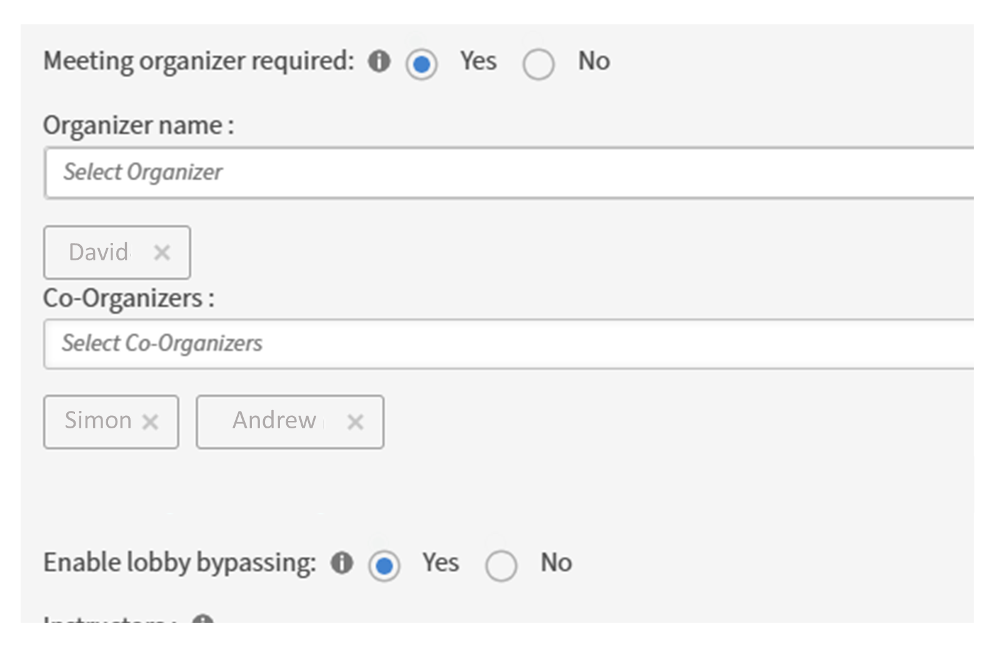

# What's new in Adobe Learning Manager October 2025 release

## Language-based learner progress

Currently, learner progress is tracked only for the selected locale language, causing significant progress loss when switching languages/locales in the player. This limitation creates poor user experience where learners lose their learning progress when exploring content in different languages.

**Current issues**

* **Progress override**: The progress for each module in the player is tracked at both the user and module levels. This leads to a situation where a user's progress is overridden when they switch back to a previously used locale for the same module.
* **Progress reset**: For instance, if a learner achieves 75% progress in Locale A (English) and then switches to Locale B (Spanish), upon returning to Locale A, their progress resets to 0% instead of resuming from 75%.

To resolve these limitations, the API has been enhanced to support locale-specific progress tracking:

* **Locale-specific storage**: When a learner switches locales (for example, from Locale A to Locale B) within the player, the system now saves the progress state separately for each locale of the content.
* **Progress resumption**: When the user switches back to a previously used locale (from Locale B back to Locale A), the content resumes from where they left off in that specific locale.
* **Independent progress tracking**: Each locale maintains its own state of progress, allowing learners to explore content in multiple languages without losing their individual progress in each language.

## Custom roles import support in incremental user import

Adobe Learning Manager now supports custom role imports in the existing multi-incremental user import workflow (regular full user import + incremental enabled flow). This enhancement allows role.csv and user_role.csv files to be uploaded and processed incrementally, without requiring full data uploads each time.

Previously, role.csv and user_role.csv files could only be uploaded in full mode, meaning administrators had to include all previously added role definitions and assignments in every upload. With this new incremental support, only new or modified role data needs to be uploaded, reducing overheads and improving efficiency.

**What's new**

1. Incremental support for custom roles and role assignments:

    * role.csv  and  user_role.csv can now be processed incrementally in the multi-file incremental workflow.
    * No need to upload all existing role and user role data with every import.

2. Enhanced multi-incremental workflow implementation:

    * Create separate folders in FTP for each uploaded user import file.
    * Each folder contains:

        * The user import file- (File1.csv)
        * Corresponding role and role assignment files- (File1_role.csv, File1_user_role.csv)

    For example, user1.csv corresponds to user1_role.csv (custom roles) and user1_user_roles.csv (user-role mapping).

    **Example FTP structure before processing:**

    ```
    import/user/internal/  
         user1.csv  
         user2.csv  
         user3.csv  

    UserRole/  
        File1_role.csv  
        File1_user_role.csv  
        File2_role.csv  
        File2_user_role.csv  
        File3_role.csv  
        File3_user_role.csv  
    ```
 
3. Adobe Learning Manager also supports up to 20 incremental user CSVs and their corresponding custom roles CSVs, making it suitable for large-scale operations.

**Use cases**

* Global companies manage regional teams by uploading multiple incremental user files for each region (EU, America, Asia), allowing administrators to update users and assign new roles for each region in a single workflow.
* Large enterprises automate onboarding and permissions by regularly ingesting incremental user updates from HR systems. This supports seamless updates to user profiles and granular role assignments without manual intervention.

### New columns added to CSV files

Three new columns have been introduced to enhance the data captured in user, role, and user-role CSV exports/imports:

* **User Registration State (user.csv)**: Indicates the current registration status of the user.
* **Role State (role.csv)**: Indicates the current status of roles within the system.
* **User Role State (user_role.csv)**: Indicates the status of the user-role association. 

>[!NOTE]
>
>The above CSV changes apply only to the accounts that use incremental users.

Download the [sample CSVs](assets/sample-csv-Incremnetal.zip) here.

## Support for Vimeo URLs in Activity Module

The Activity module now supports embedding Vimeo URLs, similar to YouTube embeds. This enhancement allows administrators to add Vimeo video links directly into the Activity module. Learners can then watch these videos seamlessly within the Learner app, without being redirected to an external site.

**Key highlights**

* Administrators can now add Vimeo URLs in the Activity module in the same way they add YouTube links.
* Learners can play Vimeo videos directly within the Learner app for a smooth learning experience.
* Learners stay within the platform while consuming video content.

**Use cases**

* Training teams using Vimeo for hosting corporate videos can now embed them directly into courses.
* Organizations using Vimeo for privacy-controlled or internal videos can integrate them easily without requiring third-party navigation.

## Time Zone information for CR/VC modules

Time zone details are now displayed for Classroom (CR) and Virtual Classroom (VC) modules. Learners and administrators can clearly see the time zone associated with scheduled sessions across key pages and calendar invites. This feature ensures clarity and prevents confusion about session timings.

**Key highlights**

* Visible time zone info: Shown in the following pages:

    * Course Overview page
    * Instance Overview page
    * Preview as Learner page
    * Calendar invite

* This enhancement is available only in the new Learner app.
* Learners can better plan and join sessions without time zone misunderstandings.

**Use cases**

* Learners in different regions can confirm the session time in the correct time zone.
* Clear time zone visibility helps avoid missed sessions or incorrect calendar planning.
* Managers previewing sessions as learners can also view exact time zone details.

## Auto-population of author name in course creation

During course creation, the **[!UICONTROL Author(s)]** field is now automatically populated with the name of the author who is creating the course.

**Key highlights**

* The current author's name is auto-filled in the **[!UICONTROL Author(s)]** field at the time of course creation.
* Authors no longer need to manually enter their own names.
* Additional authors can still be added or updated as needed.

* **Use cases**
* Speeds up course creation by reducing repetitive manual entry.
* Ensures the course creator's name is consistently recorded.

## Search external profiles in change profile Workflow

Administrators and custom administrators can now search external profiles directly in the **[!UICONTROL External Profile]** tab during the change profile workflow. This enhancement streamlines the process of updating and managing learner profiles.

**Key highlights**

* Administrators no longer need to manually browse or scroll to locate external profiles.
* External profiles can be searched directly from the change profile workflow.

**Use cases**

* Easily find and switch to the correct external profile when updating a learner's profile.
* Faster search reduces the risk of selecting the wrong external profile.

View this [article](/help/migrated/administrators/feature-summary/add-users-user-groups.md#change-profile) for more information about external profiles. 

## Add a co-organizer for Teams sessions

Administrators can now add co-organizer for the Microsoft Teams sessions. The new field **[!UICONTROL Co-Organizer]**, has been added to Microsoft Teams sessions. This feature enables authors to assign additional organizers to a session, alongside the primary organizer.

**Key highlights**

* Authors can now assign multiple co-organizers for each Teams session.
* Co-organizers have the same access and permissions as the primary organizer.
* You can add up to 10 organizers per session for improved session management.

**Use cases**

* If the primary organizer is unavailable, co-organizers can step in to manage the session without disruption.
* Multiple organizers can help manage large training sessions by handling attendance, moderating discussions, or sharing content.
* Organizations running frequent or large-scale sessions can distribute responsibilities across several facilitators.


_Virtual Classroom section highlight the new field for assigning a Co-organizer to Team Sessions_

## Interested learners report for courses

Administrators can now view and download a list of learners who have shown interest in a course. Learners can express interest by selecting the **[!UICONTROL Register Interest]** option on the course overview page when no active course instances are available. Administrators can then access the list of interested learners and export it as a report.


_Course overview section on the Learner UI highlighting the Register Interest option_

**What's new**

* **[!UICONTROL Interested Learners]** button has been added to the course page when no active instances are available.
* Displays the learner's name and the date they registered interest on the administrator UI.
* Administrators can export **[!UICONTROL Interested Learners report]** by selecting **[!UICONTROL Actions]**. 
* Report includes:

    * Course ID
    * Learner Name
    * Email
    * Type
    * State
    * Registration Date & Time (UTC)
    * Active status

>[!NOTE]
>
>The report will include the learner's UUID if it is enabled for the account.

**Use cases**

* Identify courses learners want but currently don't have active instances.
* This helps administrators schedule or reopen popular courses based on learner demand.

## Reset recommendations in Salesforce app

**Overview**

Previously, learners using the Adobe Learning Manager Salesforce app could only select roles and recommendation preferences once. If their role changed, they were required to access the native Adobe Learning Manager app to update their profile and receive relevant course recommendations. This made the learning experience and contributed to lower engagement within the Salesforce environment.

**What's new**

Adobe Learning Manager now features a  **[!UICONTROL Reset Interests]** button within the Salesforce app. Learners can now reset their roles and learning preferences without needing to leave Salesforce or sign in into the native Adobe Learning Manager app. This enhancement streamlines access to personalized learning content, ensuring recommendations remain relevant as users' roles evolve.

**Use cases**

* Learners who change job roles, teams, or responsibilities can quickly reset their preferences to receive updated and relevant course recommendations all within the Salesforce app.
* By removing the need to switch to the native Adobe Learning Manager app, the learning journey is smoother, encouraging ongoing engagement and consumption of recommended content through Salesforce.
* Administrators benefit from higher rates of learning completion and better alignment between user roles and recommended content, without extra support or guidance on switching platforms.

View this [article](/help/migrated/learners/feature-summary/sfdc-app.md#reset-recommendations-in-salesforce-app) for more information.

