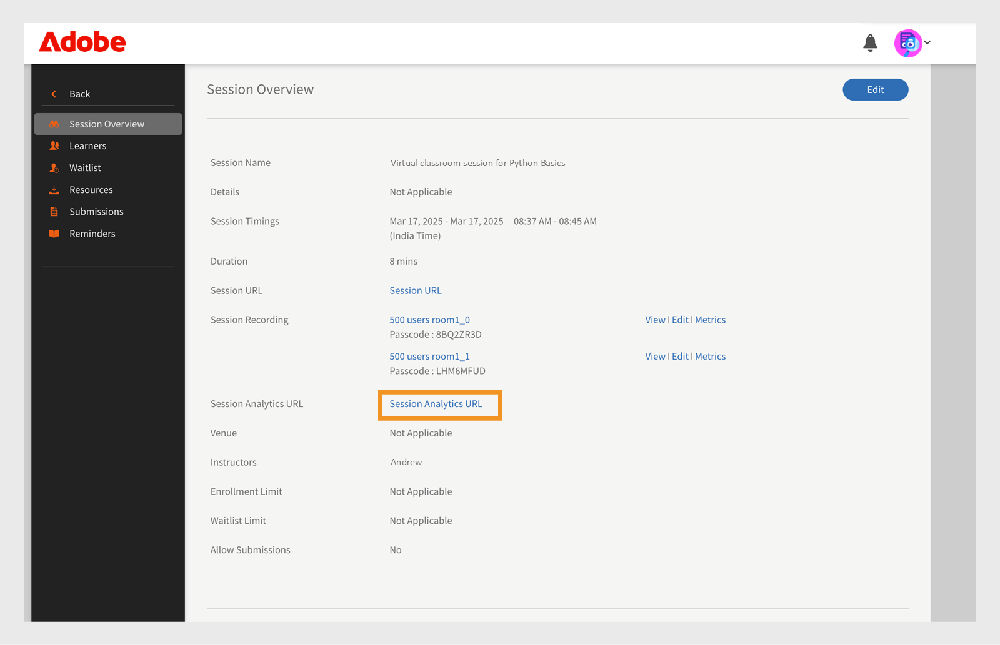

# New features summary

The upcoming release of Adobe Learning Manager introduces a variety of new features and enhancements aimed at streamlining the platform and enhancing its capabilities.

Key updates include:

* The Group Success Dashboard, which allows for real-time tracking of team progress. 
* The ability to assign multiple custom roles to individual users.
* Improved tools for marking bulk learner enrollment, attendance, and completion.

Additional enhancements include better management of content expiration, expanded support for multiple languages in content, and new purchasing options for content.

## Group Success Dashboard

The Group Success Dashboard provides a more efficient and user-friendly way for administrators and managers to monitor and track the progress of their teams' training activities.

Group Success Dashboard offers the following:

* **[!UICONTROL Simplifies Learner Progress Tracking]**: The dashboard offers an alternative to the Excel-based learner transcript, allowing for easier and quicker access to information about learners' course enrollments and progress. 
* **[!UICONTROL Facilitates Team Management]**: The dashboard is particularly useful for managers overseeing small teams, enabling them to frequently check their team members' learning progress on specific courses or learning paths.

Managers (or store managers) handling small teams (less than 50 people) can use the GSD to regularly check how their team is progressing with their courses. This is helpful for quick updates and making sure everyone is completing their training.
The Group Success Dashboard makes it easier to track learner progress. Instead of using Excel files, managers and administrators can use the dashboard to quickly see course enrollments and progress.
Administrator can create dashboards by giving them a name, selecting user groups, and choosing the courses or learning paths. The dashboards can be shared with other administrators or managers.

Refer this [article](/help/migrated/administrators/feature-summary/group-success-dashboard.md) for more information.

## Custom role enhancements

Administrator can now assign more than one custom role to a single user. This feature is especially helpful for large organizations, allowing roles to be reassigned to existing custom admin users when custom administrators move to other teams or leave the organization.
Administrator can create custom roles with specific permissions, like access to certain user catalogs or features. The new update allows one user to have multiple custom roles.
Custom roles have clear names in the user interface, so it's easier to know which role you're using. Custom administrators can see their assigned roles in the profile section (top right corner) and switch between roles easily.

>[!NOTE]
>
>You can add up to 50 roles per user and 500 users per role.

Refer this [article](/help/migrated/administrators/feature-summary/custom-role.md#assign-multiple-custom-roles-to-a-user) for more information.

## Learner bulk enrollment, attendance, and completion

Administrators and instructors manually mark completions and attendance when they get attendance rosters after session completions. This requires a lot of redundant work to update names and mark completions for them. Now, this enhancement allows administrators and instructors to update a CSV with email IDS of learners and directly upload it to the Adobe Learning Manager to mark enrollment, completions, and even mark attendance.

Refer this [article](/help/migrated/administrators/feature-summary/courses.md#learner-bulk-enrollment-attendance-and-completion) for more information. 

## Content expiry and unique code

Adobe Learning Manager now supports content expiry dates and unique codes to help manage content more effectively. These features are especially helpful for organizations that use multiple platforms and need to keep their training materials up to date and consistent.

* The expiry date helps authors keep track of outdated content that may need review or updates.
* The unique code makes it easier to link content between external systems and Adobe Learning Manager.

Authors can add a unique ID and set an expiration date when creating content. The unique ID must only include letters and numbers (no spaces) and must not be used for any other content. If a duplicate ID is entered, an error will appear. Authors can set these fields when creating a course.

The content will still be available after the expiry date, but the date acts as a reminder to review or update it. The expiry date and unique ID apply to all language versions of a content group, ensuring a consistent experience for all users, no matter the language. Authors can use the unique ID to quickly search for and find specific content, making it easier to manage and update training materials.

The unique code feature supports integration with content migration processes, allowing for seamless content transfer and management between systems.

The Training report now includes two new columns: Content Expiry Date (UTC TimeZone) and Content Unique ID, to track content expiry and content unique ID.

Refer this [article](/help/migrated/authors/feature-summary/content-library.md#add-content-unique-id-and-expiry-date) for more information. 

## New content languages

Adobe Learning Manager is known for supporting many languages, which makes it stand out from other learning platforms. With every milestone, Adobe Learning Manager expands its language offerings to better support a global and diverse user base. In this release, we're introducing new content languages, further enhancing our commitment to delivering inclusive and accessible learning experiences for all.

* Chinese-traditional Hong Kong (cn-HK)
* Norwegian Bokmal (nb-NO)
* Tamil (ta-IN)
* Telugu (te-IN)
* Kannada (kn-IN)
* Malayalam (ml-IN)

Refer to this [article](/help/migrated/languages-supported.md) for a list of supported languages in Adobe Learning Manager.

## Go1 content enhancements

Adobe Learning Manager introduces new purchasing models for Go1 content, providing more flexibility and options for acquiring content: Premium Essentials and Premium Essential Plus. Essentials offers cost-effective solutions for boosting employee engagement and includes content providers like Skillshub, Thomson Reuters, and Emtrain. Premium Essential Plus offers additional content from premium providers such as Blinkist, Pluralsight, Skillsoft, Traliant, and Coursera.

Refer to this [article](/help/migrated/administrators/feature-summary/content-marketplace.md) for more information.

## Login access report in FTP

The login access reports are now available for Box, FTP, and Custom FTP connectors, providing visibility into connector login activities. This report, along with other reports, helps administrators build their reporting suite outside the platform by providing detailed information about user login and access times. This report can be used to create more informative dashboards and track user activity effectively.

The report is now available in the custom FTP, FTP and Box along with existing reports, such as learner progress and course completion. This integration allows administrators to access all necessary reports from a single source, facilitating better data management and analysis.

The report helps in automation by enabling the export of login and access data to the FTP, where it can be joined with other reports to create comprehensive dashboards. This feature is particularly useful for organizations that rely on automated processes for data analysis and reporting.

## User language preference update on login through SAML

Adobe Learning Manager is a multi-lingual platform where learners' language preferences are taken care of through various ways, like interface language, content language, and courses, along with its modules and instances, are also multi-lingual.

For users of the Adobe Learning Manager native platform, this enhancement addresses the need for just-in-time user provisioning. When users are creating accounts and logging in for the first time, this feature ensures that their language preferences are accurately captured and applied.

This feature ensures that users' language preferences are updated automatically when they log in through SAML. This helps in providing a personalized experience by displaying the interface in the user's preferred language.
When users log in through SAML, their language preference (Interface and Content language) is checked and updated based on the information provided during the login process. 

The feature integrates with the SAML login process to capture and update the user's language preference seamlessly.

Refer to this [article](/help/migrated/administrators/feature-summary/set-up-interface-language-through-saml.md) for more information.

## Filter deleted users before purging

Purging users means permanently deleting their data from the system. This includes removing all records and information linked to the user, so nothing is left behind. Purging helps keep the system clean, saves storage space, and follows data retention rules.

The feature is designed to help administrators manage and purge users who have been deleted for a certain period. This is particularly useful for maintaining data hygiene and ensuring that old, unused user data is removed from the system. 
Administrator can filter users by the month they were deleted, making it easier to identify and purge users who were deleted in a specific timeframe.

Refer to this [article](/help/migrated/administrators/feature-summary/purge-users.md#filter-deleted-users-before-purging) for more information.

## Adobe Connect connector enhancements

### Support for Seminars with large audiences

ALM now also supports selecting Seminar rooms from Adobe Connect while setting up a VC session in Connect. Previously, admins could only select the Meeting room type. This enhancement enables admins with a valid seminar license to schedule and manage one-time or large-scale events (up to 1,500 attendees) within ALM.

Refer to this [article](https://helpx.adobe.com/adobe-connect/using/creating-seminars.html) for more information about the Seminar room.

### Support for access to session analytics

Instructors can now access Session Analytics for their completed Adobe Connect sessions via a new link provided in their session dashboard.


_Select session URL_

This link opens the session analytics dashboard in Connect, which provides detailed insights into session engagement.
This feature is available only for sessions conducted through Adobe Connect. The session analytics include: 

* Engagement: Overview of the live session's overall performance
* Interactions: Detailed breakdown of participant activity across different pods 
* Attendee Activity: Summary of participant engagement 
* Download Reports: Option to download reports for pod-specific engagement data


_Session dashboard_

## Migration changes

Migration process in ALM for importing modules now supports the ability to add parameters for defining success criteria. 
This is supported now by adding three new optional columns in the module_version.csv. Three new optional columns are: `successCriteria`, `successQuizData`, and `successViewPercent`.

These fields accept only specific values, and the connector will fail to process the file if invalid values are entered.
A quiz module can use three types of success criteria. Either it can mark pass if the learner launches the content, depending on a percentage value scored (defined by `successViewPercent`: below), or it can be based on the quiz module's outcome (defined by `successQuizData`: below). This value is to be filled in as per the instructions below. The successCriteria parameter is used to determine this.

`successCriteria`: Accepts `LAUNCH_CONTENT`, `VIEW_PERCENT`, `QUIZ`, or `VIEWPERCENT_OR_QUIZ`.

* If `LAUNCH_CONTENT`: Leave `successQuizData` and `successViewPercent` blank. This will mark the learner as passed if the learner launches the content.
* If `VIEW_PERCENT`: Enter a value for `successViewPercent`, leave `successQuizData` blank. This will mark the learner pass depending on the percentage value scored in the quiz.
* If `QUIZ`: Enter a value for `successQuizData`, leave `successViewPercent` blank. This will mark the learner as passed depending on the outcome of the quiz module.
* If `VIEWPERCENT_OR_QUIZ`: Enter values for both `successQuizData` and `successViewPercent`. This will mark the learner as passed depending on either the outcome of the quiz module or the percentage scored.

`successQuizData`: Accepts `QUIZ_ATTEMPTED`, `QUIZ_PASSED`, or `QUIZPASSED_OR_LIMITREACHED`.

* `QUIZ_ATTEMPTED` will mean that the learner will be marked as passing for the quiz if the learner has attempted the quiz.
* `QUIZ_PASSED` will mean that the learner will be marked as passed for the quiz, if the learner passes the quiz as per the criteria defined inside the quiz content. For e.g. Scorm module defines the criteria and reports it to ALM.
* `QUIZPASSED_OR_LIMITREACHED` will mean that the learner will be marked as passed for the quiz if the learner has either passed the quiz or has exhausted the number of limits.

`successViewPercent`: Accepts integer values from 0 to 100.

* This criterion accepts a percentage value that the learner is required to score to successfully pass the quiz
Webhook changes.

## Webhooks changes

* Webhooks now send payloads for both parent and child learning objects for enrollment, completion, and unenrollment events. For example, if a learning path has three courses and a learner enrolls in all of them, you'll receive one learning path enrollment payload and three-course enrollment payloads. Refer to this article for the sample payloads.
* Adobe Learning Manager now captures learner activity from LinkedIn Learning (LIL) in Adobe Learning Manager Learning Record Store (LRS). For example, if a learner enrolls in and completes a course on LIL, that progress will automatically sync to ALM using xAPI statements.

Refer this [article](/help/migrated/integration-admin/feature-summary/webhooks-usage-guide.md) for more information about Webhooks. 

## API changes

Public APIs now support improved error handling by returning clear and specific error messages when invalid or incomplete data is passed in `POST` and `PATCH` requests. This enhancement applies particularly to relationship fields within the request payloads.

When a request includes incorrect data types or is missing required information in the relationship section, the API responds with descriptive messages that indicates the exact issue. This enables faster identification and resolution of errors during integration or testing.

The following sample responses illustrate various error scenarios:

```
{
  "status": "BAD_REQUEST",
  "title": "Field Type incorrect",
  "source": {
    "info": "incorrect relation type - Andrew"
  }
}
```

```
{
  "status": "BAD_REQUEST",
  "title": "Missing Param",
  "source": {
    "info": "skills"
  }
}
```

## Bugs fixed in this update

* Fixed an issue where `dateCompleted`, `dateEnrolled`, and `dateStarted` were incorrectly set to the `dateModified` value in the Get Learning Object API response for Job Aids.
* Fixed an issue where the user API endpoint returned generic error messages; it now shows clear details indicating the specific field causing the failure.
* Fixed an issue where the `/learningObjects` endpoint returned empty results when accessed by admins for the default catalog.
* Fixed an issue where Job Aids that were not migrated to the latest version were not appearing in the public API response.
* Fixed an issue where unrelated skills were being shown on courses in the learner's Recommendation section.
* Fixed an issue where renaming a content folder did not reflect the updated name in search results.
* Fixed an issue where text overflow occurred in the Course Overview page.
* Fixed an issue where self-registration links were broken for accounts using a custom domain.
* Fixed an issue where the subscription report was triggering enrollments for courses the learner had not enrolled in within a Flex Learning Path.
* Fixed an issue in multi SSO configurations where only 20 external profiles were displayed, all configured profiles are now visible.
* Fixed an issue where Content Marketplace courses were incorrectly included in recurred certifications.
* Fixed an issue where users with edit permissions were unable to duplicate courses from the My Courses and Courses tabs.
* Fixed an issue where auto-enrollment was not triggered for subsequent courses in an enhanced Learning Path shared via catalog.
* Fixed an issue where changing the system date incorrectly launched the player instead of showing an error message.
* Fixed an issue where a custom author's session was terminated upon removing a module from a course.
* Fixed an issue where the organization logo size appeared reduced on the logout screen.
* Fixed an issue where the Delete button for courses stopped working if the drag option was used multiple times during Learning Path creation.
* Fixed an issue where store managers were not receiving email notifications when learners did not have an assigned manager.
* Fixed a string issue where virtual session was corrected to Virtual Classroom for consistency.
* Fixed an issue where deleted badges were still visible and achievable by learners.
* Fixed an issue where the CourseDescription field was not populated in email communications.
* Fixed an issue where the account-level discussion board setting was being overridden by the course-level setting.
* Fixed an issue where editing or adding instructors to a checklist module failed due to too many instructors causing the URL to exceed its maximum length.
* Fixed an issue where duplicate columns in the user CSV did not trigger an appropriate error message.
* Fixed an issue where enhanced Learning Path APIs were not rendering data for child Learning Paths.
* Fixed an issue where rich text was not supported in course descriptions in the mobile app.

## System Requirements

[Learning Manager system requirements](/help/migrated/system-requirements.md)
